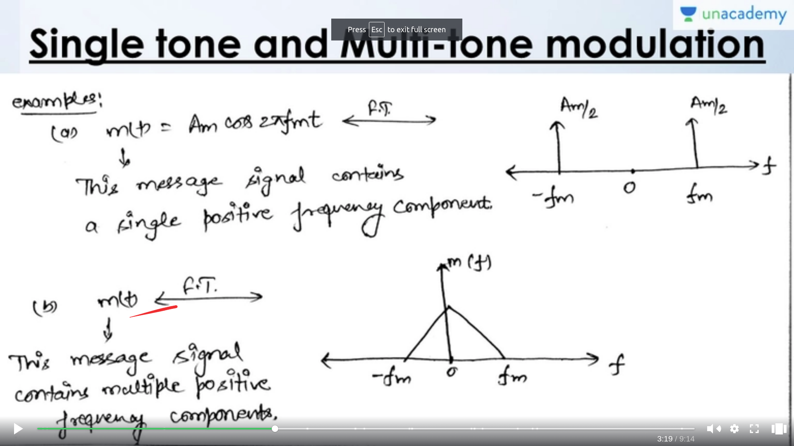
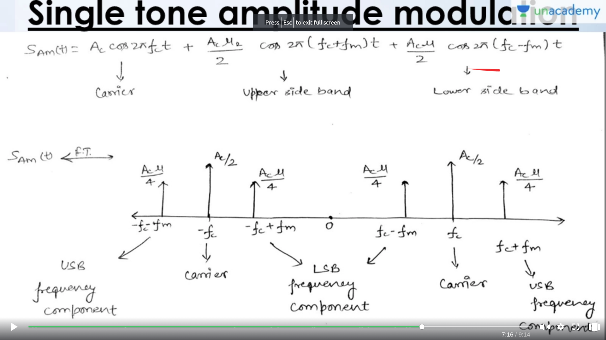
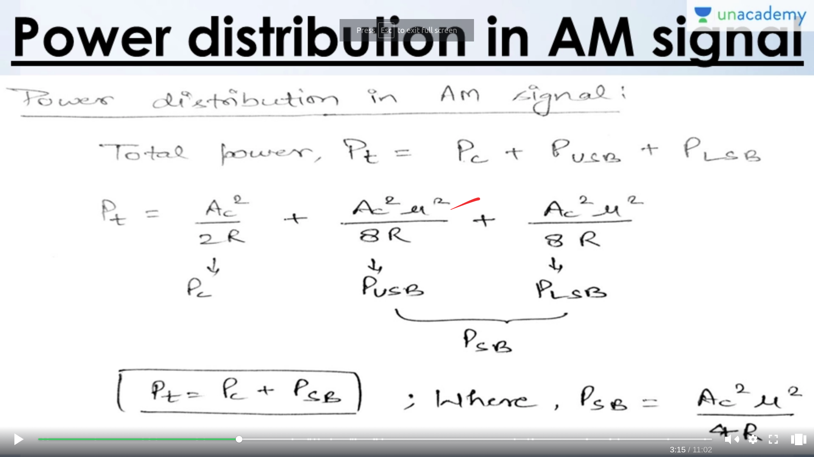
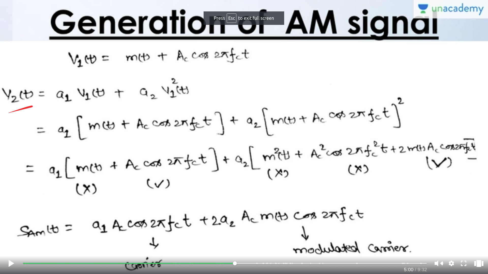
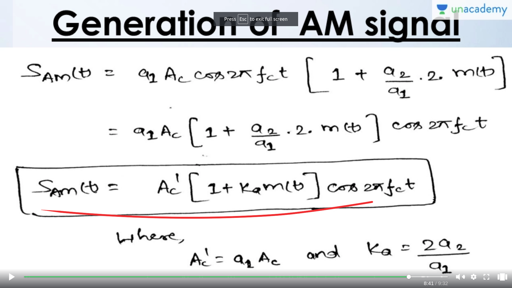

## AM
- To transmit a message signal , high frequency carier is needed
- In AM --> the magnitude of the carrier wave will vary according the the magnitude of the message signal
- The general expression for the amplitude modulated signal is given by

  - )cos(2\pi%20f_c%20t))
  - Here $k_a$ is the amplitude sensitivity
  - if you break it you will get a sum of the carier signal and modulated signal

### Disadvantage
- Bandwith of the amplitude modulated signal = 2 * bandwidth of the message signal
 
### Single Tone and Multi Tone Modulation
- Single Tone Modulation
  - m(t) = $A_m cos(2\pi f_m t)$
  - If we draw the fourier transform from this equation
  - We will only have single frequency
  - Hence it is called single tone

- Multi Tone Modulation
  - m(t) signal here can have multiple frequencies
  - ie from 0 to fm there is a band of frequencies
  - Hence it is called multi tone modulation

- **Note**
  - the frequency transform is take from the modulated signal not the message signal
  - 

### Modulation Index
- $u = K_a * A_m$ is the modulation index
- There are 3 cases
   - u<1 Under Modulation
   - u=1 Critical Modulation
   - u>1 Over Modulation
  
### Lower/Upper Side Band
- Coverting the modulated signal into freq domain
- We obtain two main freq's
   - $f_c + f_m $ ==> Upper side band
   - $f_c - f_m $ ==> Lower side band
- 

### Power distribution in AM signal
- Using the RMS value in the power
- 

### Generation of AM Signal
- Outline of the process
  - First we will sum the m(t) and c(t)
  - And pass it to square law device
  - then pass to BPF
  - and we will get the ans
  - 
  - 

### Square Law Demodulator
- Square Law Device
- LPF
- Sam(t) --> SLD --> LPF --> m(t)
- We would square it again and will get the ans

**INTUITION : Carrier takes up 66.7% of energy of transmision even if the message is modulated at 100% , hence we want to be able to use other signal in order to reduce the energy wasted by the signal**
-> Thus we have the double side band suppressed carrier

### DSB-SC
- Intro
  - We will only transmit the USB and the LSB
  - We will not pass the carrier wave
  - Can be represented by $c(t) * m(t)$
- Generation

- Analysis

- Demodulation
### SSB-SC
- Intro
- Generation
- Analysis
- Demodulation
