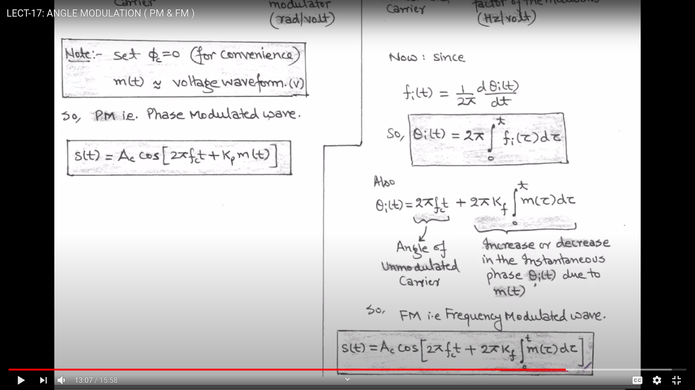
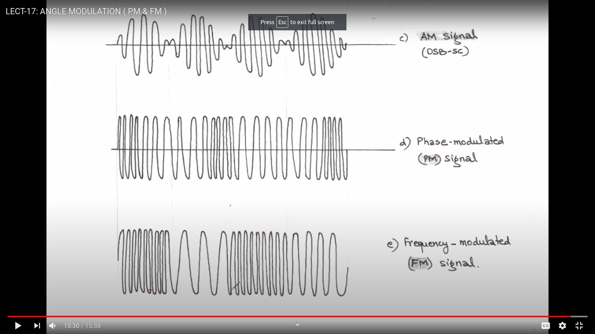
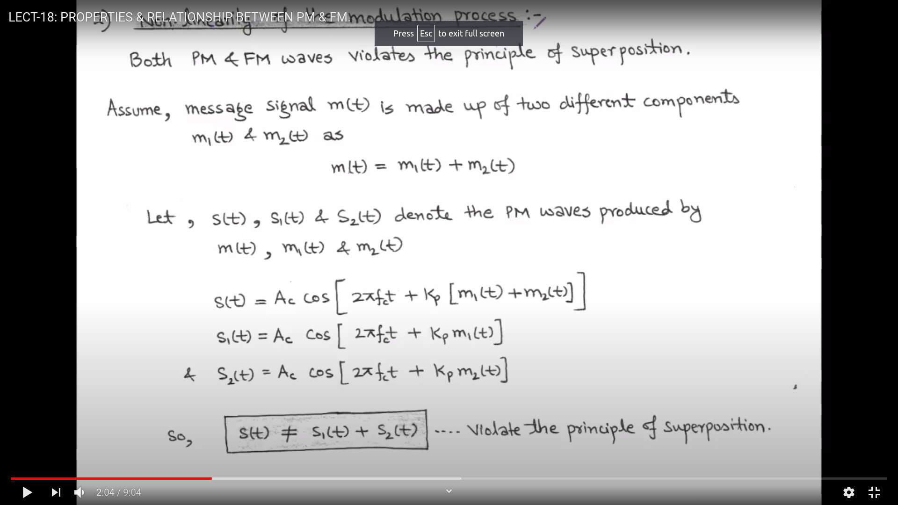

## Frequency and Phase Modulation 
**In case of FM and PM , amplitude remains constant**

### Phase Modulation

**In phase modulation , then angle is modulated according to message signal**

- $A_c = A_c cos(2 * \pi * f_c * t  + K_p m(t))$
   - $ K_p$ : Phase sensitivity of modulator (rad/volt) 
   - here m(t) is the message signal
   
### Frequency Modulation

- $f_i(t) = f_c(t) + K_f m(t)$
   - $K_f$ : Frequency of sensitivity factor of the modulator
   - $f_c$ : frequency of unmodulated carrier

- Now since
   - $f_i(t) = \frac{1}{2 * \pi} \frac{d \theta_i(t)}{dt}$
   - 

### Graphs
- 

### Properties of Angle Modulated Wave
- $P_{av} = \frac{1}{2} A_c^2$
- Average transmitted power of angle modulated is independent of $K_f$ and $K_p$

1. Non Linearity of the modulation process:
- **It does not violate the principle of superposition**
- $m(t) = m_1(t) + m_2(t)$
- 

2. Irregularity of zero-crossing:
- 

3. Difficulty of visualisation of message waveform
- Due to non linearity 

### Relation b/w phase modulated and frequency modulated wave
- $ K_p m(t) <=> 2 * \pi * K_f * \integral{m(T)}dT $

### Single Tone Frequency Modulation
- 