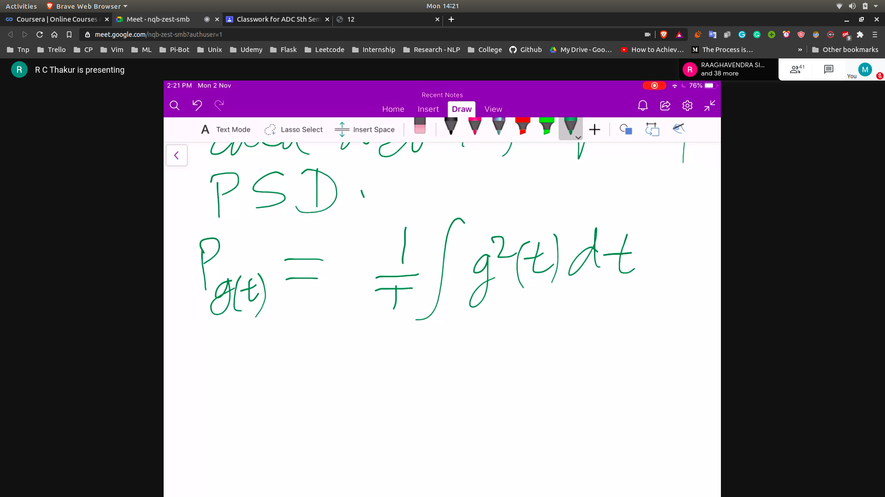
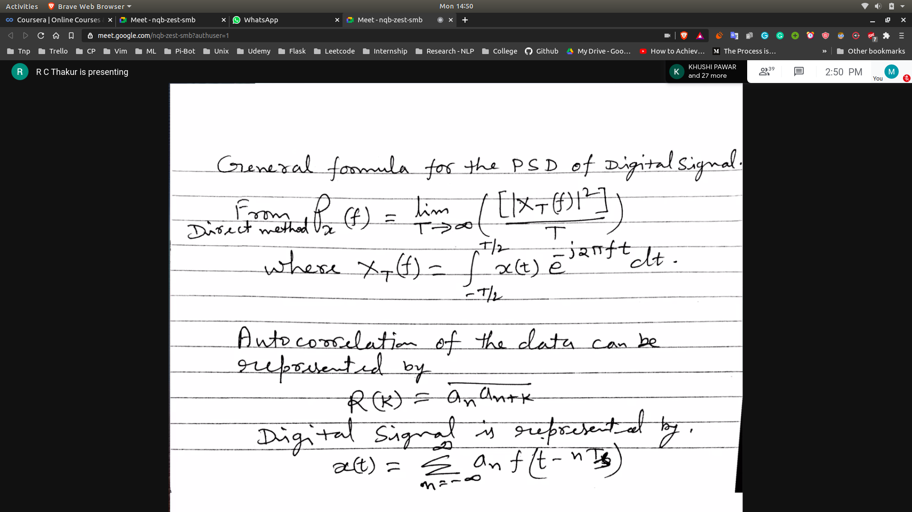
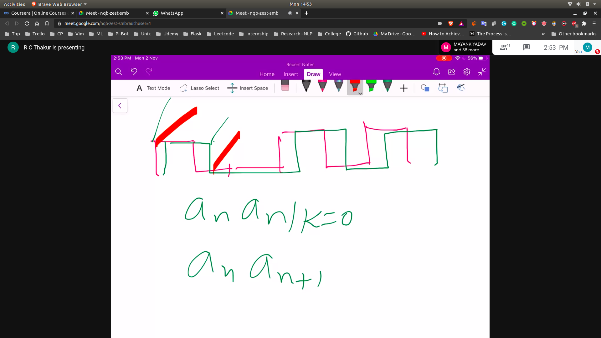

## Frequency Analysis of digital signal
- Here we are going to transmit binary codes word by word
  - 1011101
  - 0100101
- We can get an idea of the freq component of the signal we can have 
- 

### General formula for the PSD
- 

### Autocorrelation
- 
- R(k) = 0.5 $(a_n a_{n+k})$
- 
