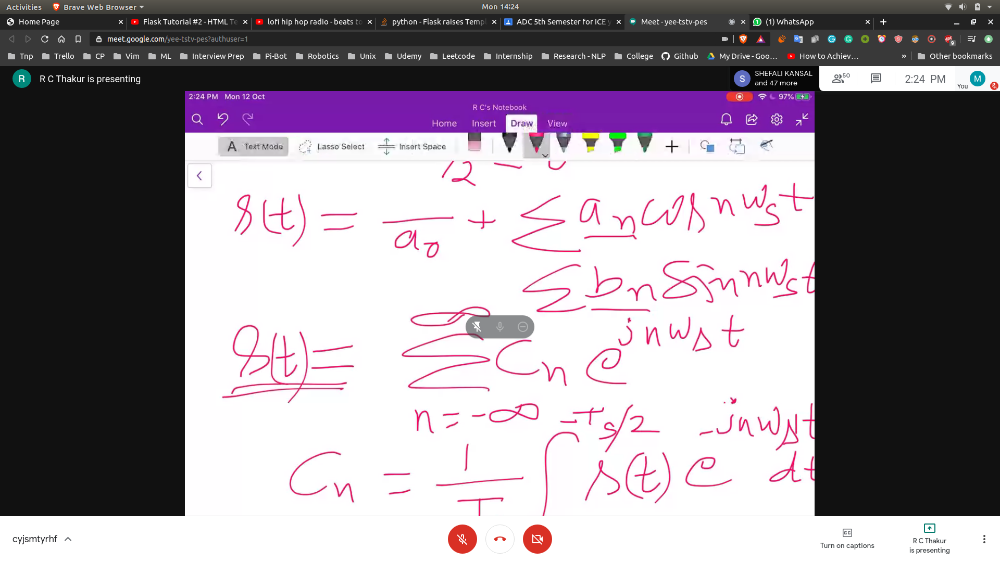
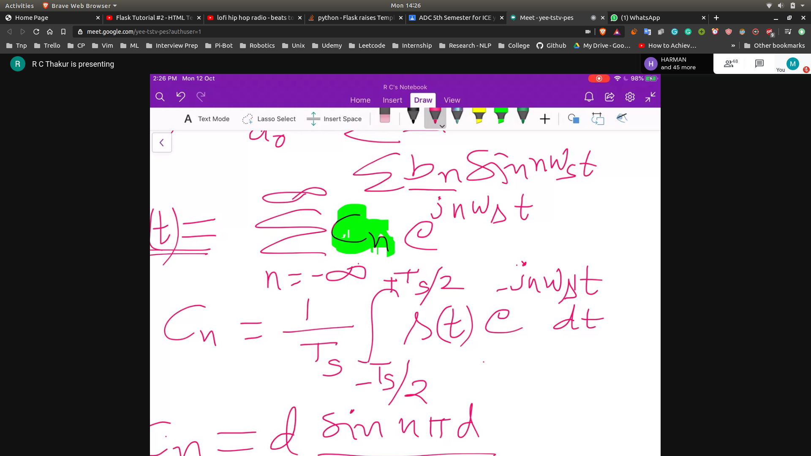
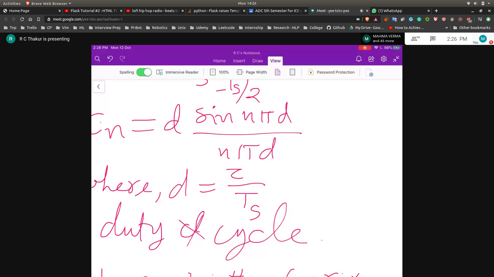
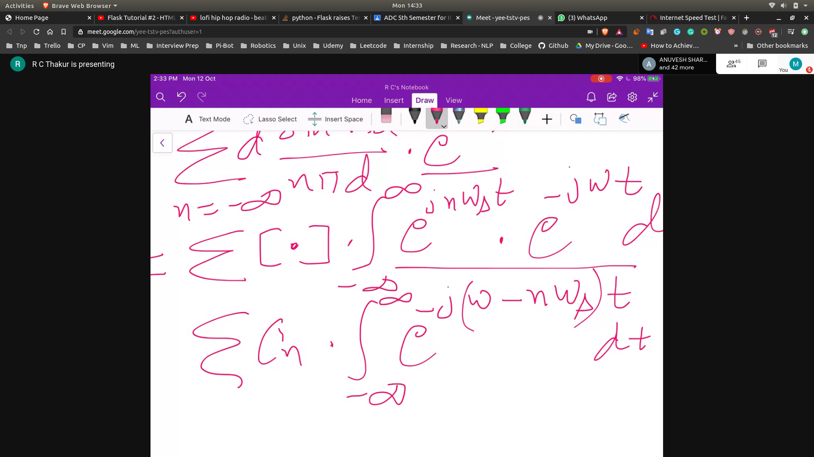
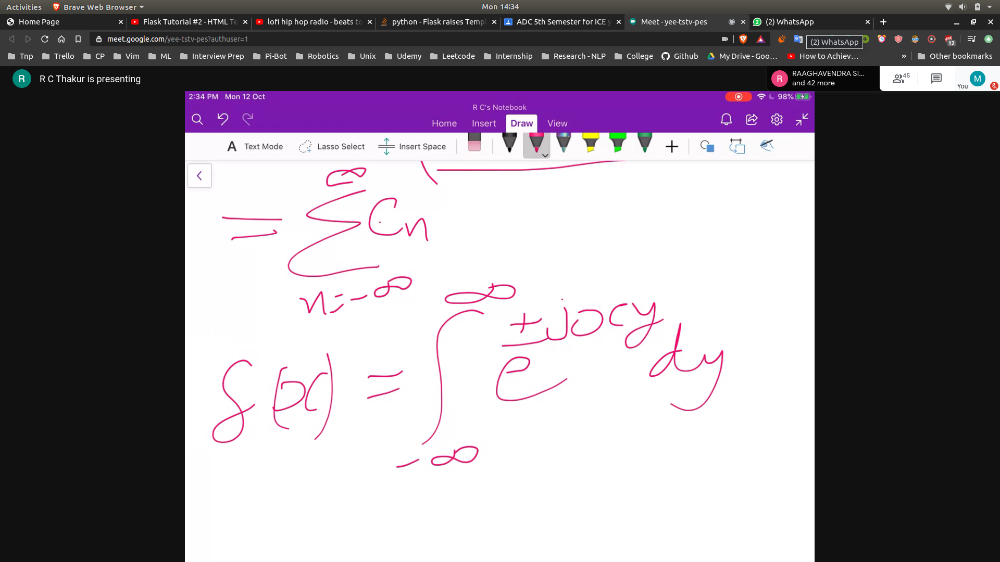
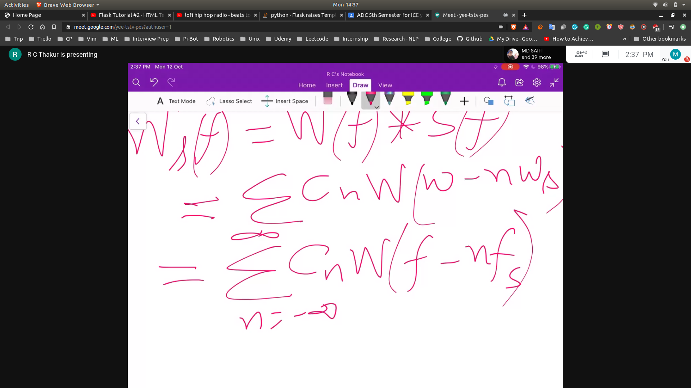
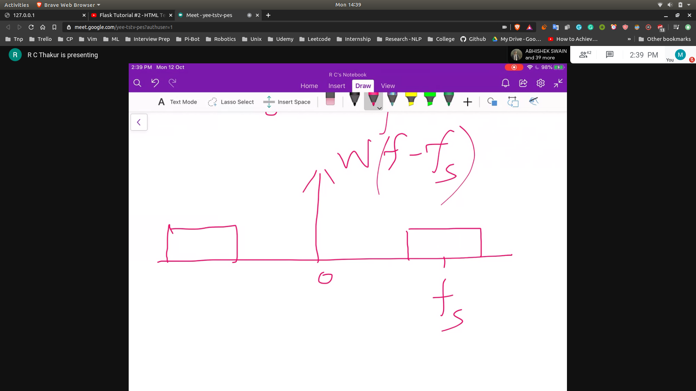
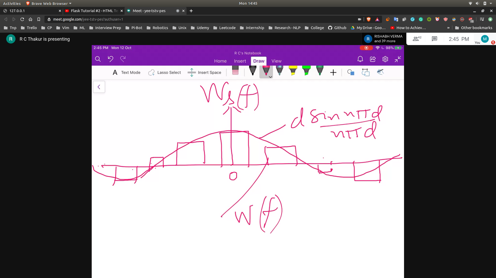
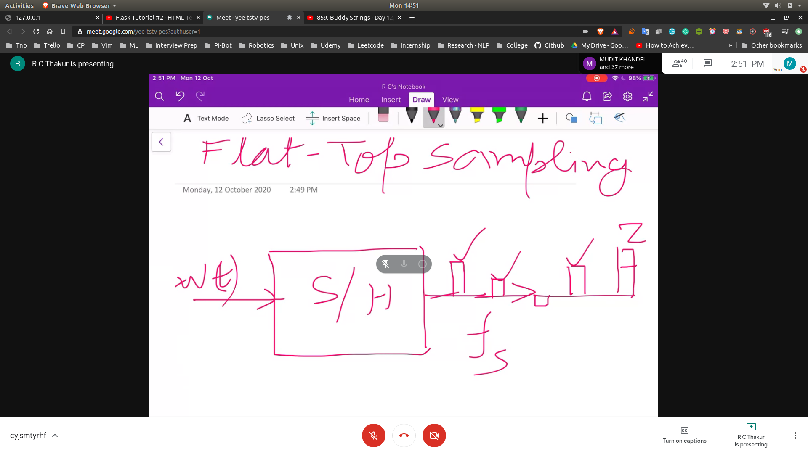
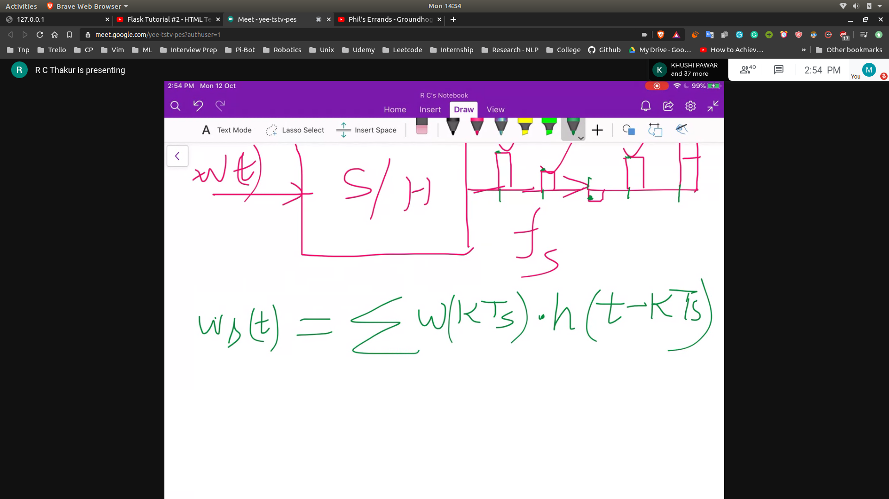

## Fourier Series
- 
- $C_n$
- 
- 
- The fourier transform will come out to be
- 
  - $W_s(f) = W(f) * s(f)$
  - $s(t) = \sum \frac{d sin(n \pi d)}{n \pi d} * \exp{jn w_s t}$
  - 
  - 
  - 
  - 

## Final Graph
- 

## Flat top sampling
- 
- 