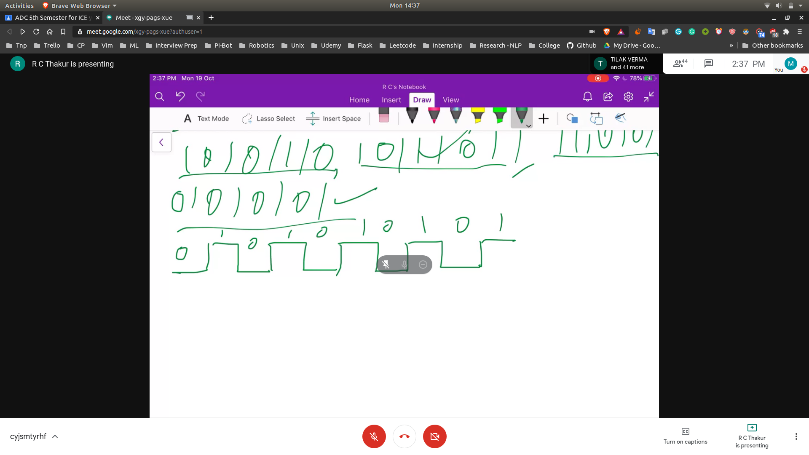
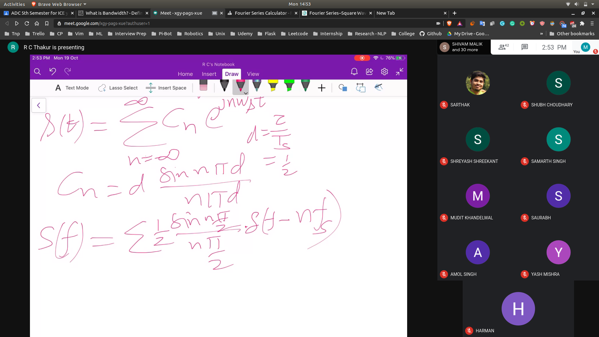

## Bandwidth Requirements of PCM
- The bandwith of the voice signal id 0-4Khz
- The sampling rate should be > 8KHz
- Sampling rate = 8K Samples/Sec
- Quntization = 8bit
- Bit rate = 64Kbit/s

- Now we have some data
 - With 8k samples/sec
 - 8bits sequence will be available
 - 1010101
 - 

- Length of bit duration
  - 15.6 micro sec

- Time Period
  - 32 micro sec

- Fourier Series and Fourier Transform
- 
- Thus the min bandwidth will be 1/Ts = 1/(32 micro sec)
- 31.25 KHz ~= 32 KHz
