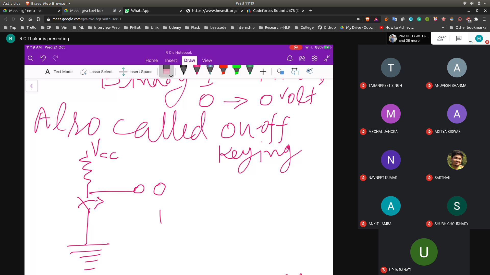
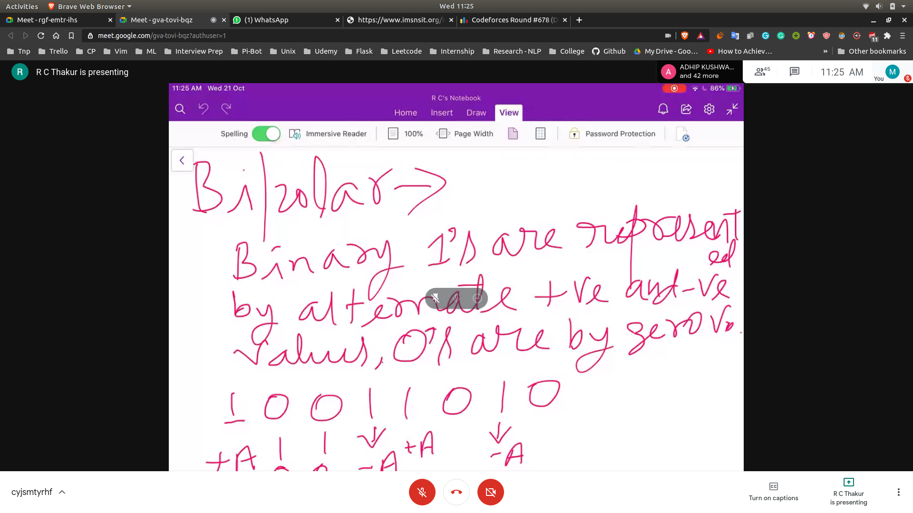
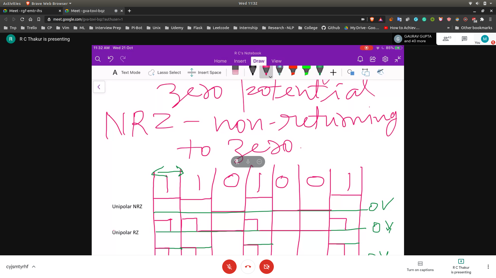
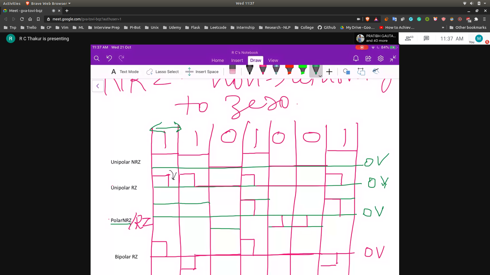
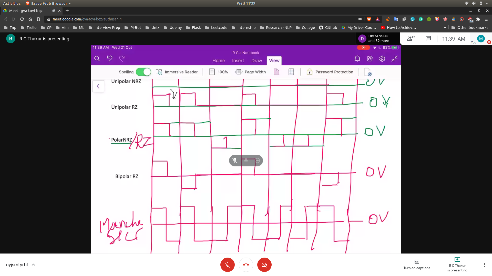

# Unipolar Line Code

- PCM Data is stored in sequence
- When this data is required to be transmitted to the line
- This streams will be transmitted using 0 and 1

## ON - OFF Keying
- 

# Polar
1 -> +A volts
0 -> -A vols

## Bipolar
- 
- Alternative +ve and -ve A's will be there

## Manchester Signalling
- Binary 1 --> +ve half bit duration followed by -ve half of the bit duration
- 0 --> -ve half -> +ve half

## Non Returing zero and returning zero
- 
- 
- 