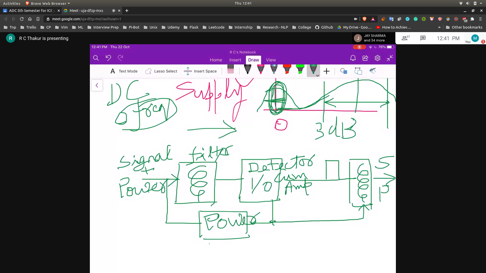

# Characteristics of line code

## Characteristics
```
1. Self Synchronisation
2. Low Probability of bit error
3. Power Supply to Repeaters
  - A --> R --> R --> B
  - R is the repeater
  - It requires power supply for amplification
4. Transmission b/w should be as small as possible
5. Error Detection
6. Transparency in recieved bit pattern
```

### Self synchronisation
- Station A and Station B
- Transmitter A and Recieving B
- Station A and Station B agree upon certain particular line code

### Sampling at Station B
- When the wave reaches station B , the wave has to do sampling
- The sampling has to be done , wrt to a reference point

### Frequency Analysis
- The impulses in the frequency analysis can help us deciding the synchornization

### Solution for the repeaters problem
- We can send DC power supply with the signal
- And at the input of the repeater we will install tranformer coupling
- Which will use the DC power to amplify the signal
- 

### Error Detection
- Already done in manchester signalling

### Transparency 
- A control word is required to be sent to the repeater
- How is it required by the repeater station?
  - To validate the signal elements
  - Basically security