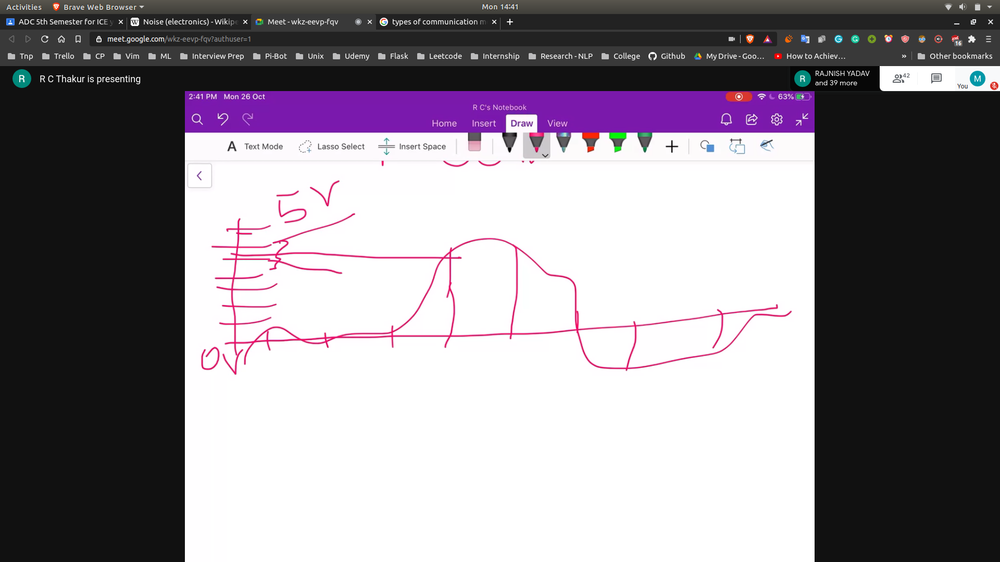

## Effects of Noise

- Main Sources of Noise
  - Cosmic Radiation
  - Heating Effect
  - Sunny Weather

- Mediums
  - Fiber , Ether

- Why do small noise matter?
  - Because of encoding , we have very small step size
  - so it might change the signal

- Types of Noise
  - Channel Noise
    - Noise on media , (copper , ether etc)
  - Noise introduced due to you electronics
    - ADC 
    - quantization error!
    - Transmitter
    - Reciever

- Quantization Noise
  - 

- Max Value of Quant error can be <= step size/2

- Channel Noise:
  - Noise error
     - db = 10 $log_10$ (S/N)
     - 20 $log_10$ (S/N)
     - $P = I^2 R$
     - Hence we consider the 20 log 10

- Ration of revovered analog sinal power to the total average noise power
- prob of bit error
   - [bit-prob](bit-prob.jpg)
