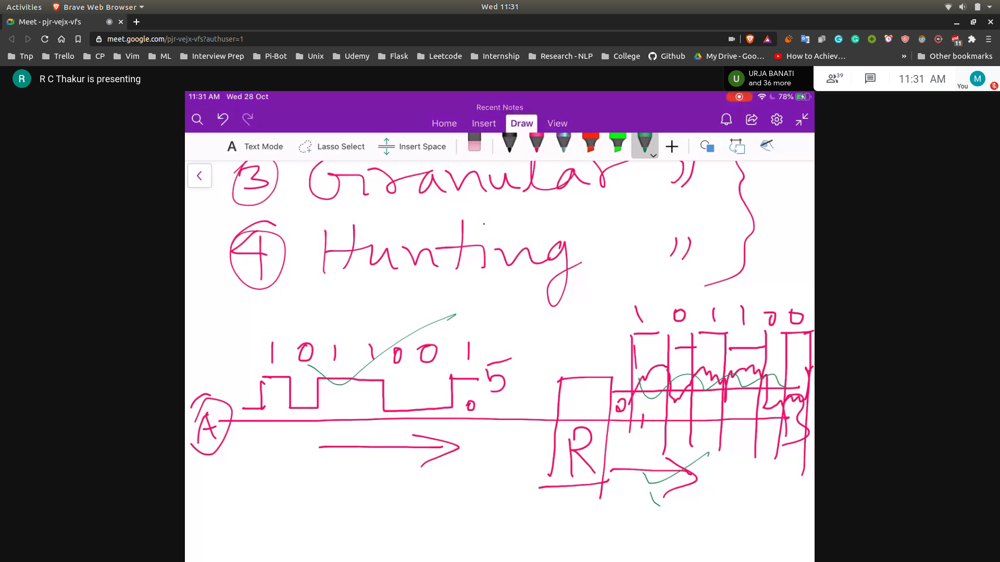

## How to reduce channel noise?
- Using repeaters will reduce channel noise
- The signal will be distorted when it reaches the repeater
- The repeater will identify the signal and generate the same signal
- 
- Media bit error will be modified

## Quantization Noise
- Resoltion will depend on $(V_r)/(2^n)$
- Non - Linear Quantization is achieved in the 95 % region to reduce error

## Overload Noise
