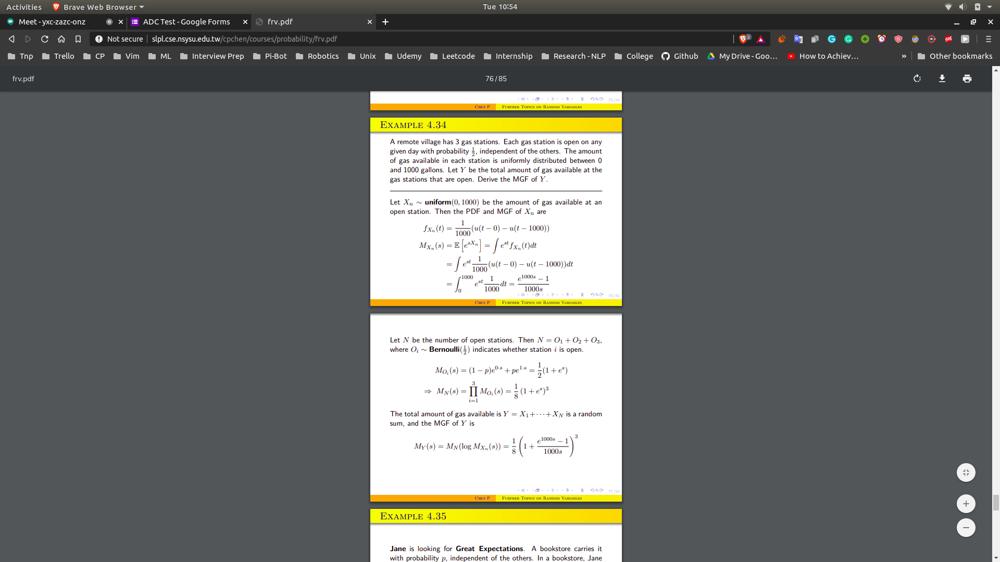

# Properties of Transform
## Prob
- y = ax + b
- $M_y(s) = e^{bs}E[e^{axs}]$
- which is equal to
- $M_y(s) = e^{bs}M_x(as)$

## Prob
- z = x+y
 - $M_z(s) = E[e^{zs}]$
 - $E[e^{x+ys}]$
 - $E[e^{xs} * e^{ys}]$
 - $E[e^{xs}]*E[e^{ys}]
 - $M_x(s)*M_y(s)$

## Prop
- z = x1 + x2 + ... + xn
 - $M_z(s) = M_{x1}(s) * M_{x2}(s) ... * M_{xn}(s)$

- z = X1 + X2 + x3 ... + XN
 - Sum of random number of independent of Ind random variables
 - The value of $M_n(s)$ = $E[e^{sn}]$ , except $e^{s}$ is replaced by $M_x(s)$

## Prob
- A remote village has 3 gas stations and each one of them is open on any given day with prob , 1/2 independent of others. The amount of gas available in each gas station is unknown and is known and is uniformly distributed b/w 0 and 1000 gallons.
- What is the distribution of the total amount of gas available at the gas station that are open.
- 
