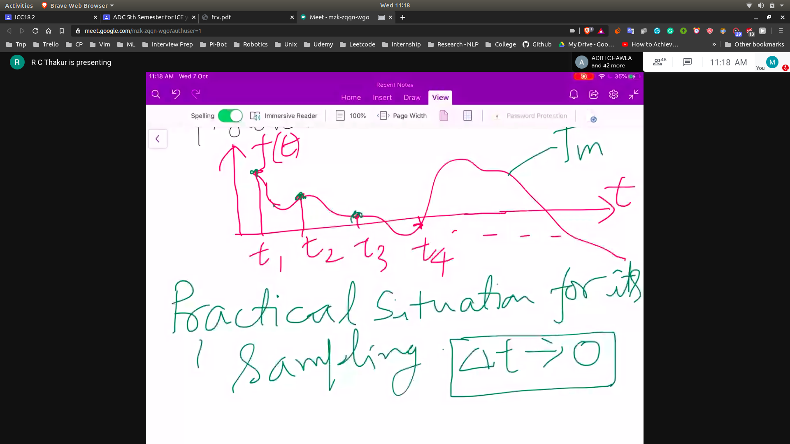
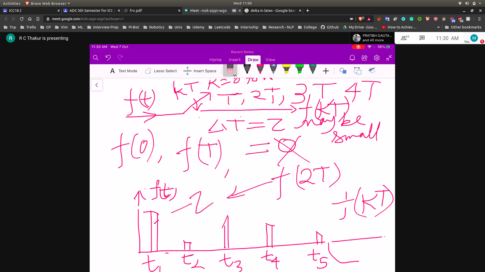
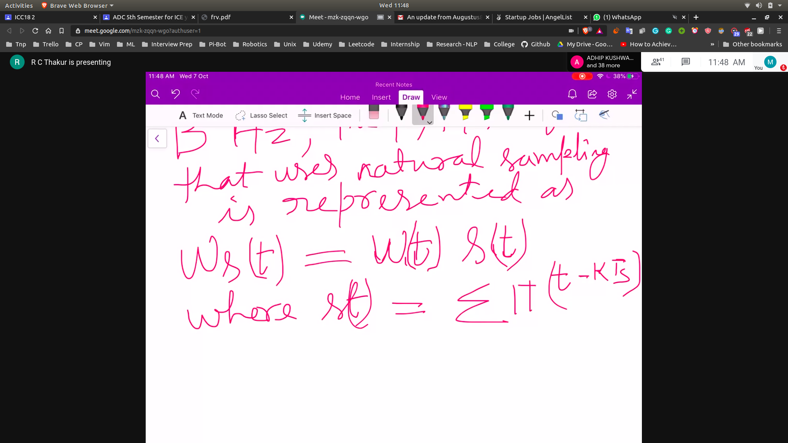
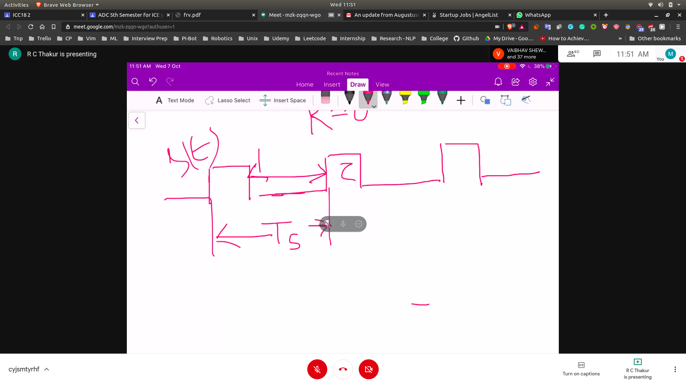

# Pulse Amplitude Modulation
- Some time will be taken after the activation of device at t1
- Hence the real time taken for measuring will be t1+$\delta t$
- 

## Natural Sampling
- We can simply have a switch for doing this thing
  - f(t) ---> kT ---> T,2T,3T
  - Basically open the switch when t = kT 
  - Thus the f(t) signal will be sampled at only that points where the switch is open
  - The switch will remain open untill you release (lag of $\delta z$)
  - Output will be something like this 
  - 
  - This type of sampling is called **Natural Sampling**
     - Here the top part is inclined or rounded

## Instantaneous Sampling
- When the magnitude of the top is contant during a impluse
- We call it Sample and Hold
- f(t) ---> |S/H ckt| ---> $f_s(t)$
- Whatever is detected at time T , will be hold for value T + $\delta T$
- Magnitude of the pulse is there according to instantaneous magnitude of analog signal

# Frequency Analysis of PAM'S

## Natural Sampling
- If w(t) is an anlalog signal waveform
- 
  - 

- So what is the fourier transform for $W_s(f)$