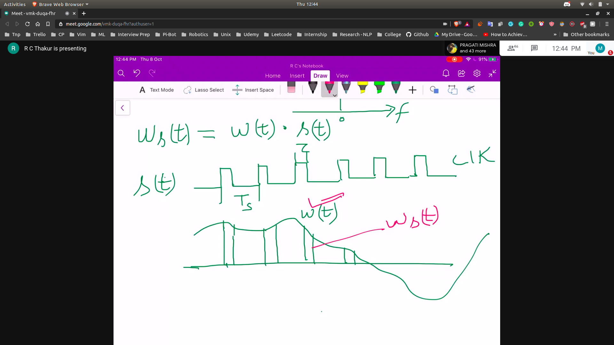
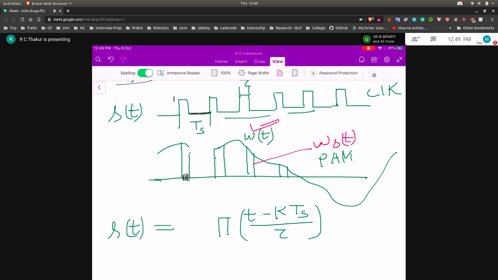

# PAM Recall
- Representing the sampled time wave in frequency
- The sampled time wave is $w_s(t)$
- This is equal to $w(t).s(t)$
- $s(t) is the clock signal$
- 
- wst is the PAM , pulse amplitude modulated signal
- 
- K = $-\infty$ to $\infty$
- W_s(f) = W(f) * S(f)
   - convolution
- s(t) = $a_0 + /sum a_n cos(nw_0t) + /sum b_n sin(nw_0t)$
