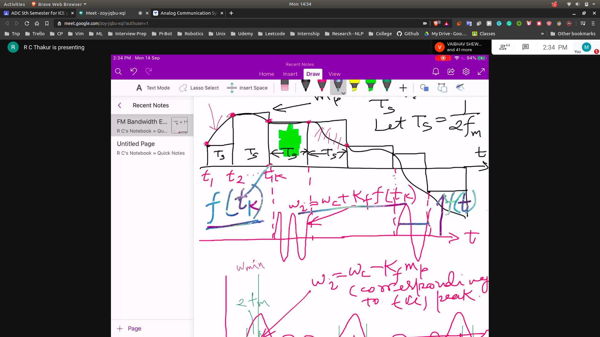
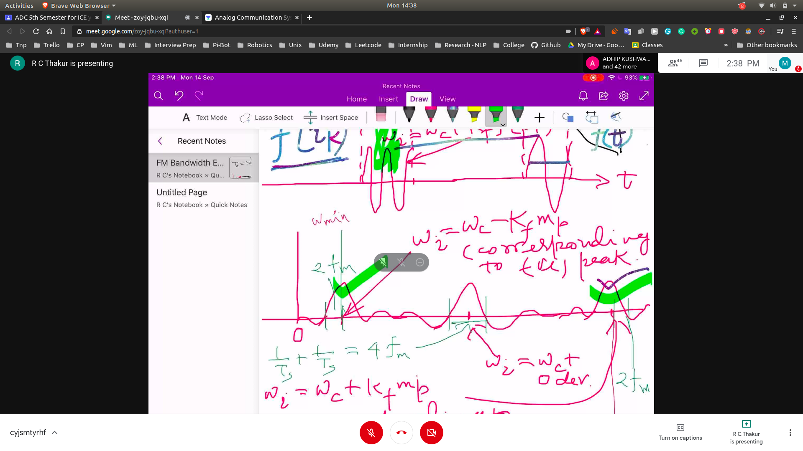
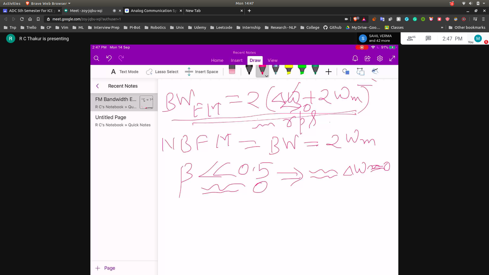

## Uptill Now sampling is done
- We also use sampling for transmission
- That is we have only the sampled version of the signal , then we can recover the signal

### Bandwith Estimation

- While taking the sampling at time tk
- The frequency of the carrier wave is w2 = wc + Kf * f(tk) 
- The carrier wave frequency will inc or decrease with the magnitude of the signal wave
- 
- 
   - the middle peak corresponds to zero devidation
   - the right peak corresponds to the pos deviation
   - the left peak corresponds to the neg deviation
- A zero crossing will be a point in which peak touches zero it is equal to 1/Ts
   - 1/Ts + 1/TS
- The bandwith will be
  - wmax - wmin + 2fm(due to zero crossing) + 2fm
  - wc + Kp * fm - wc + Kp * fm + 4fm
  - is equal to (2 * wc + 4 * fm)
  - BWfm = 2( delta w + 2* wm)
 

### Comparision with NBFM 

- Now if we put delta w == 0
  - as we said there will be no higher harmonics so delta w = 0 
  - in the formula of BWfm then we should obtain NBFM
  - but we don't obtain due to approximation in sampling
- 

- Hence we have to do correction (Carson's Rule)
- 
- This is also applicable to wide band FM
