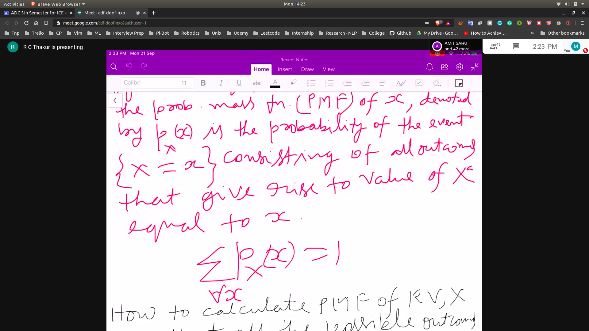

# Random Variables

- A RV is a function whose values , x are real number of depends on chance
- RV can be discrete or continous
- Discrete RV can be tossing of the coin
- Discrete RV can be tossing of the dice

- Properties
  -  the number of values for which the prob. diff from 0 is finite
  -  P(a < x <= b ) == 0

## Discrete RV
- It can be characterised by prob mass function
- 

### PMF
- It is the summation of the values for which the probability of x is equal to X = 1
- 

### How to calculate PMF
- Calc all the possible outcome that give rise to the event x = X
- Add the probabilities of all the elements to get the PMF

### Example

- 2 independent tosses of a fair coin
- Let x be the number of heads obtain
   - if x ==0 prob = 1/4
   - if x ==1 prob = 1/2
   - if x ==2 prob = 1/4
- 

- Now if we say P(X>0) == 3/4 (1/2 + 1/4)

## Popular Dicrete Variables
- Bernauli Random Variable
- Binomial Random Variable
- Geometrical Random Variable
- Possion Random Variable

### Bernauli

- has only 2 values like tossing of the coin
- 

### Binomial

- 
- 

### Geometric

- 

### Poisons
- FLAG101
- apply when n is infinity
- 
