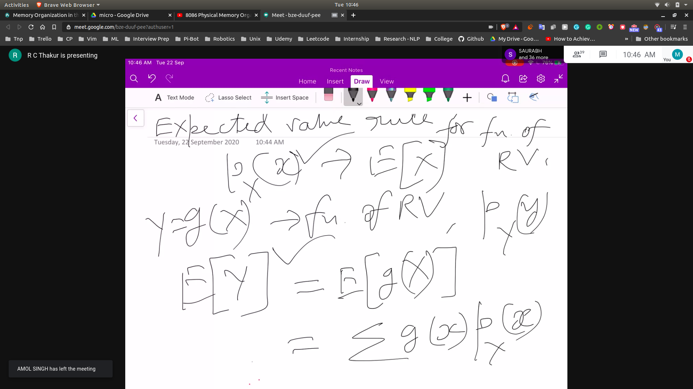
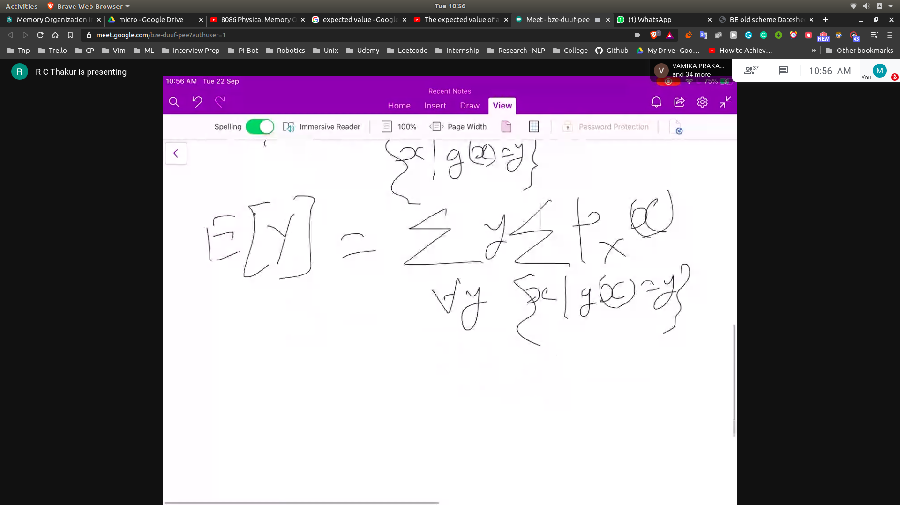

## PMF of a random dependant variable

- Let's suppose x = [-3 -2 -1 0 1 2 3]
   - let's suppose p(-3) = p1
   - p(-2) = p2
   - p(-1) = p3
   - p(0)  = p4
   - p(1)  = p5

- Let's suppose y = $x^2$ = [0 1 4 9]
    - Now the p(0) = p4
    - p(1) = p3+p5

## Parameters of Random Variable

- PMF
- Mean
- Variance
  -  smaller---mean---higher
  -  $E[(x - E[x])^2]$ = variance
- Stnd Deviation
  - $(var)^(0.5)$ = SD
- Moment
- Expected Values , Expectation
   - $\sum x.p_x(x)$ = Mean = E[x]
   - Mean is the first expectation

- 
- prof in exam
- 