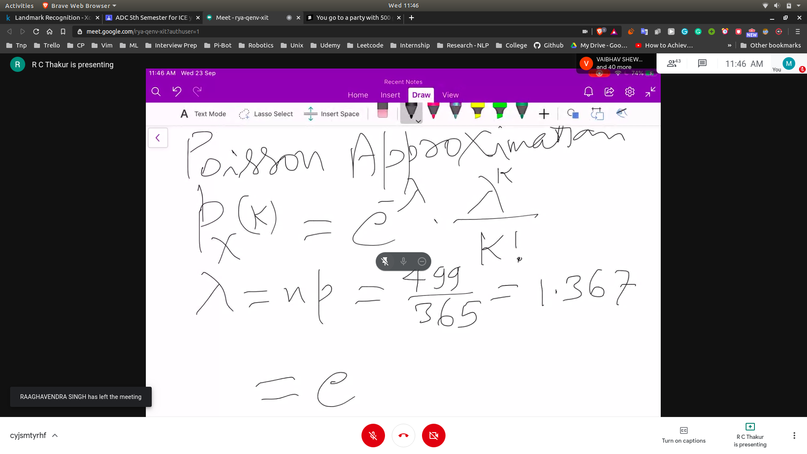

# Examples of Discrete Random Varibles

1. You go to a party with 500 guests . What is the probability that exaclty one other guest has the same birthday as you?

- P(your birthday) = 1/365
- 500 - 1 ==> 499
- n ==> 499
- 499 experiments

- Binomial Method
  - $499_c_1$(1/365)$(364/365)^498$
  - = 0.3486

- Poisson Approximation
   - 

2. Let a and b be the +ve int with a<=b and let x be the RV that takes as values equal prob the powers of 2 in the interval [$2^a$,$2^b$].Find the expected value and variance
- p(x) is x is in the interval then p(x) = 1/(b-a+1)
- otherwise p(x) = 0
- so the expectation will be
  - 2^a + 2^(a+1) + 2^(a+2) .... 2^(b) / (b-a+1)
- Variance = E[$x^2$+$u^2$ - $2 * x * u$]
  - E[$x^2$] + $u^2$ + E[$2 * x * u$]
