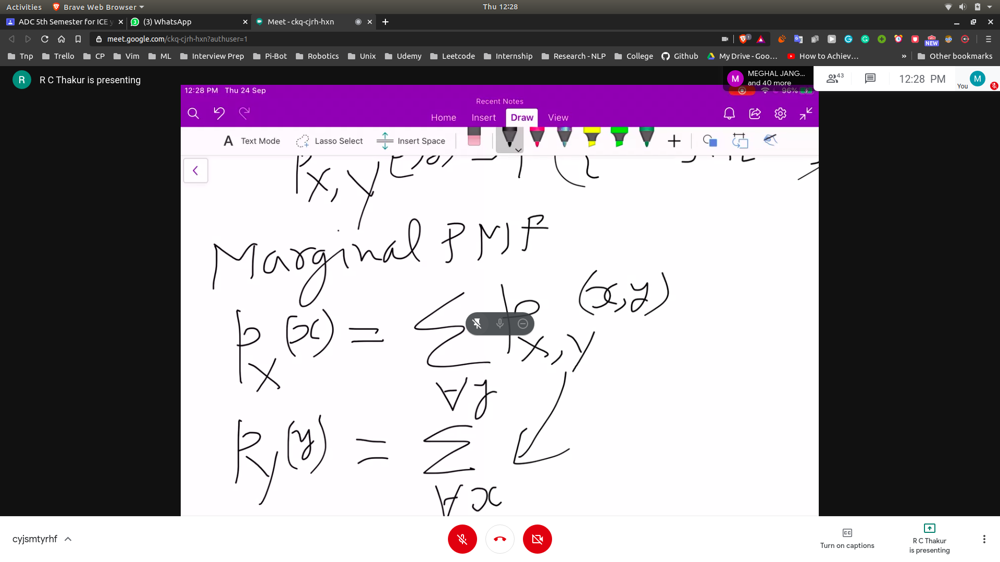
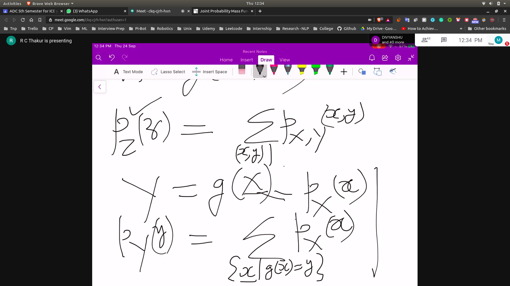
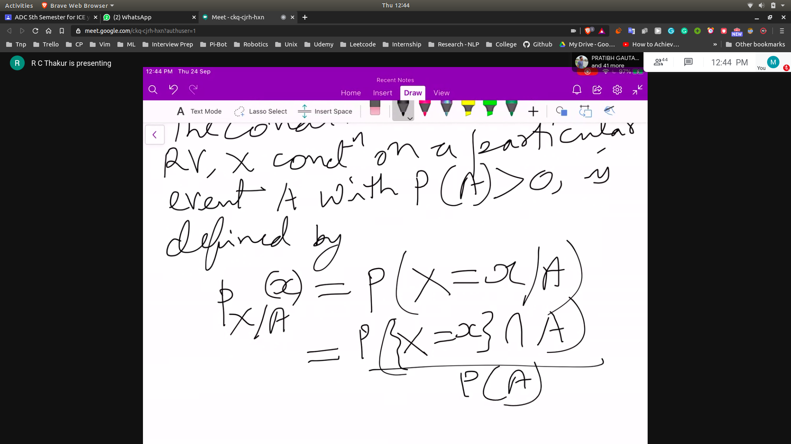
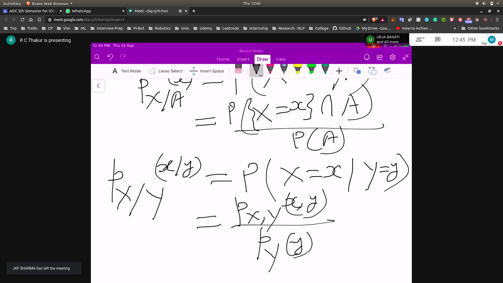

## Joint PMF
- Joint PMF fo two dicrete RV's X and Y
  - pxy(x,y) = p(x=x,y=y)
- for all pairs of numerical values (x,y) that x and y take
  - px,y (x,y) = p(x=1,y=y)
  - px,y (x,y) = p(x=x,y=1)

## Marginal PMS
- 

## Function of Multiple RV
- Z = g(x,y)
- A = g(x,y,z)
- 
- E[g(x,y)] = $\sum g(x,y)p(x,y)$ for all pairs (x,y)

## Conditional RV
- 
- 

## Total Expectation Theorem
- Let A1,A2,A3 be the disjoiint events that form a partition of the sample space and assume that P($A_i$)>0
 - for all i
 - Then E[x] = $\sum P($A_i$) E[x/Ai]$ for i=1 to n
 - The unconitional average can be obtained by averaging the conditional averages
 - $/sum xp(X)$ for all value of x

- Try to prove it

## Independece of a random variable from an event A
- p(X=x and A)
