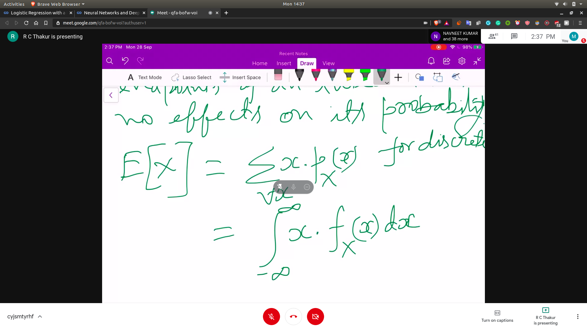

## Continous Random Variable

- A random variable is called continous if it's probability law can be described in terms of a non negative fn,f(x) called Probability Density Function (PDF)

- P(x belonging to B) = integral of f(x)dx
- 
- Hence value of any integral from a to a will be zero

### Example
- Probability of room temp 30 degress exact it is zero
- Other wise if you say it is an interval , then you will get some value less than 1

- **Including and excluding the end point of the interval have no effect on the probability**

### Expected Value
- 
- expected value for a polynomial will be g(x) instead of x in the formula
### Variance Value
- 
- **Variance of random variable**
- 

## Popular Continous RV
- Exponential RV
  - Has a PDF of the form
  - 
  - where $\lambda$ is a +ve parameter
  - E[x] for exp RV
- 