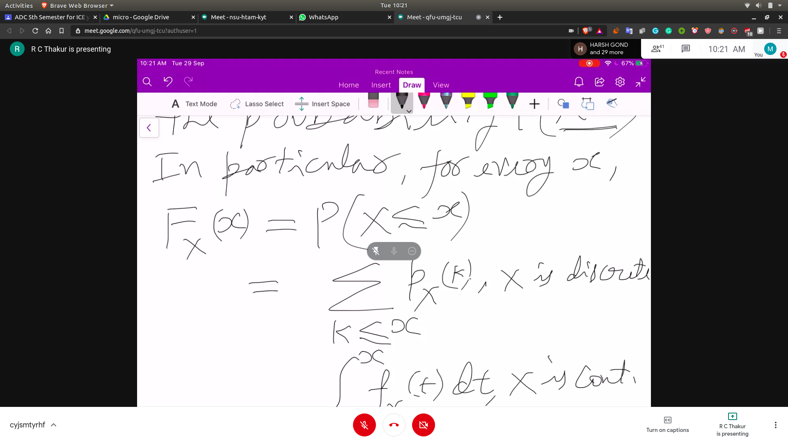

# Cumulative Distribution Function (CDF)
- The CDF $F_x(x)$ accumulates probability upto the value x
- 
## Properties of CDF
- Fx is monotically non-decreasing function
 - Fx tends to 0 as x-> -inf
 - Fx tends to 1 as x-> inf

- If x is discrete , then Fx is piecwise linear
- If x is continous , then Fx has a continous varying form
- If x is dix and takes integer values , then the CDF can be calculated like
 -$F_x(K) = /sum{-inf}{K}p_x(K)$

### Calculate PMF out of CDF
- For integer values
- For continous values

## Normal Random Variable

