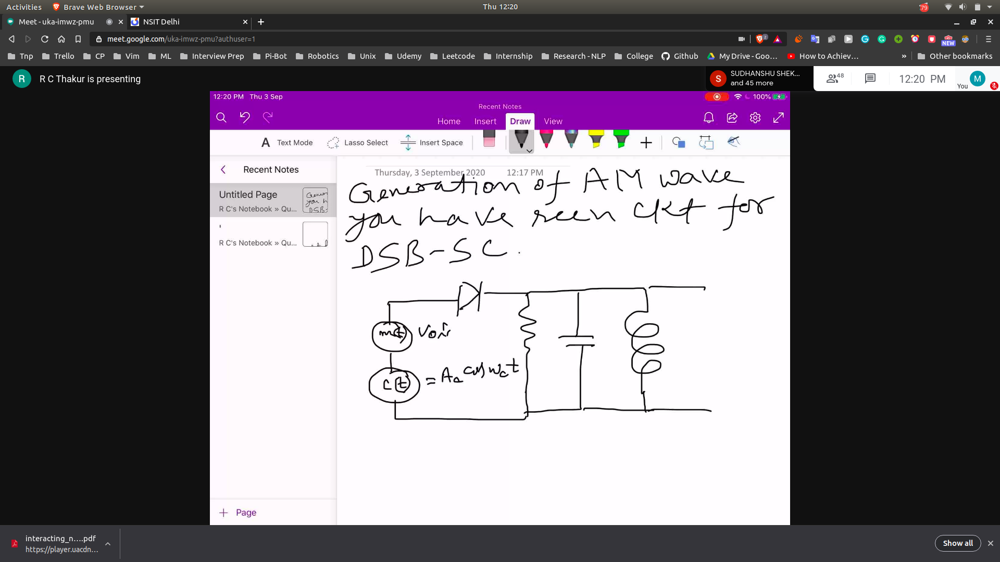
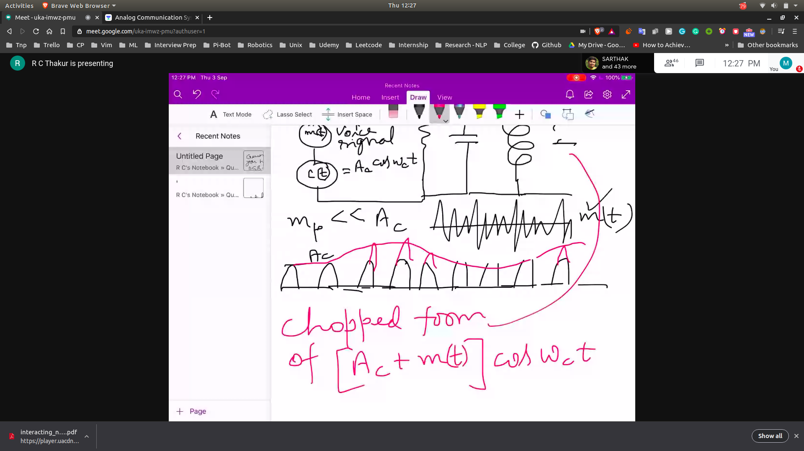
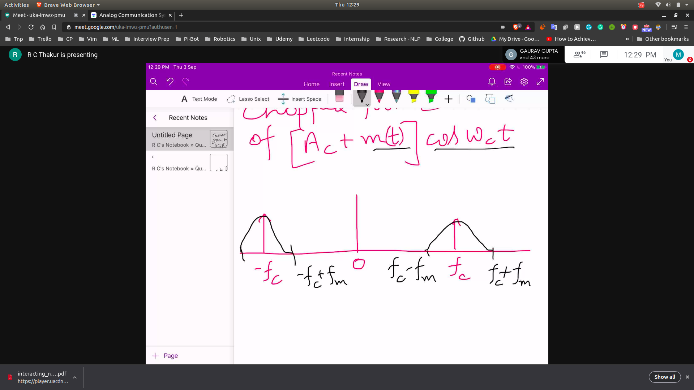
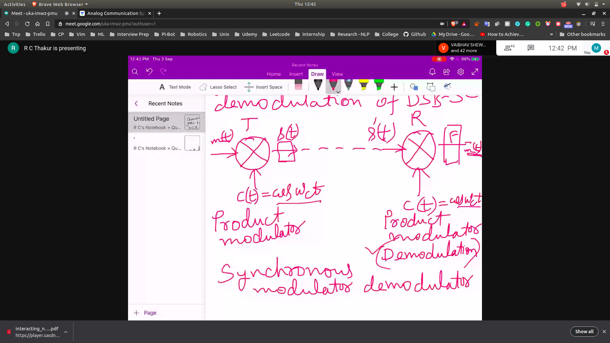
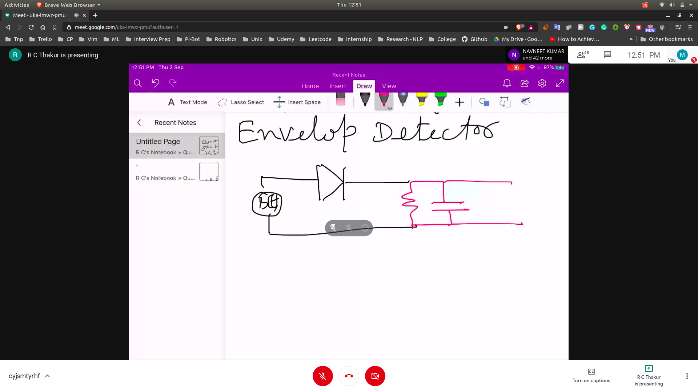
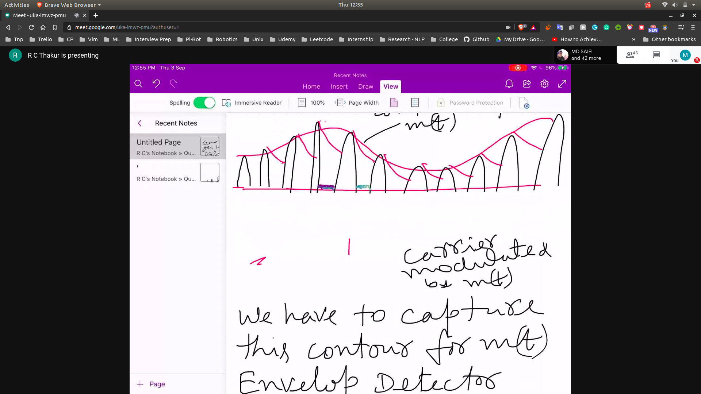

# Generation of AM Wave
- In the circuit the c(t) ==> carier signal
- Voice signal ==> m(t)
-  
- output is chopped form of [AC + m(t)]coswct
- 
- output in the form in frequency
- 

## Demodulation of DSB-SC
- 
- in order to do demodulation , we have to capture the contour of m(t)
 - **Called Envelop Detector**

## Envelop Detector
- first we pass it though diode , then we will only get the positive half cycle
- then we can pass it though the RC filter
- 
- so when we pass Rc filter , we will get a ripple and the envelope
- 
- Time constant condition for RC
  - 1/wm >> Rc >> 1/wc

## Vedio for RC Filter
- [here](https://unacademy.com/lesson/envelope-detector/80FA0FRM)
