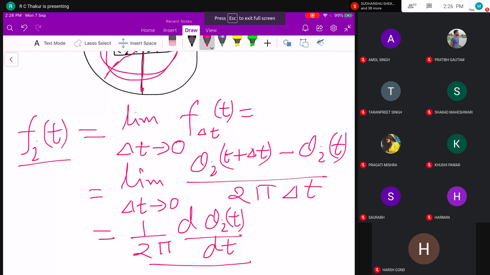
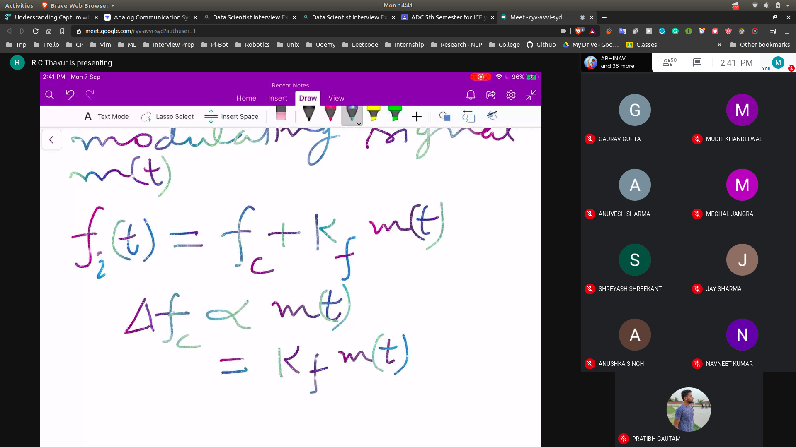
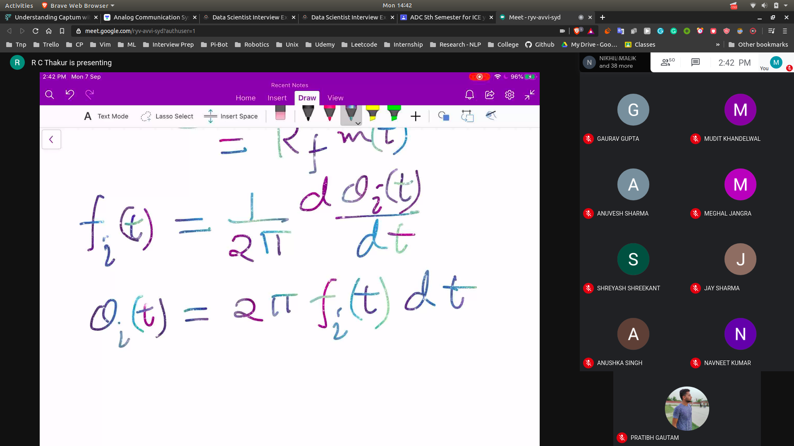
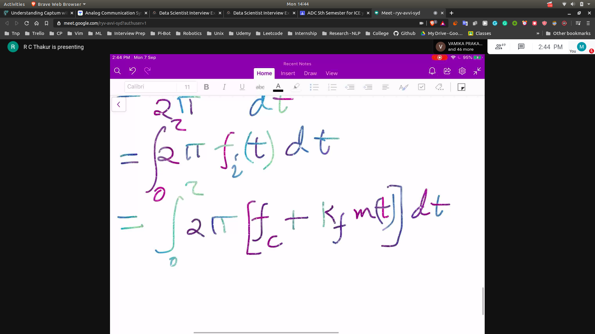
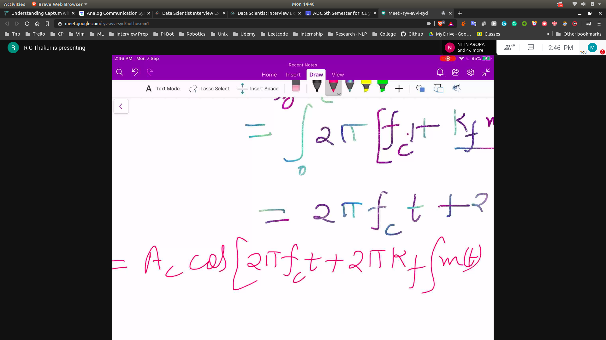

## Angle Modulation
- Angle of carrier wave is carried in accordance with the modulating signal

## Intro
- We say here that the general formula for the signal is Acos(theta(t))
- At any point the wi = d theta / d t
- 
- Hence **instantaneous frequency** is given by fi = d theta/(2 * pi * dt)
- Further you can write the equation as 
  - A cos( 2 * pi * f * t  + theta_c)
  - so we can vary frequency and theta_c

- So we have FM and PM ( Phase modulation)

## Phase Modulation
- phi_c = kp * m(t)
- here the angle is varied linearly with m(t)
- so phi_i(t) = (2 * pi * fc * t ) + (kp * m(t))
- so the signal can be written as
  - Ac cos[(2 * pi * fc * t) + (Kp m(t))]

## Frequency Modulation 
- fi(t) is varied according to modulating signal at m(t)
- 
- 
- 
- 

### FM AND PM ARE RELATED
- If we inc the value of PM>360 , then freq will inc.
