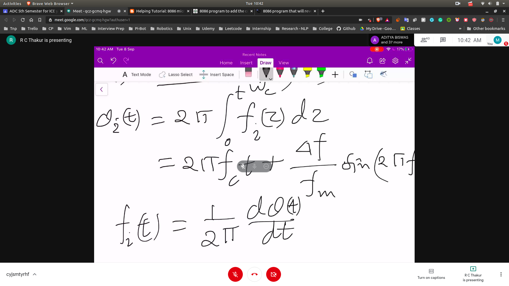
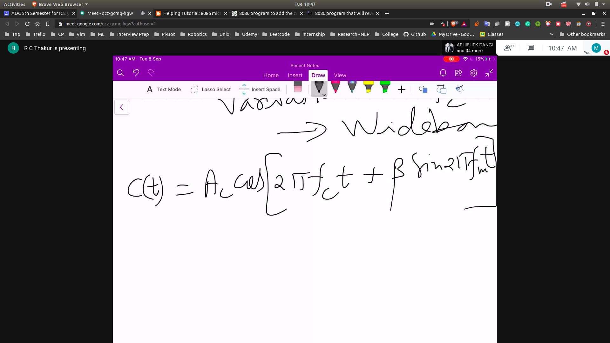
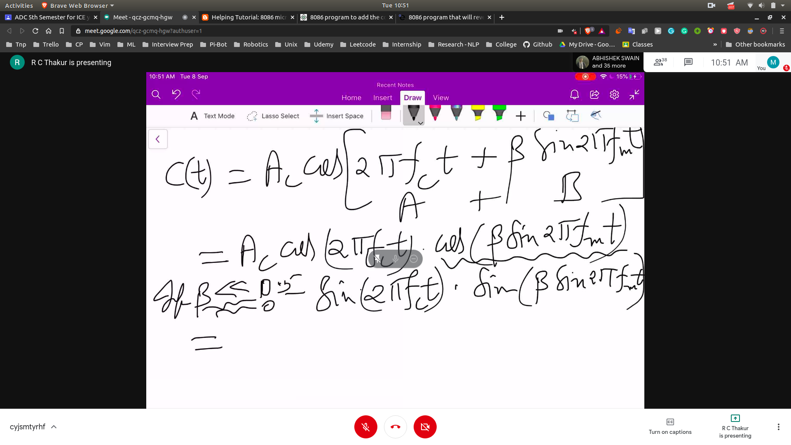
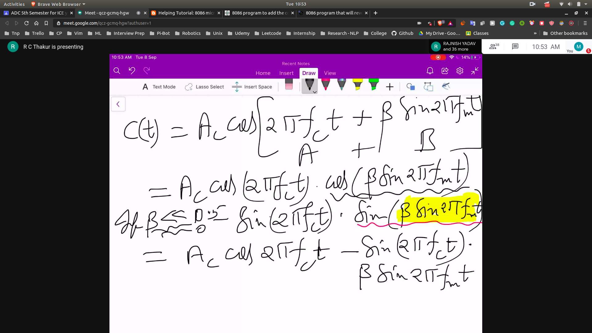
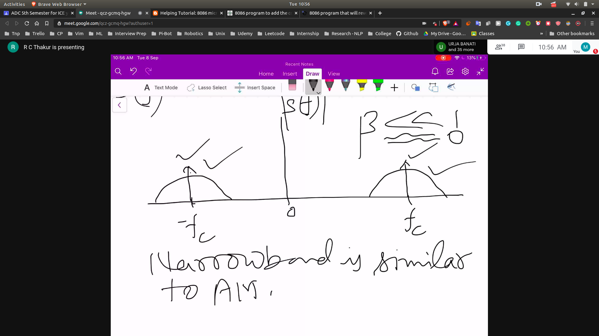

# Analysis of FM and PM

## Modulation Index in FM and PM

- We have assumed m(t)
  - m(t) = Amcos(wm * t)
- f(t) = f_c + K * Amcos(wm * t)

### Frequency Deviation
- delta_f = K * Am
- delta_f = can take values max and min depending on the values of magnitude of m(t)
- c(t) = Accos(wct) + phi_0
- 
- here delta_f/fm will be called modulation index==>beta
- if beta is small then it is called -> **Narrow Band**
- if beta is large then it is called -> **Wide Band**

## Carrier Wave
- The final carrier wave can be written as 
 - 
- Expanded form
 - 

## For Narrow Signal
- cos(theta) --> 1
- sin(theat) --> theta
- 

## In terms of freq band
- 
