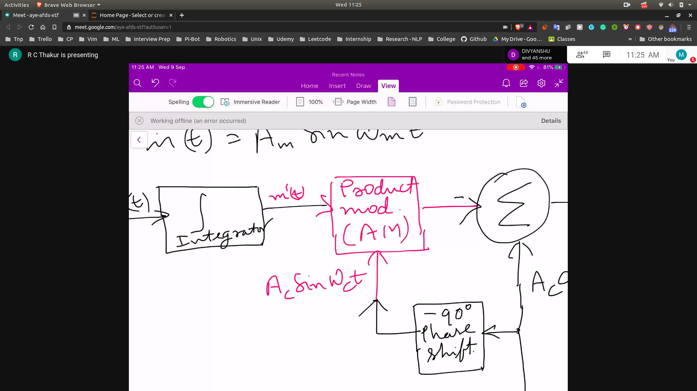
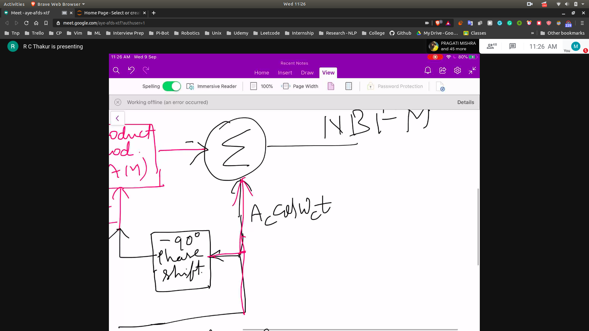
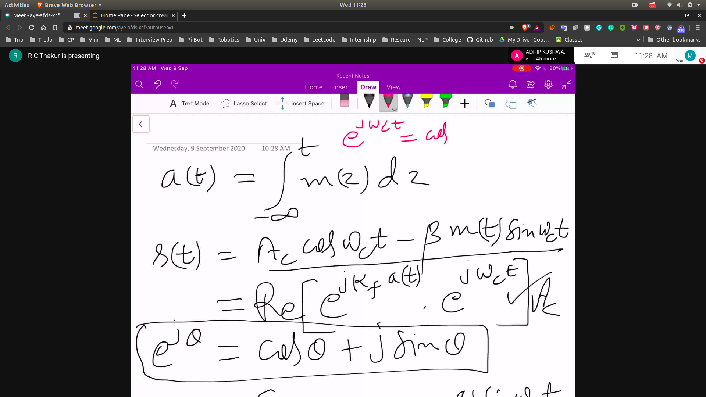
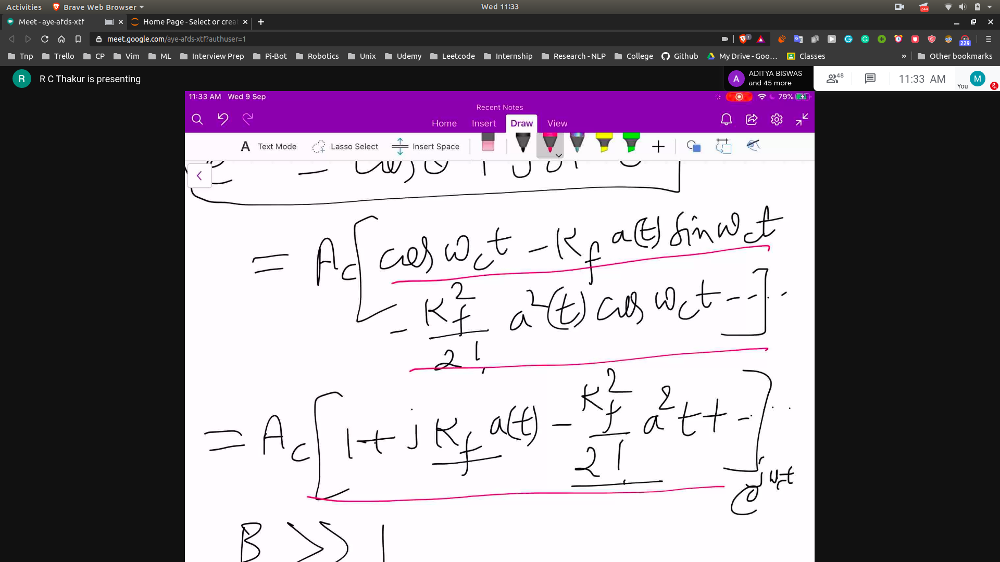
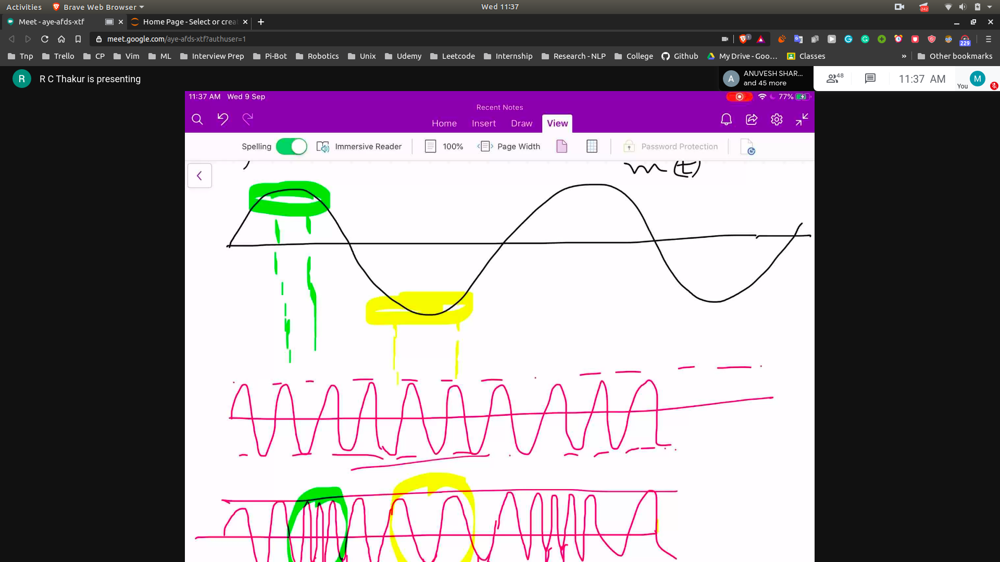
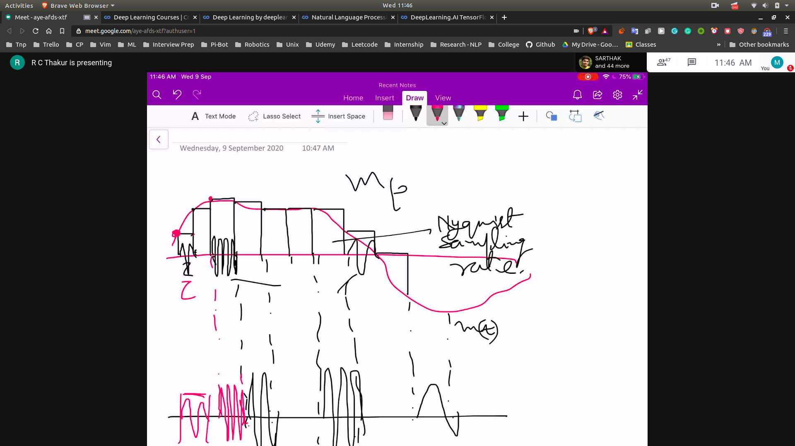

## How to realize narrow band FM?
- 
- 

## Complex form of Equations
- 

## We expand using Fourier
- 

- FM is non linear
- So it's banwidth is different to represent

## How does FM Wave looks?
- 
- BW ==> is tough to calculate

## To represent Frequency 
- We break the signal into peices using niquist sampling freq
- 

### Sampling Theorem
- 
