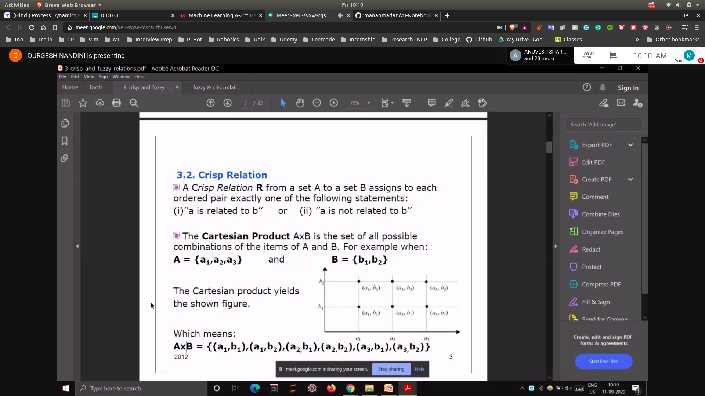
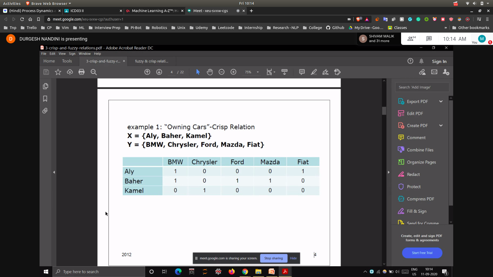
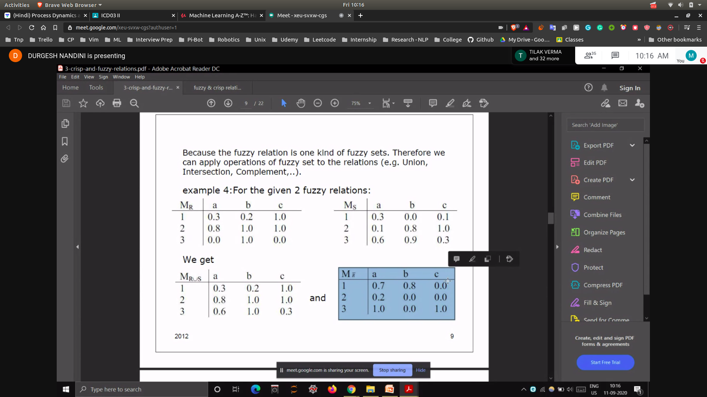
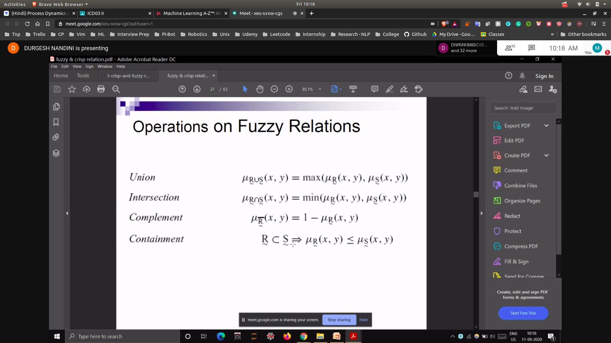
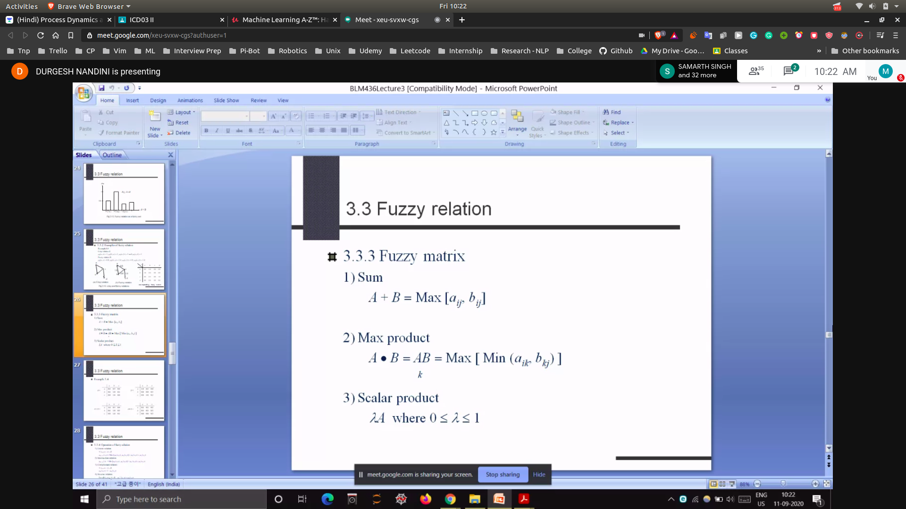
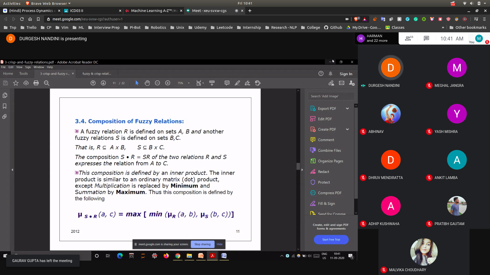

## Relations
- Uptill Now we have talked about crisp relations
- Relations are not always 0 or 1
- But in real life the relations can be between (0 and 1)
 - This the relations are not always crisp , it can be fuzzy also
- 

## Example
- 

## Fuzzy Relations
- They are represented in the form of matrices
- 

### Operations on Fuzzy Relations 
- 

- If a fuzzy set has a value of 1 , then it is called identity set

### Operations on Fuzzy Matrix
- 

### Composition on Fuzzy Relations
- 