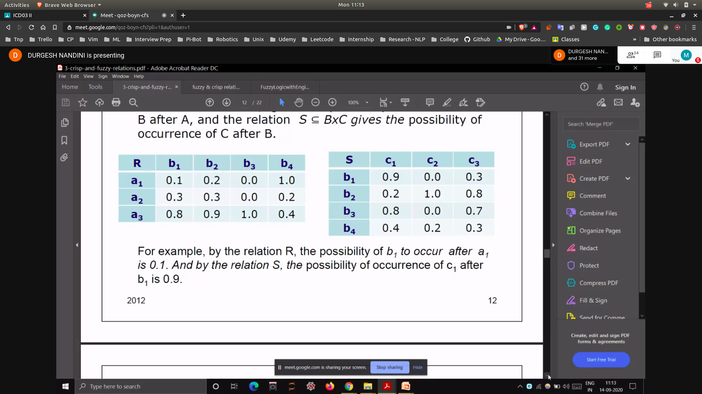
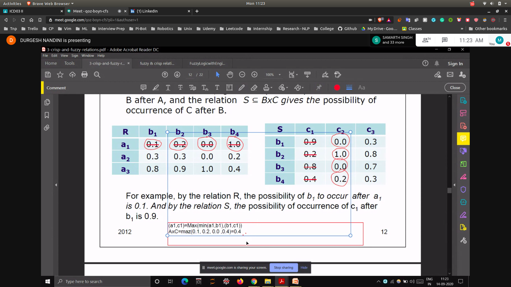

## Cardinality of Crisp Relation
- Cardinality is the number of elements in a set A
- The cardinality of a relation is the number of elements in set1 * number of elements in set2
-

## Composition
- If X is related to y
- if y is related to z
- then x is also related to z
- 

## Prob
- 
- find relation b/w a and c using max min composition

## Max-min composition
- 
- 
- Here the resultant matrix will be A* C of order  3*3
- One element will be R1a * C1b
- Another element in the row will be R1a * C2b
- 