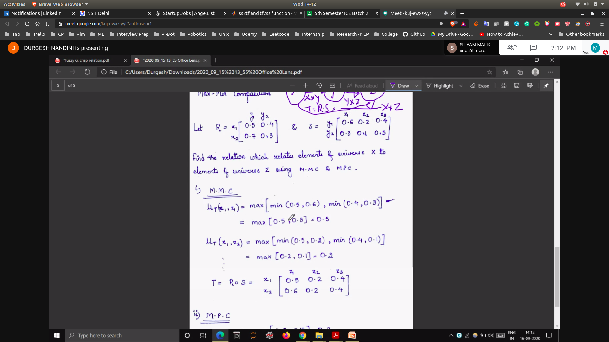
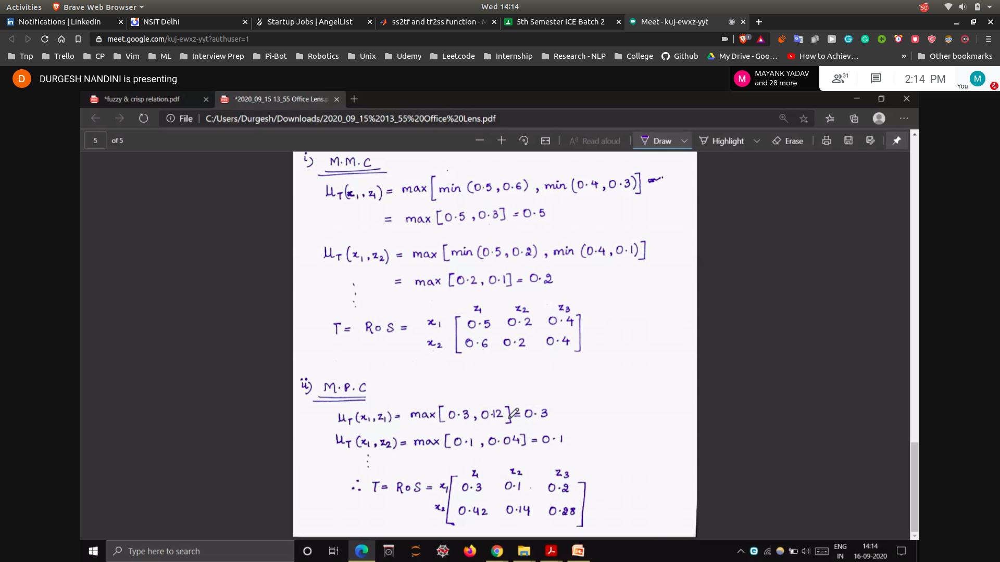
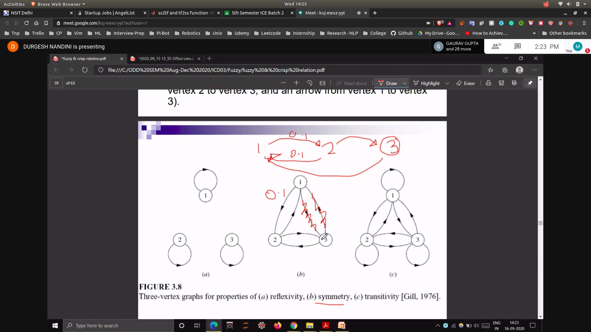
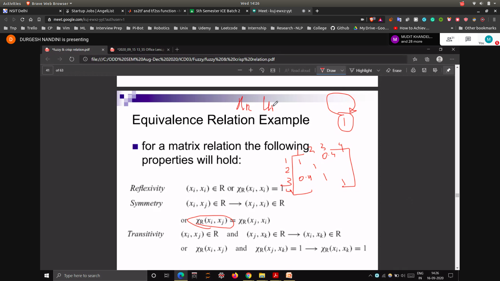
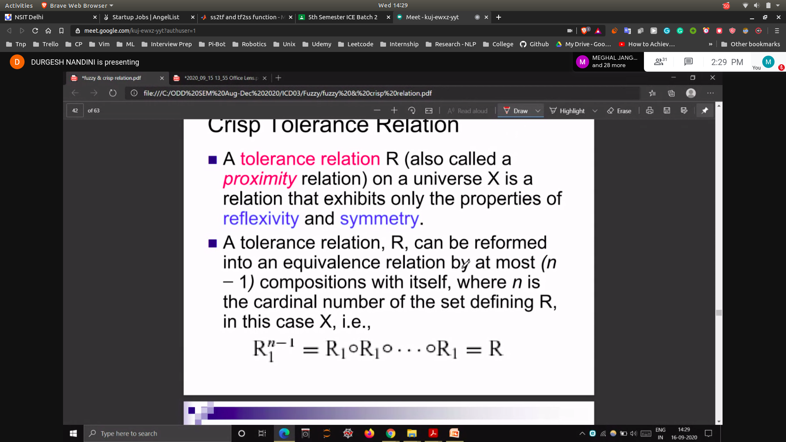
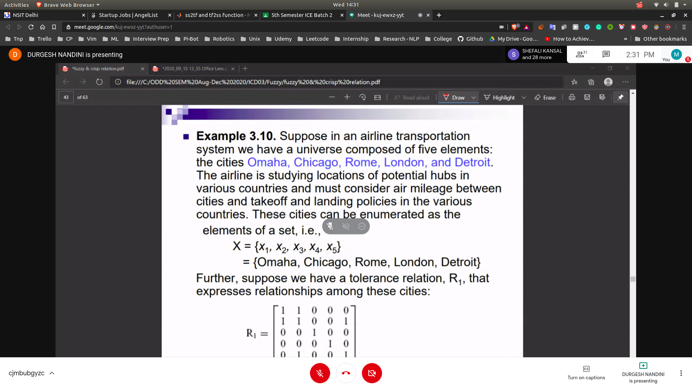
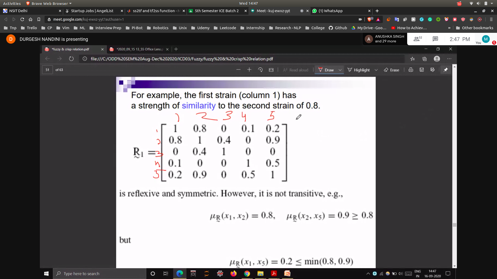
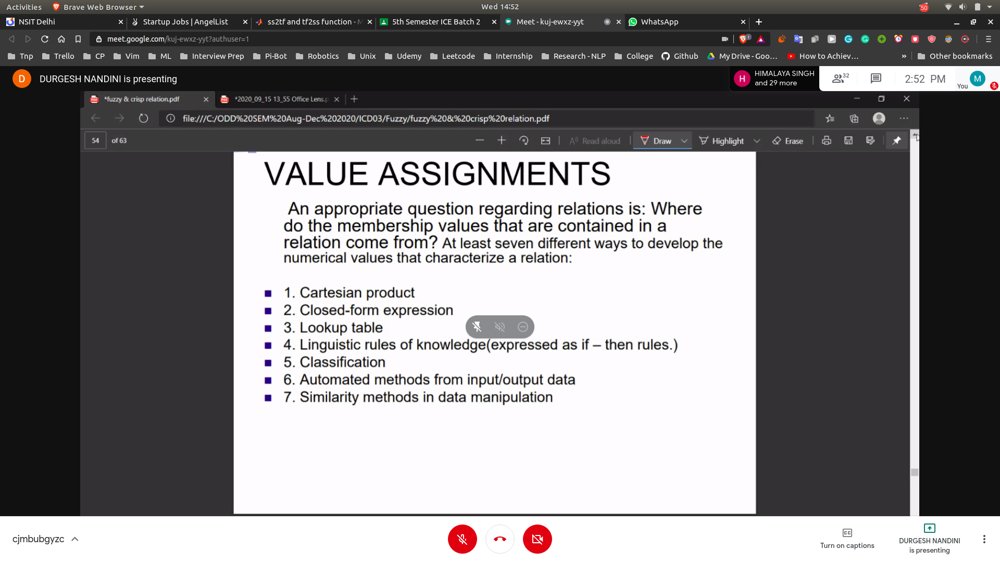

## Min Max Composition
- Revision
 - 

## Max Product Composition
- In case of finding the min 
- We will take the product
- 

# Tolerance and Equivalence Relations
- 
- Reflexive
   - x1 -> x1 and x2->x2
- Symmetric
   - x1 -> x2 and x2->x1
- Transitive
   - x1 -> x2 and x2 -> x3 and x3 -> x1
- 

## Equivalence Relations
- If all three relations hold then it will be an equilance realtion
- 

## Tolerance Relation
- Will follow Reflexive
- and Symmetric
- 

## Example 3.10 (Crisp Tolerance Relation)
- 

## Fuzzy Tolerance and Equivalence Relation
- 
- Transitive in fuzzy
- x2,x5 >= min((x2,x1) and (x1,x5))

# Value Assighnment
- 
