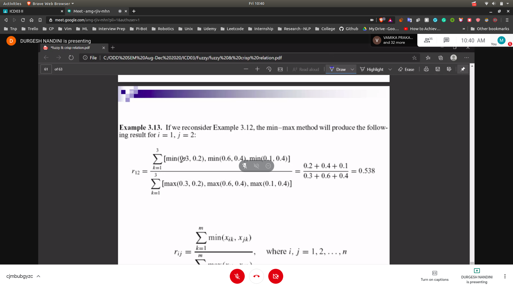

## Similarity Methods
- 
### Cosine Methods
- Each data set (1..n) is represented as a vector of m features (1...m)
- 
- 
### Problem
- 
- 
- compute the score for each element
- 

### Max Min Method
- 
- 
- 