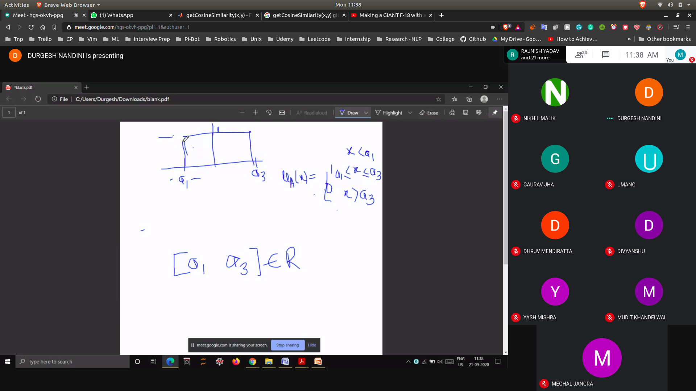

# Intervals
- Interval numbers is a closed set having an infinite number of points b/w the left and the right bound

## Membership in interval
- If the value < left bound
  - u(x) = 0
- If the value>= left bound and <=rightbound
  - u(x) = 1
- If the values > right bound
  - u(x) = 0

- 

# Fuzzy Number
- If a fuzzy set satisfies certain condition , then it will be a fuzzy number

