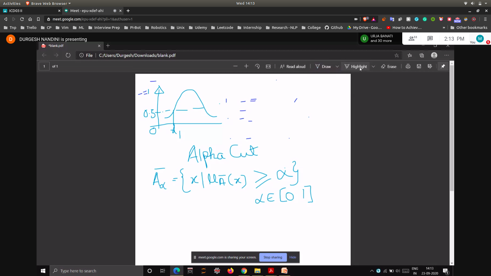
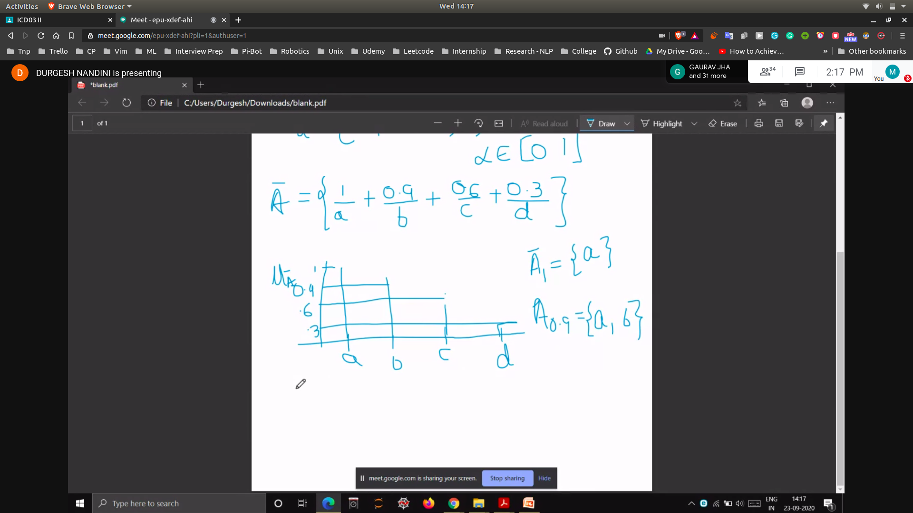
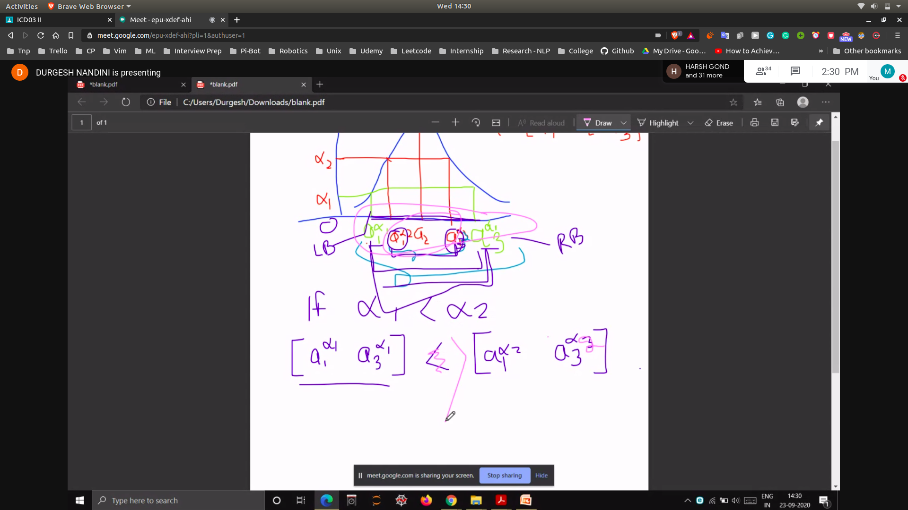
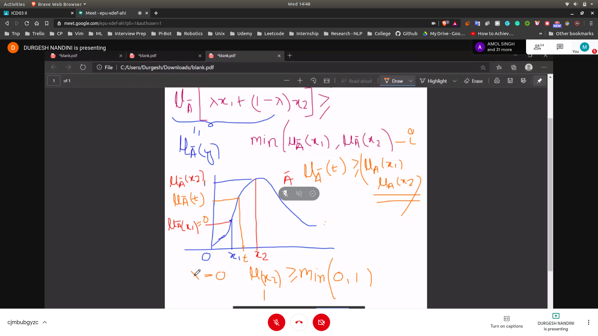

# Fuzzy Number

- A fuzzy number is a fuzzy set

 -  FS should be convex
 -  If it's normalized
 -  It's MF is peicewise continoues

# Alpha Cuts
- Any particular A'(A bar)
- Alpha cuts can be defined as { x|$u_a'(x) >= \alpha where \alpha [0 1]$ 
- 

### Example
- 

## Alpha Cut Interval
- 

# Convex Fuzzy Set

- A conves fuzzy set is described by membership function whose membership values are strictly monotonically increasing or monotonically descreasing with increasing value for the element in the universe

- Suppose we have [x1,x2] in a fuzzy set
- A convex fuzzy set id defined by 
- $u_a[\lambda x1 + (1 - \lambda) x2 ] >= min ( u_a(x1) ,u_a(x2) )$
- 
