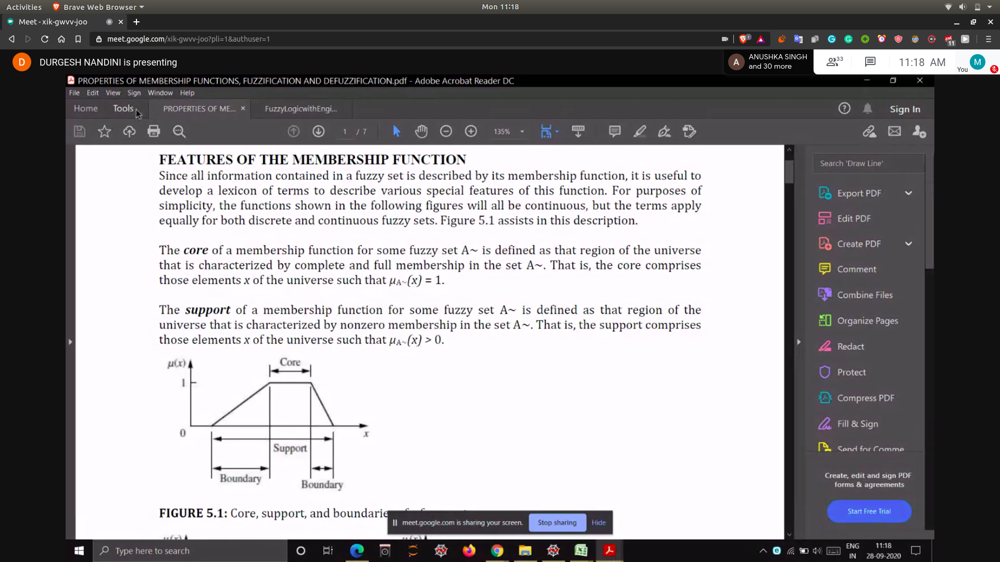
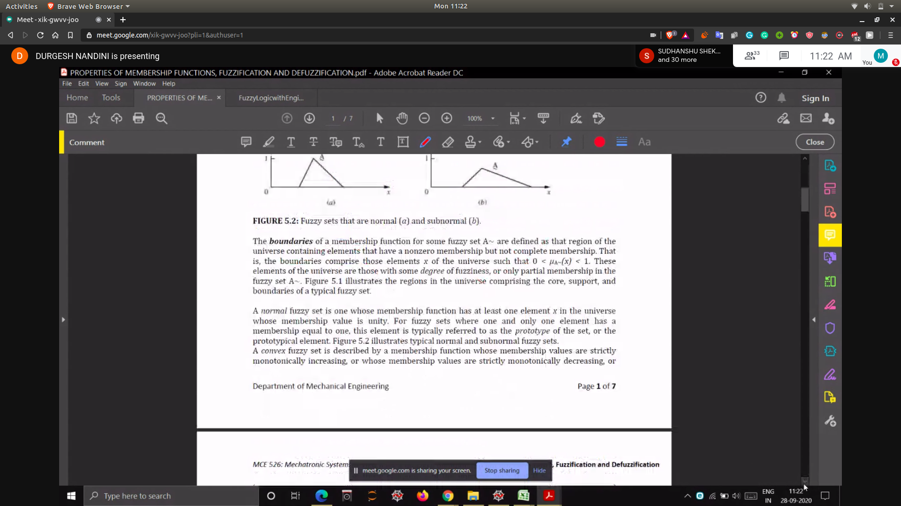
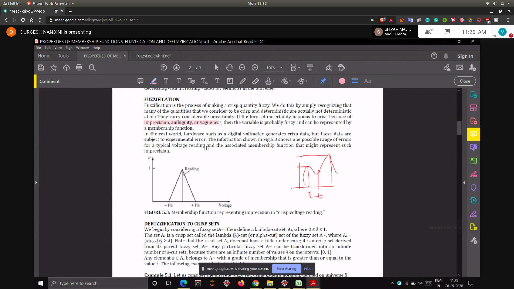
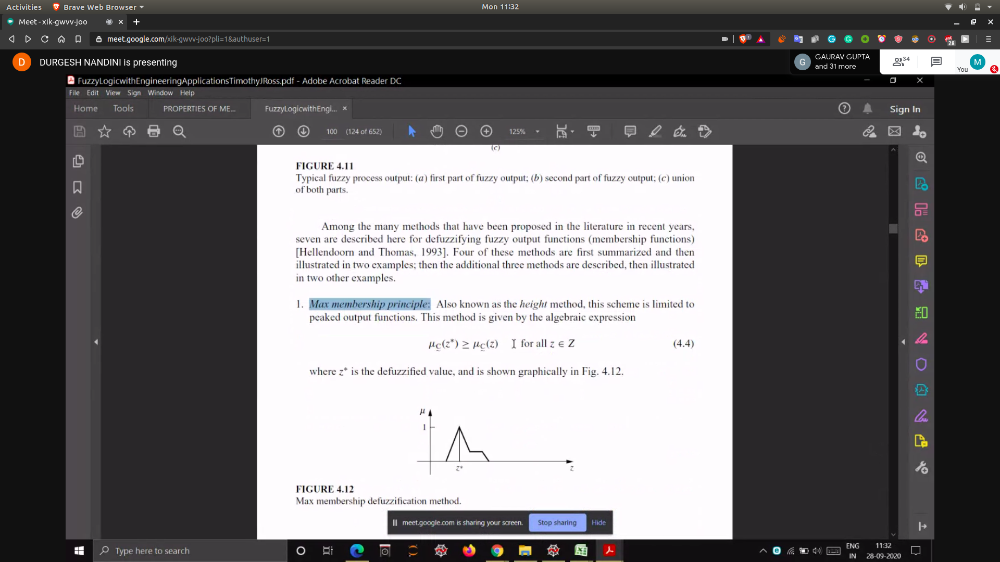
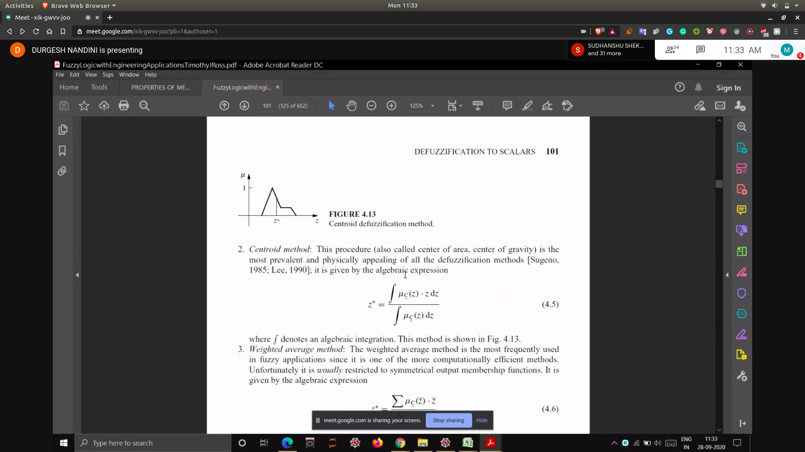
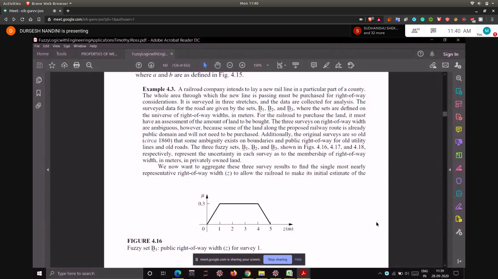
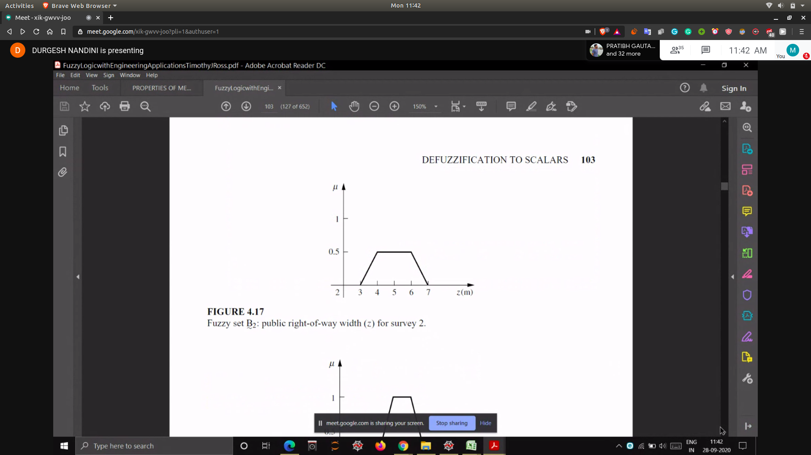
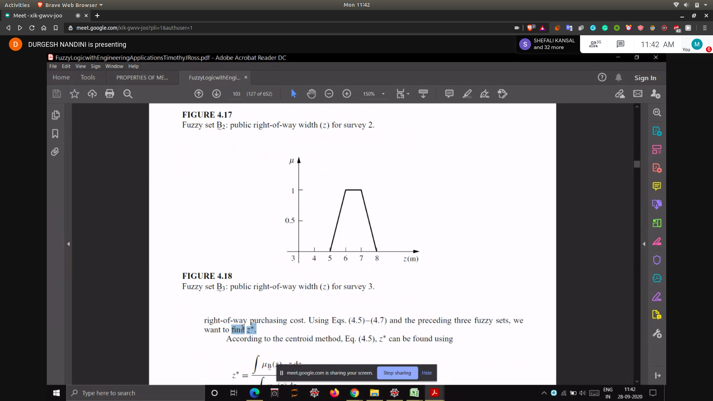

## Defuzzification
- sometimes defuzzification is also necessary to answer some questions like yes and no?

## Features of a membership function
- 
- Boundary
  - membership function is in between 0 and 1
  - basically boundary is the difference b/w (support and core)
  - 

- **Crossover point : 0.5 value of membership**

## Fuzzification
- It is always the case that sensor's give crisp value , but that also lies in b/w a certain range of values 
- 

## Defuzzification
- Max Membership Principle
  - 
- Centroid
- Weighted Average
  - 

### Problem
- 
- 
- 
