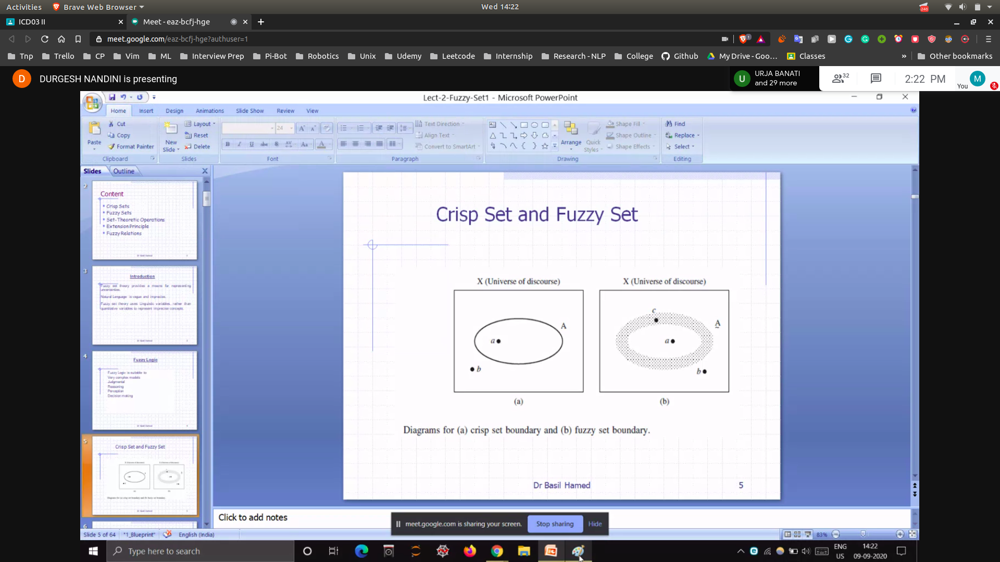
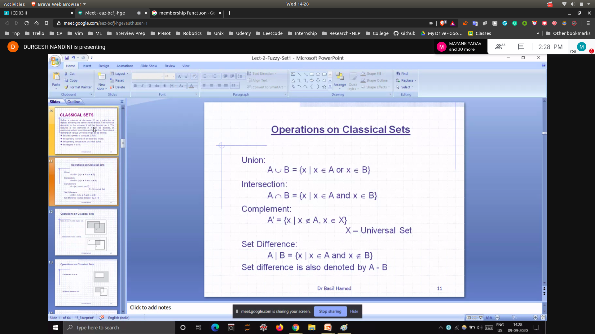
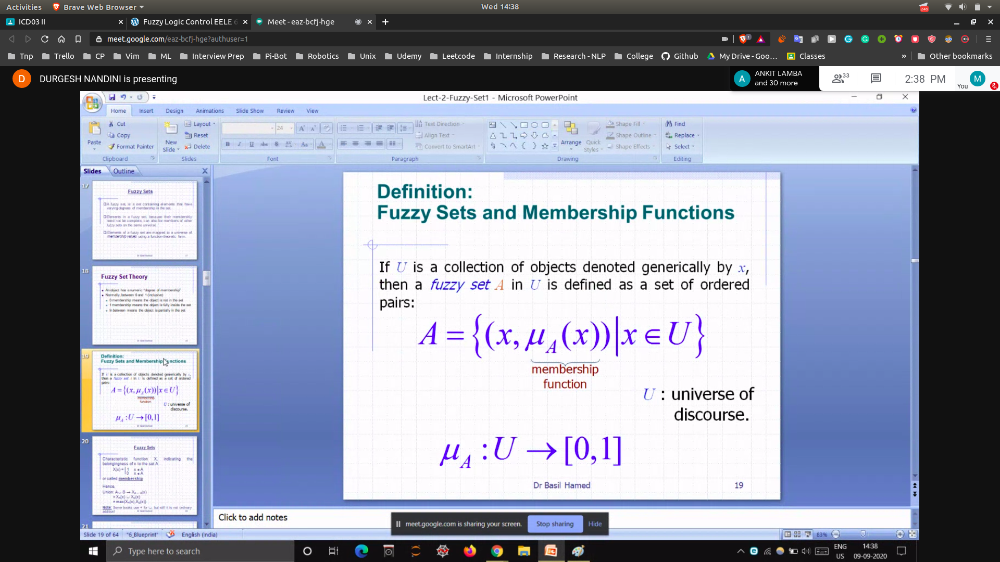
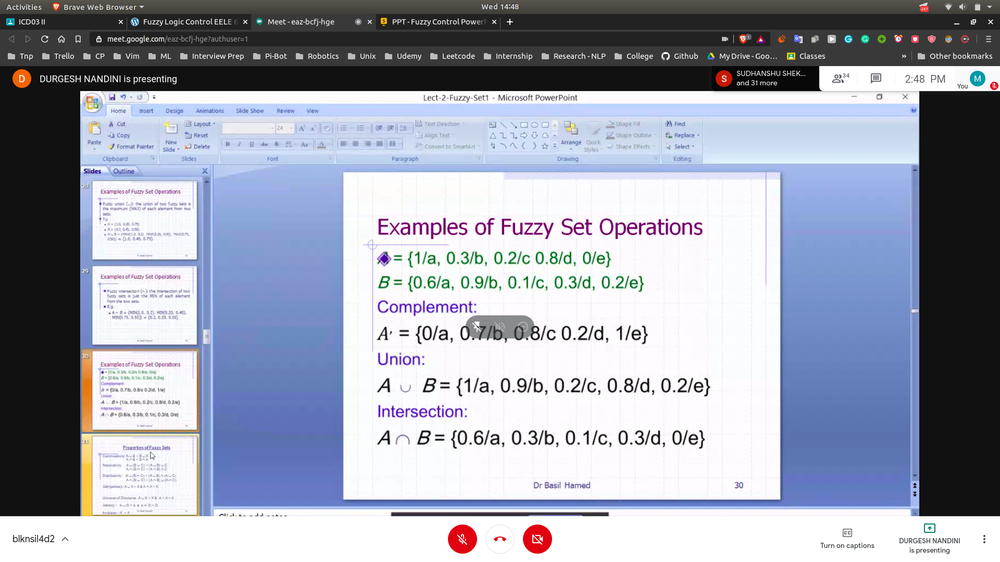

## Fuzzy Logic

- Anything that is "not clear" ==> is fuzzy
- 
- centre values will be assighned 1
- near boundary will be define 0.6,0.5 etc.

## Membership Function

- Tells about the degree of belonging in the fuzzy set

## Classical Sets

- operation of classsical set
 - 

### Properties

- 
- Commutavity
- Associativity
- Distrubutivity
- Idempotency

## Fuzzy Set
- 
- 
- 

## Examples of Fuzzy Set Operation
- 
