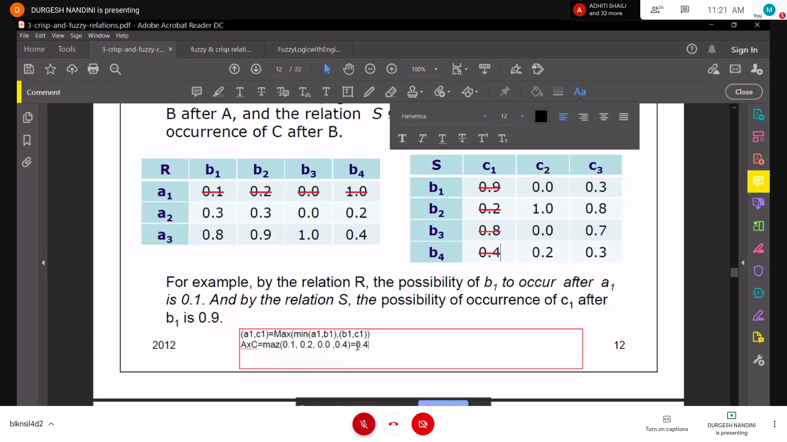

# Fuzzy

## Fuzzy and Crisp

- Crisp Set 
  - Has only 0 and 1 values
  - clear boundary

- Fuzzy Set
  - Has values b/w 0 and 1
  - no clear boundary

## Membership Function
- Tells about the degree of belonging in the fuzzy set
### Features of Membership function
- Boundry Part
- Core Part
- Support Part

## Operation and Properites
### Operations and Properties of a classical set

- Operation on a classical set
  - Union
  - Intersection
  - Compliment
  - Set Difference
  
- Properties of a classical Set
  - Commutavity
     - AUB = BUA
  - Associativity
     - (AUB)UC = AU(BUC)
  - Distrubitivity
     - AdisBUC = (AdisB) U (AdisC)
  - Idempotency
     - AUA = A
  - Cardinality
    - It is the number of elements in a set nx
    - **Cardinality of the power set of a set with nx elements in $2^nx$**

### Operations and Properties of Fuzzy Set

- Operation on Fuzzy Set
   - Compliment
      - 1 - (element value)
   - Union
      - max of both the values
   - Intersection
      - min of both the values

## Relations

### Crisp Relations
- The crisp relations are defined in 0 and 1
- Relation matrix b/w 2 crisp sets can be represented as 0 is there is no relation b/w the row and the col
- 1 if there is a relationship b/w the row and the column
- The relationship matrix b/w the crisp relations is obtained by cartesian product itself

### Cardinality of Crisp Relations
- If the cardinality of the set1 is $n_x$ and the cardinality of set2 is $n_y$
- Then the cardinality of the relation R b/w these 2 universes is nxy = nx * ny
- The cardinality of the power set describing the relation is $2^(nxny)$

### Fuzzy Relations

- In real life the relations can be represented by fuzzy values
- Fuzzy Relation are one kind of fuzzy set

### Operations on Fuzzy Relations
   - Therefore you can apply operation on those fuzzy relation
   - Union
   - Intersection
   - Complement
   - Containment (FLAG101)

- Extra Properties ( Other than Fuzzy Sets )
   - Sum
     - A + B = Max[aij,bij]
   - Max Product
     - A.B = AB = Max[Min(aik,bjk)]
   - Scalar Product
     - lambda * a

### To form relation from two fuzzy sets
- Cartesian Product
   - Multiply the two sets and min of the values in the set
   - P[x][y] = min(u_a(x),u_b(x))

### Composition of fuzzy relations

- Max Min Composition
  - 
- Max Product Composition
  - Instead of finding the min of the values , we will multiply them

### Properties of Relation Matrices
- Reflexitivity
  - xr(xi,xi) = 1
- Symmetry
  - xr(yi,xi) = xr(xi,yi)
- Transitivity (Crisp)
  - xr(xi,xj) and xr(xj,xk) = 1 -> xr(xi,xk) = 1
- Transitivity (Fuzzy)
  - x2,x5 >= min((x2,x1) and (x1,x5))

### Types of fuzzy Relations

- Check in the relation Matrices for these properties
- Equivalence
  - All three relations will hold
- Tolerance
  - Reflexivity
  - Symmetry

### $/alpha$ cuts for fuzzy relations
- **Basically saying that if 2 elements are highly related then they are connected**
- like defuzzification of fuzzy relations
- certain value below which the value of the fuzzy is approximated to zero
- above values are approximated to 1
- thus the fuzzy set is approximated to a crisp set

## Similarity Methods in Matrices
- Cosine Methods
   - rij = $/sum{k=1}{m} x_ik x_jk$
   - $(/sum{k=1}{m}(x_ik)^2 /sum{k=1}{m}(x_ik)^2)^(1/2)$
- Max-Min Methods
   - $/sum{k=1}{m} min(x_ik,x_jk)$
   - $/sum{k=1}{m} max(x_ik,x_jk)$
      - where i,j = 1,2 ......,n

## Convex Fuzzy Set
- Whose values are strictly monotically increasing or monotically descreasing

## Arithemetic Operation

### Fuzzy Sets
- Addition
- Subtraction
- Multiplication
- Division

### Cont Fuzzy Sets

## Fuzzy Number
- A fuzzy number is a fuzzy set
 - It should be convex
 - If it's normalized
 - It's MF is peicewise continous

### Arithemetic Operation of Fuzzy No.

## Defuzzification
- It is the conversion of a fuzzy quantity to a precise quantity
- Methods
  - Max Membersip Function
     - Simply Replace the set with the max value
  - Centroid Average Method
     - Integral uc(x).x.dx/Intergral uc(x).dx
  - Weighted Average Method
     - Find the peak value in the set and where is the peak
     - weighted avg = (pk1*v1 + pk2*v2 + pk3*v3)/(v1+v2+v3)
