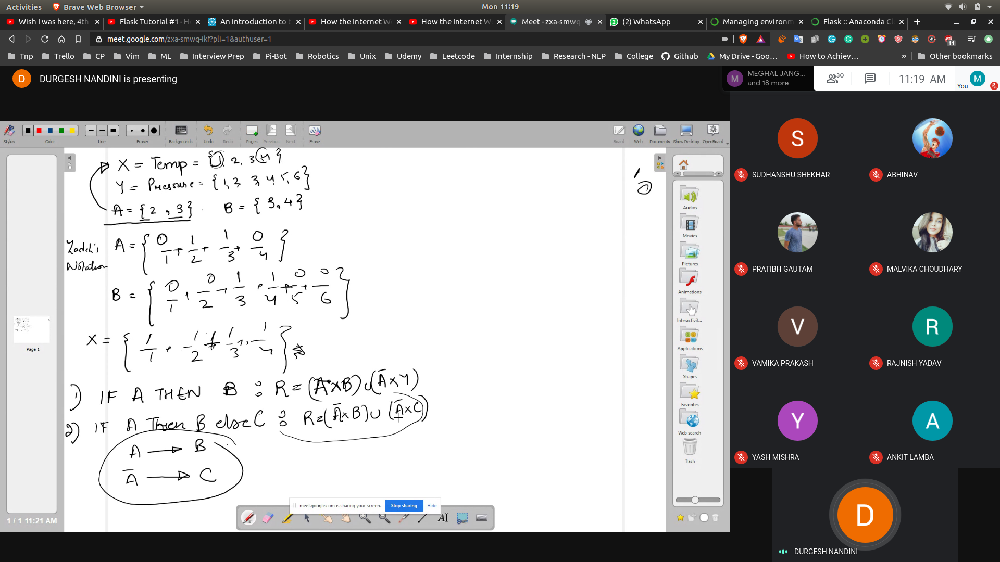
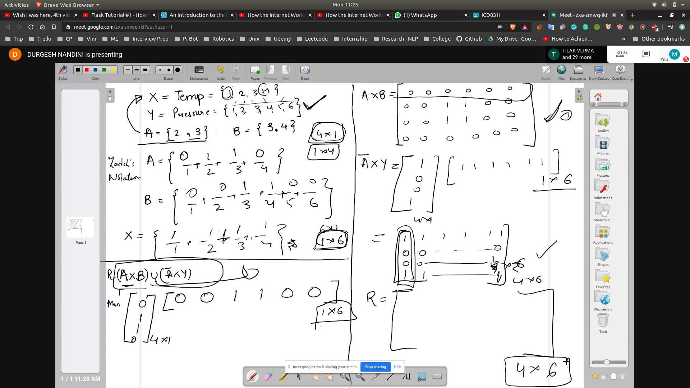
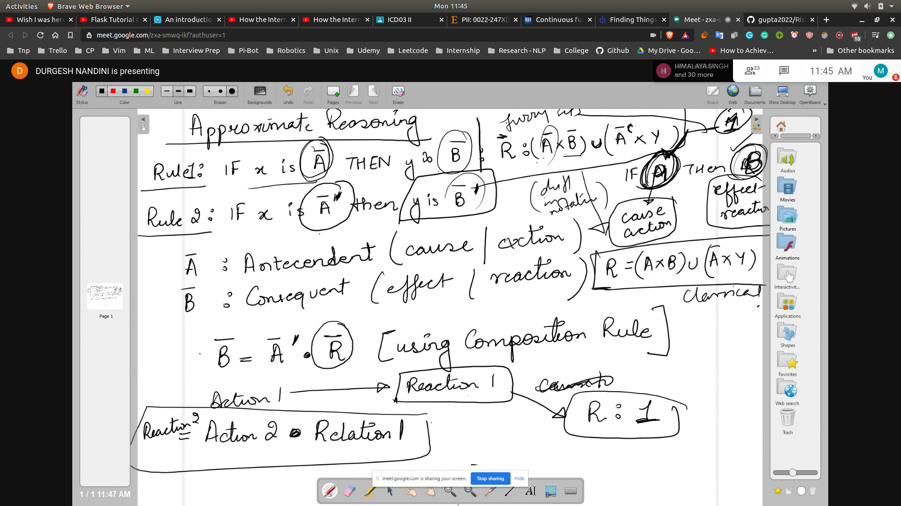

## Problem Solution
- 
- Here the relation is IF A THEN B
- hence we know that R : (A X B) U (A(bar) X Y)
- 
- We also have another relation defined as 
- C , so we will represent it in zadeh's notation
- And then form the relation to find the ans

## Fuzzy Logic
- Here A(bar) will be represented as the fuzzy set
- and A(bar)^c will be represented as the compliment

## Approximate Reasoning
- Rule1 : IF x is A(bar) y is B(bar)|R : (A X B) U (A(bar) X Y)

- Rule2 : IF x is A(bar)' y is B(bar)'
  - A(bar) = Antecedent (cause|action)
  - B(bar) = Consequent (effect|action)

- Here A is causing B , hence the name of the terms
- 

## Problem
- 