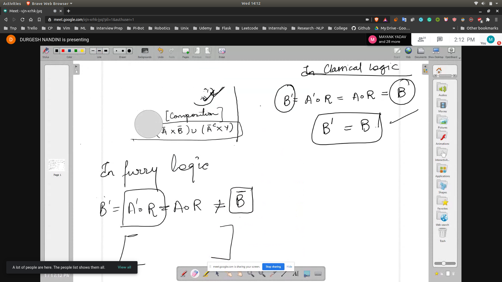
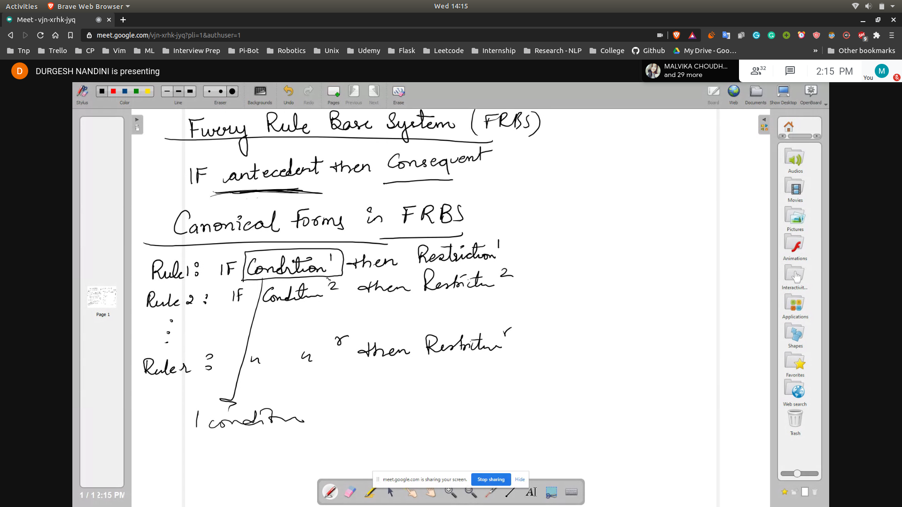
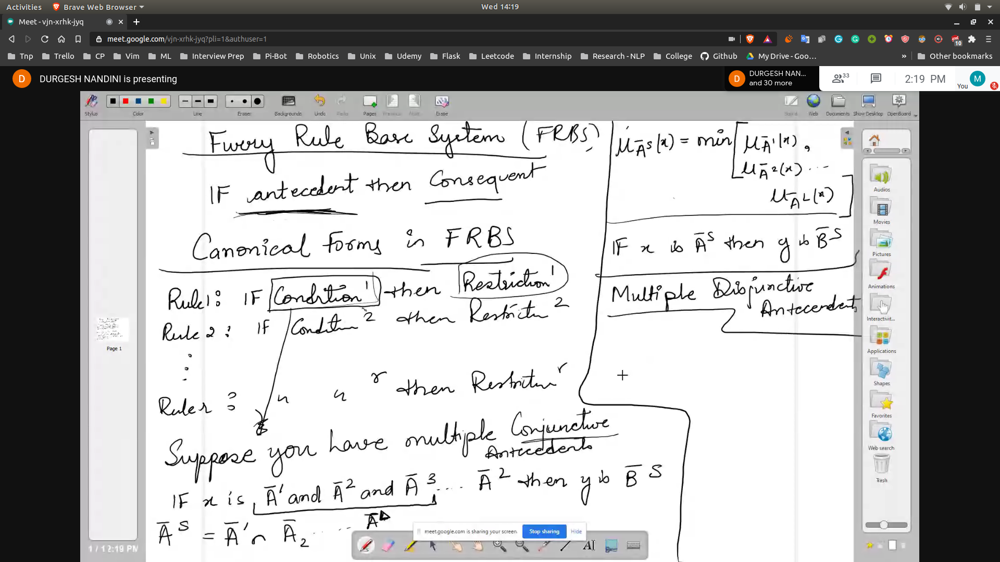
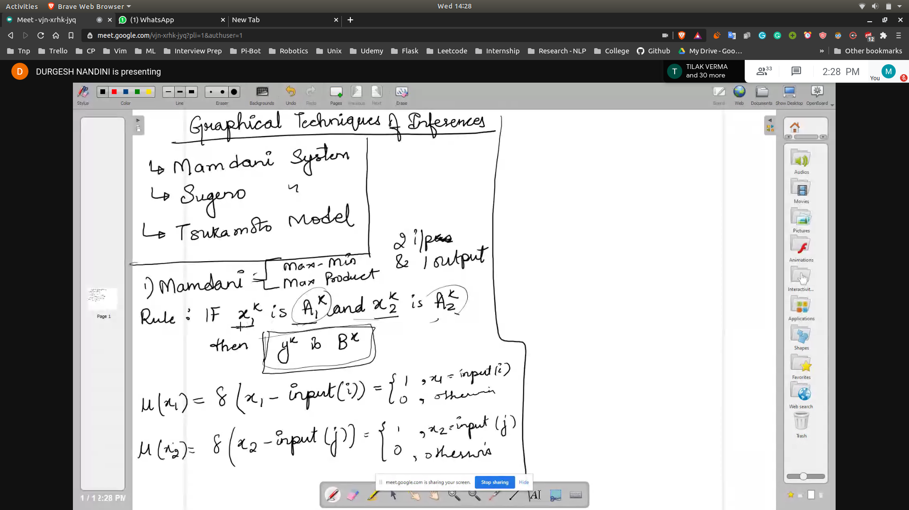
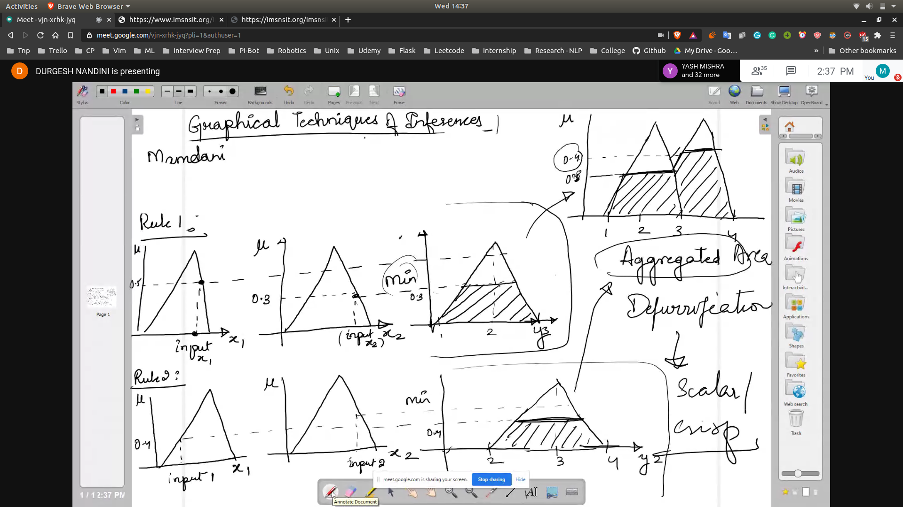
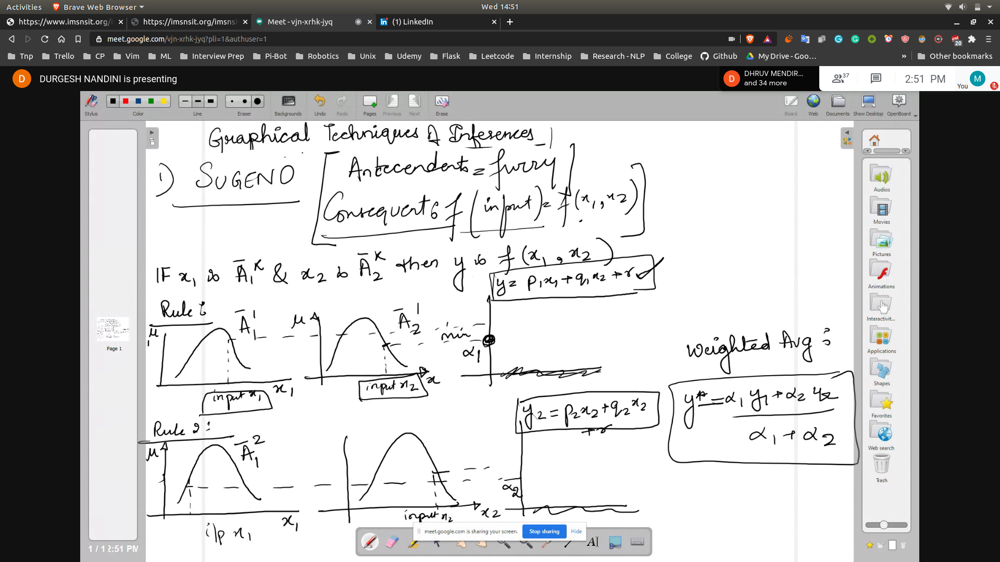
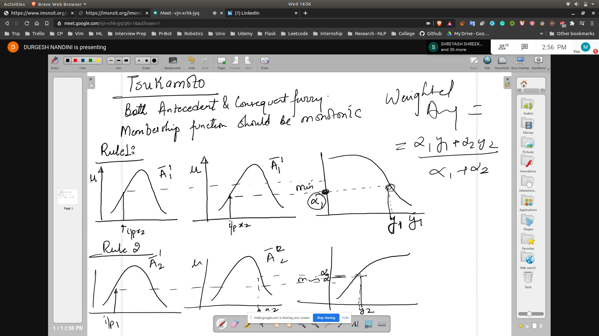

## Why it is called approximate reasoning
- 
- Try eg 5 , 11

## Fuzzy Rule Base System
- If antecedent then consequent
- Canonical Forms
  - 
- To connect k conditions then we will apply logical conectives to get a uniform ans

- Suppose you have multiple conjuctive
- 
- So you can apply in case of Multiple Conjuctive antecedent and Multiple Disjunctive antecedant

## Aggreagation of Fuzzy Rules
1. Conjuctive System of Rules
2. Disjunctive System of Rules

## Graphical Techniques of Inferences
- Mamdani System 
- 
   - Max Min
   - Max Product
- 
- Sugeno
  - 
- Tsukamoto Model
  - 
