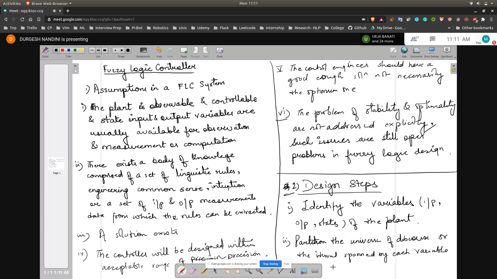
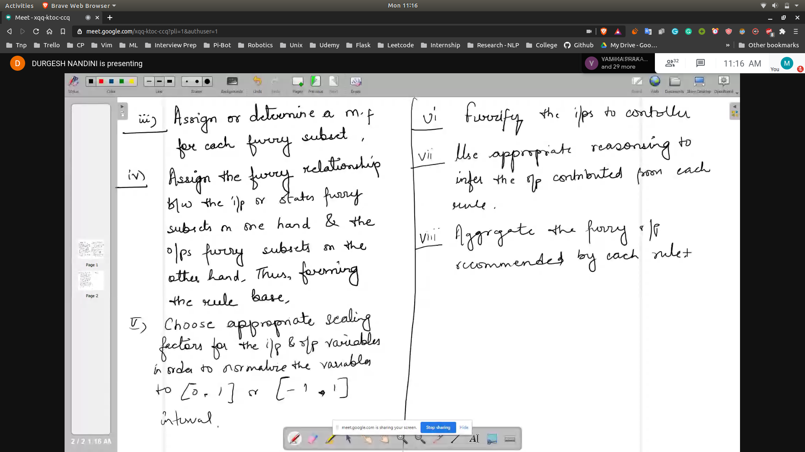
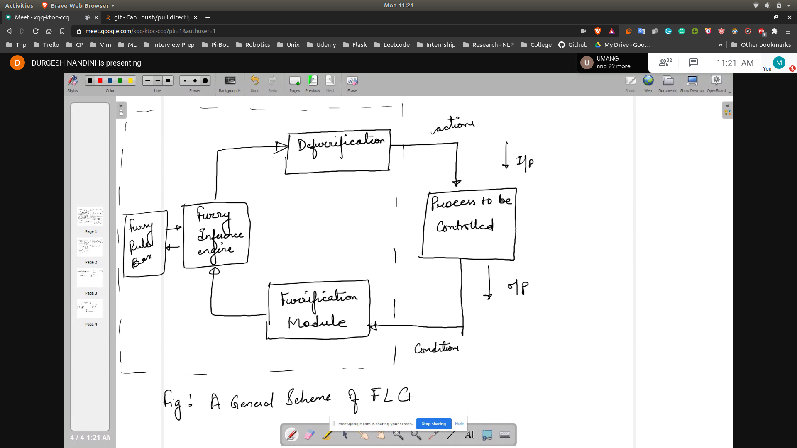
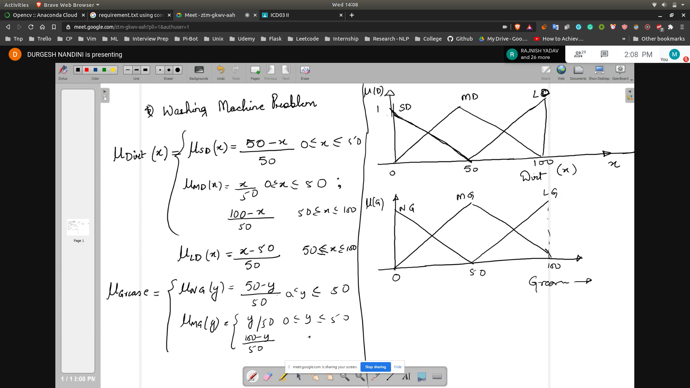
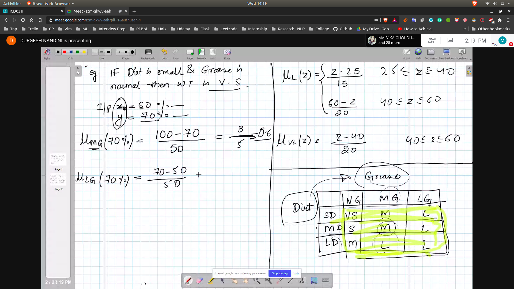
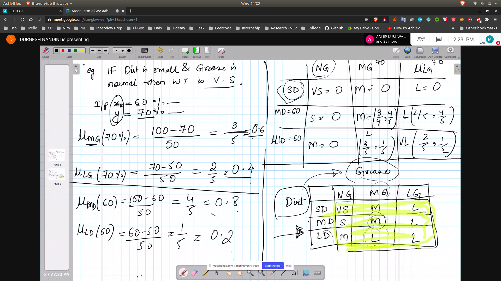

## Fuzzy Logic Control

### Assumptions
- The plant is observable and Controlable 
- Further assumptions
  - 

### Design steps
- some in the picture above
- some are in the picture below
- 

1. Measurement i/p are taken as variables that represent relevant condition of controller process
2. Fuzzificaton
3. Fuzzification measurements are then used by inference engine to evaluate the control rules stored in the fuzzy rule base.
4. Defuzzification

### General Scheme for Fuzzy Logic Controller
- 

### Washing Machine Problem
- We have i/p variables and o/p variables

- DEFINE IN LINGUISTIC FORM
- Dirt :{Small Dirt , Medium Dirt , Large Dirt}
- Grease :{SG,MG,LG}

- Output variables
   - Wash Time
   - {Very Short , Medium , Large , Very Large}
- First reprsent Graphically
- And represent the equations
- 
- We design the rules in the form of matrix for the equation
  - 
- Now let's suppose we have the input of dirt = 60% and y = 70%
- Now we will calculate the membership values from thest inputs
- On the basis of these values , we will make an output table
  - 
- First the rule base was defined linguistically
- Now the rule base needs to be decided on the basis of the numerical values
  - Basically put numerical values in linguistic variables
- Now we will get the fuzzified output based on the rule base
- Now this value will be duzzified on the basis of membership function of the
o/p
- This value will be the output
