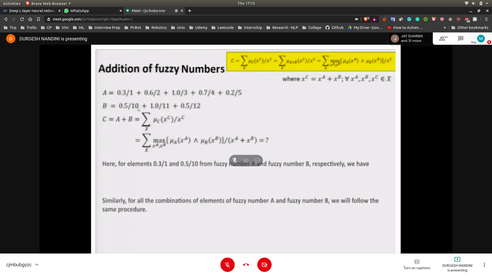
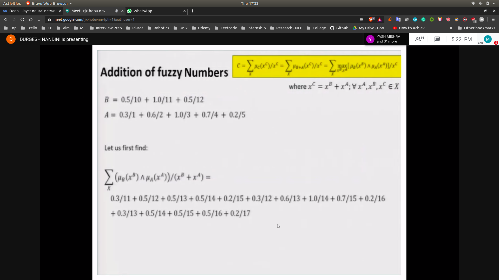
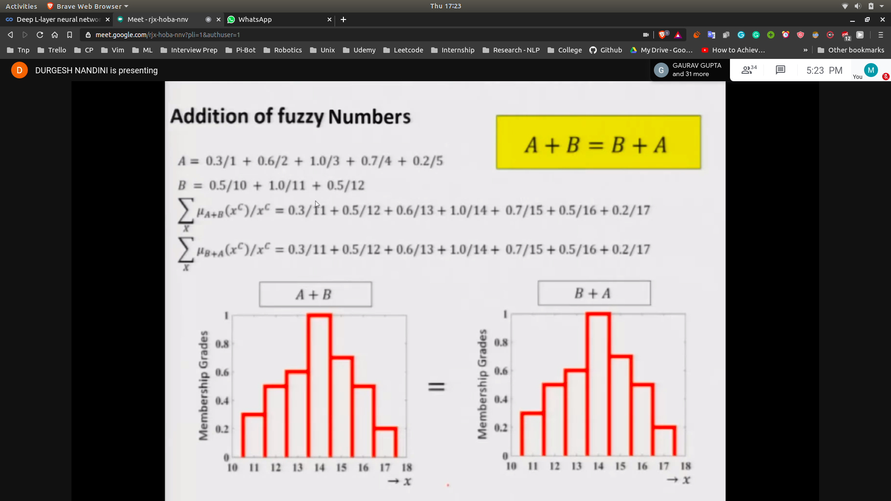
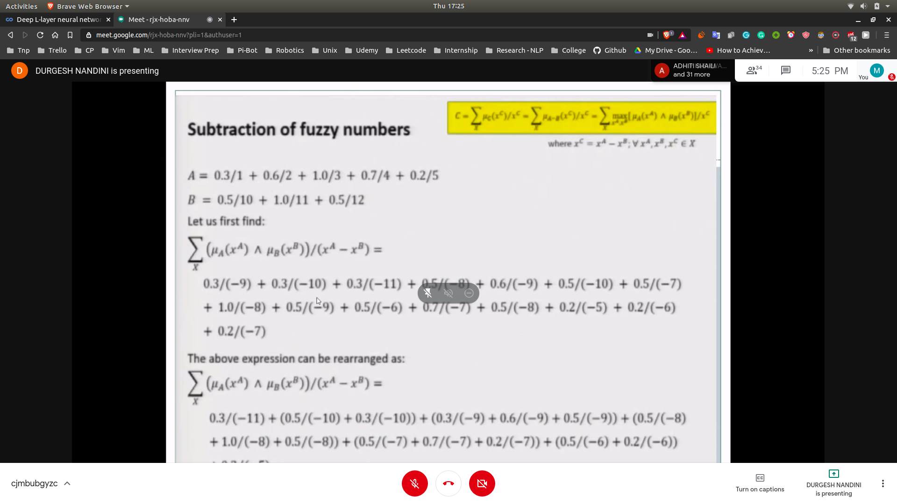
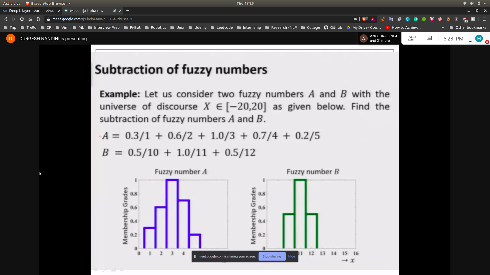
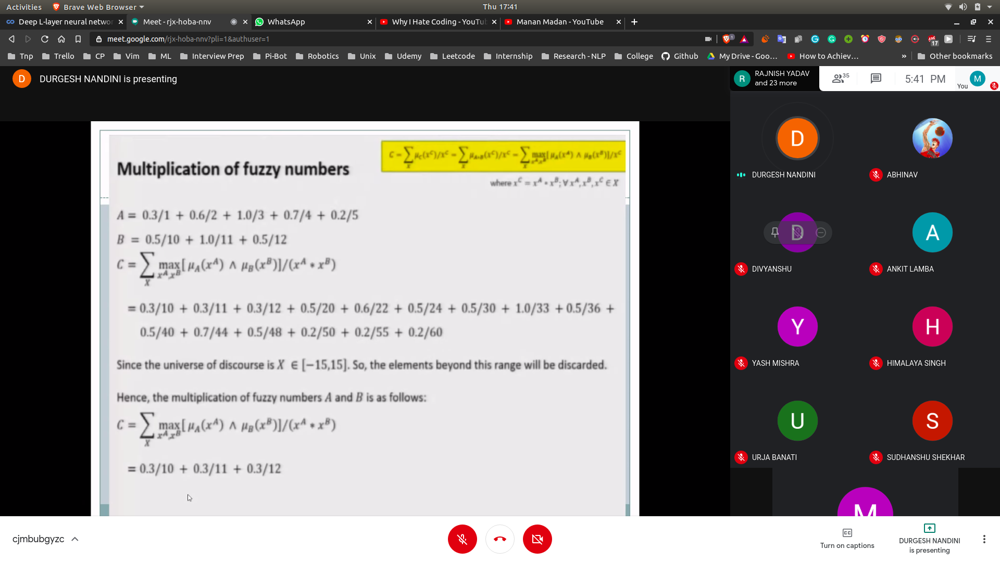
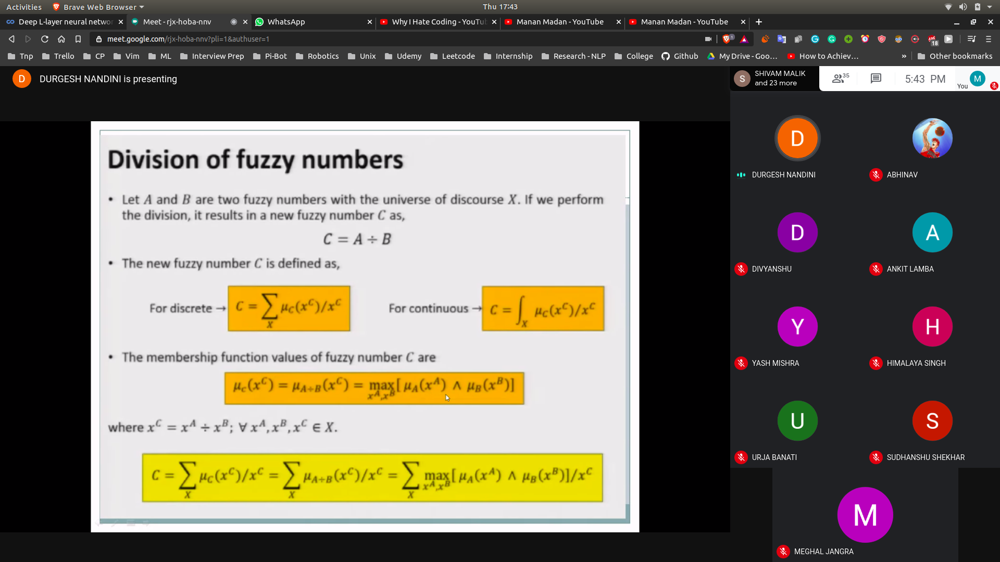
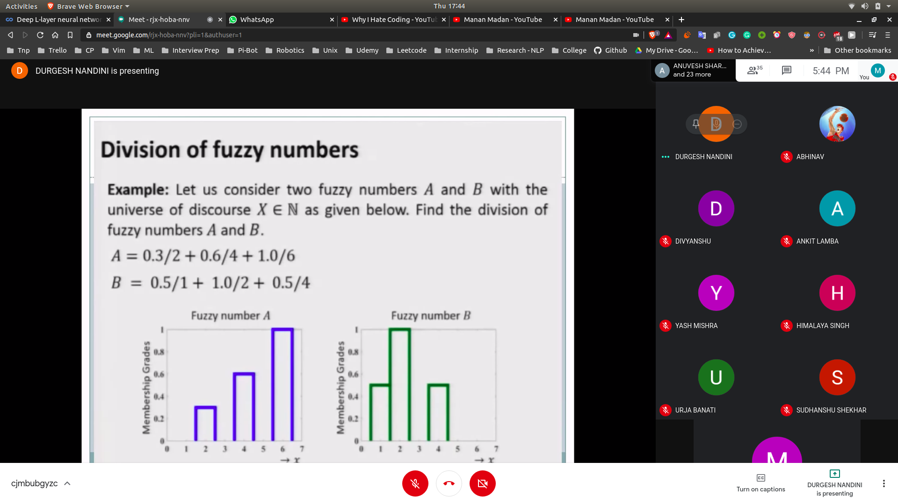

# Addition of fuzzy number
- (A+B = C)
- 
- (B+A)
- 
- 

# Subtraction of fuzzy number
- 

## Prob
- 
- after re-arranging takes mx in both

## Multiplication of fuzzy numbers
- 
- Multiplication Example
   - 

## Div
- 

### Prob
  - 