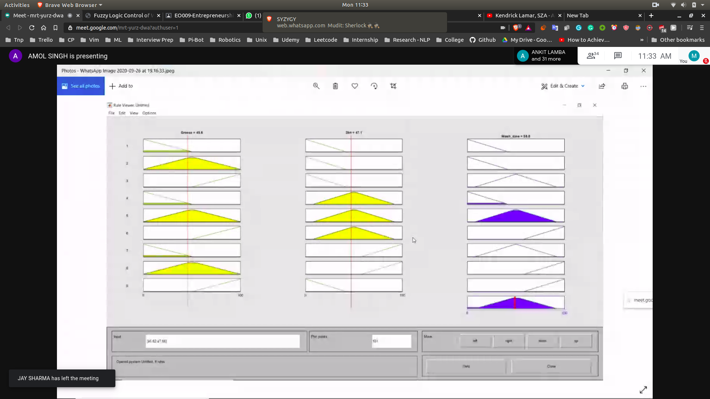

- Practical
 -  So we will get the numerical input and the value will be fuzzyfied
 - According to that we will have a rule and will get a fuzzy output
 - Then this fuzzy output will be dufuzzied and will be given to the machine
 - 