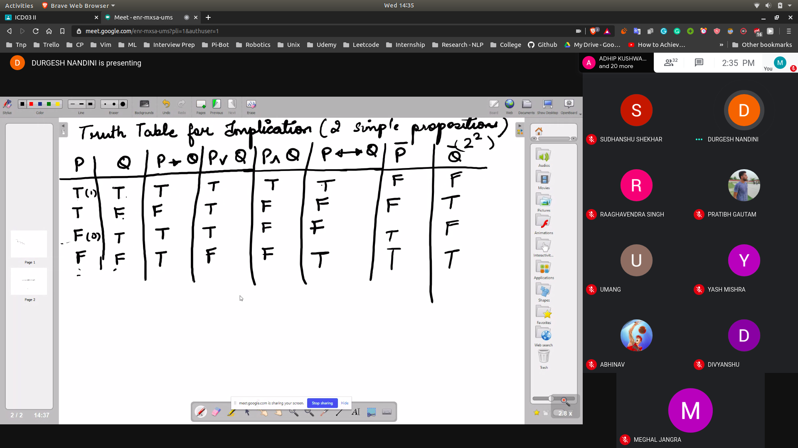
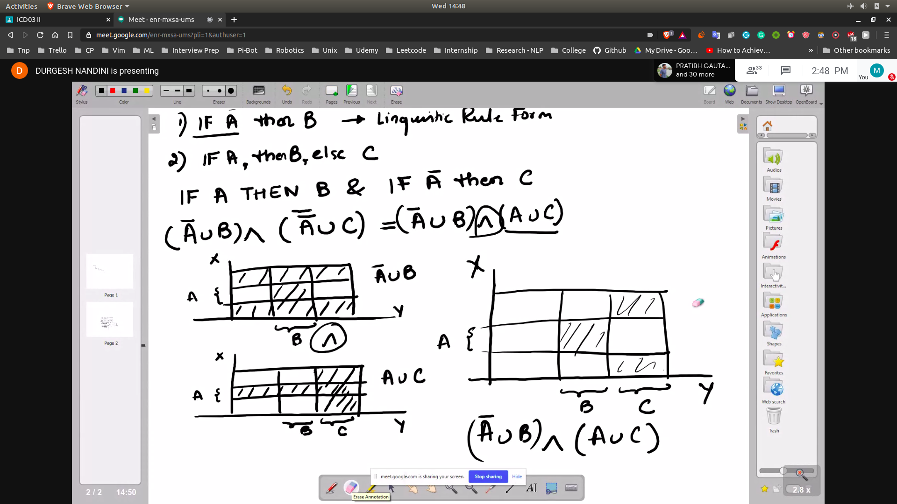

**Proposition: Declarative Statement with a condition**
## Classical Logic
- T(P) = 1 (True)
- T(P) = 0 (False)

Suppose we have a universe of discourse X
- If A belongs to X
  - T(P) = 1
- else T(P) = 0

- If 2 or more proposition is in a system it is compound preposition

## Logical Connectives
- Connect 2 or more Logical connective to make them compound connection

1. Disjuction
- xbelongsA or xbelongsB
- T(P v Q) = max(T(P),T(Q))
2. Conjunction
- xbelongsA and xbelongsB
- P A Q = min(T(P),T(Q))
3. Negation
- T(P) = 1 T(P(bar)) = 0
4. Implication
-  If p->q : xnotbelongsA or xbelongsB
- T(P->Q) = T(P(bar) U Q)
5. Equivalence
- P<->Q
- xnotP or xnotQ
- T(P<->Q) == 1 if T(P) = T(Q)
           == 0 if T(P) != T(Q)

## Examples
1. If 1+1 = 2 then 4>0
2. If 1+1 = 3 then 4>0
3. If 1+1 = 3 then 4<0
4. If 1+1 = 2 then 4<0

Sols
1.  T(P) = 1 and T(Q) = 1
- T(P->Q) = T(P(bar)U Q)
- max[T(P(bar)),T(Q)]
- 1

3. 1
4. 0
- T(P) = 1 T(Q) = 0
- If first statement is true then implication might not true

## Truth Table for implication (2 P)
- 

## Realtions on Implications
- Linguistic Rule1
  - [Relation](Relation.jpg)
- Linguistic Ruel2
  - 

## Tautologies
- Simple Proposition
  P1 -> P2
- Resultant Compound Propostion C
- T(C) =1 or T(C)=0
- Tautologies
  - P Q --> C = T(P) = 1 
  - When the truth value of compound preposition C is always equal to 1
  - then it is called Tautologies

- The compound prop. always true irrespective of the truth of the individual simple prop.