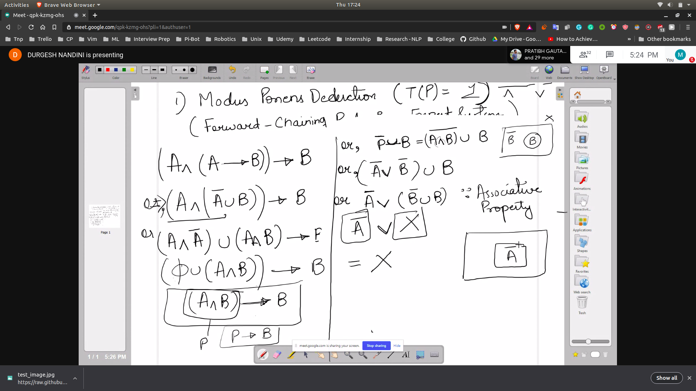
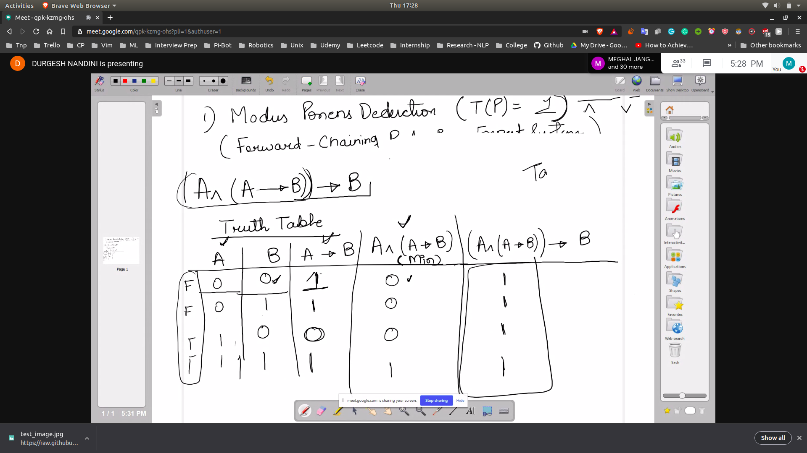
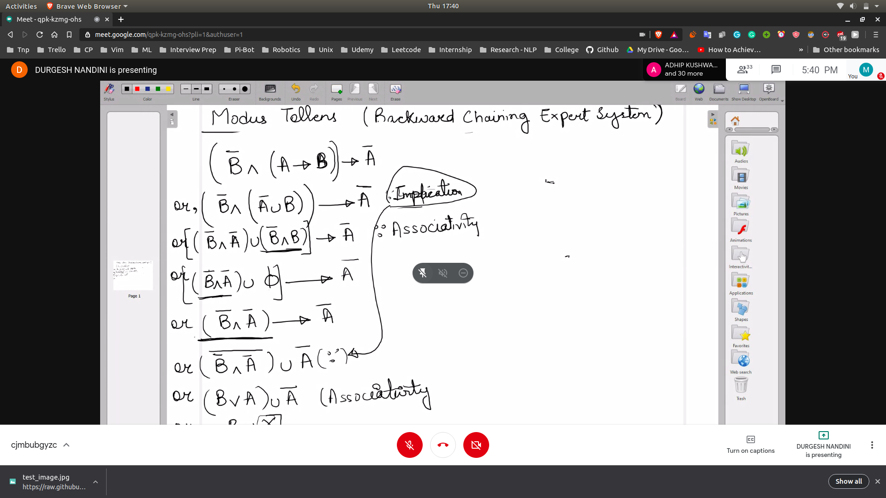
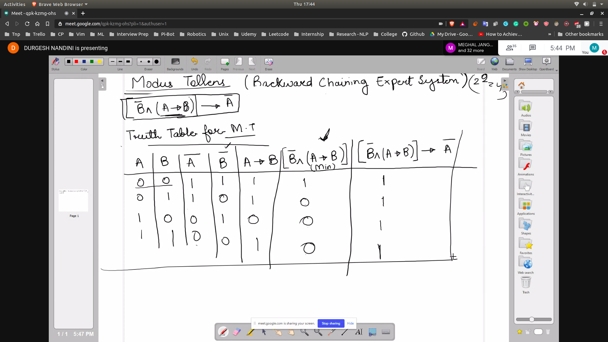
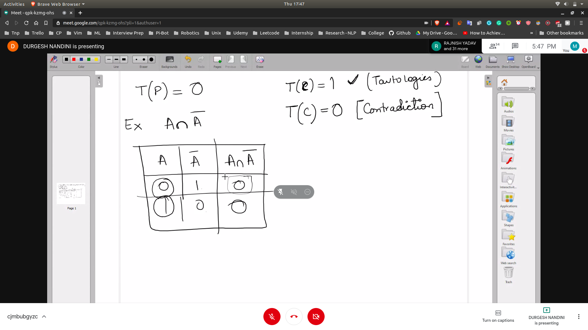
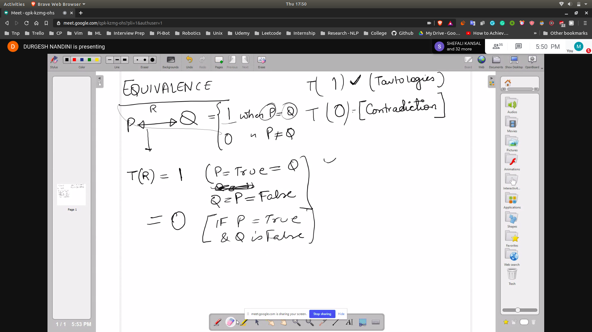
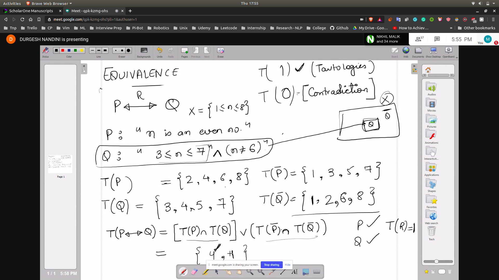

# Types of Tautologies

**
Truth of the universal set T(X) = 1
Truth of the null set T(phi) = 0
**

## Modus Ponen Deduction (T(P)= 1)
(Forward chaining rule base experst systems)
- if p then q
- 
- Hence T(X) = 1 always
- Hence proved

- Using truth table
- 

## Modus Tollen (Backward chaining expert system)
- eg - If p then q
- Here we will check if not p then not q
- Basically if p does not occur then q will not occur
- 
- Hence proved

- Using truth table
- 

## Contradiction
- When the value of T(C) = 0 always
- Then it will be called contradiction
- 

## Equivalence
- 
- 
- T(P) = T(Q) (1)
- T(P) != T(Q) (0)
