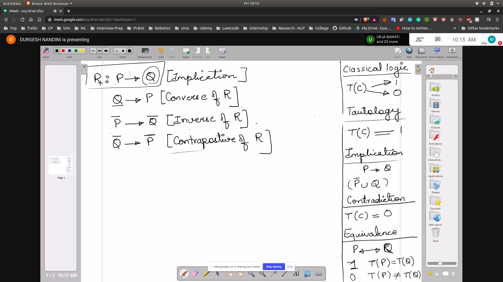
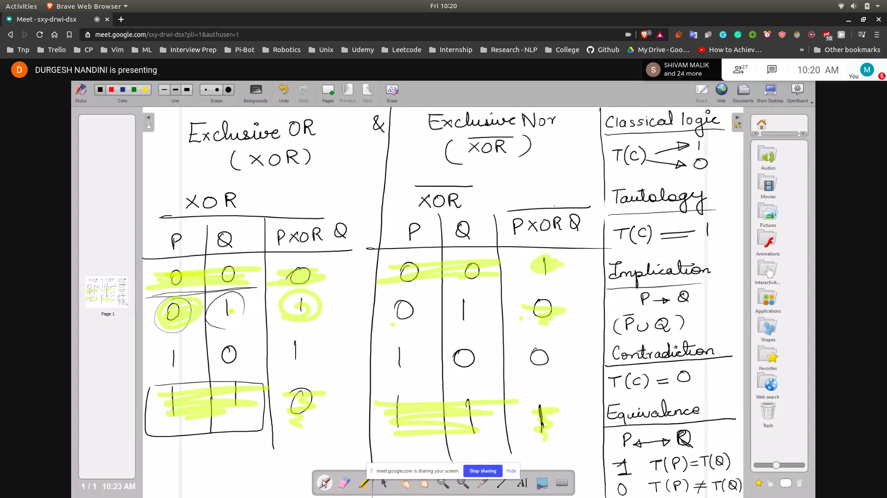
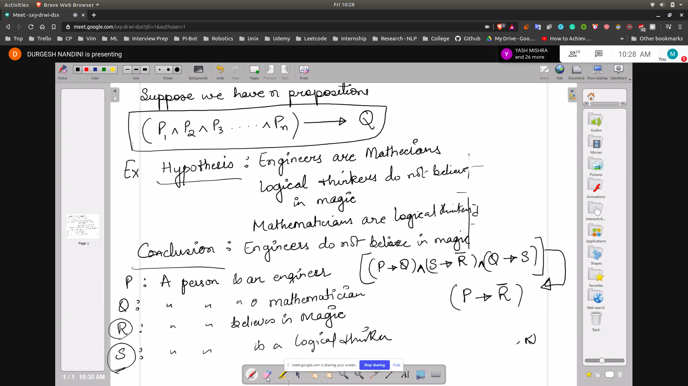
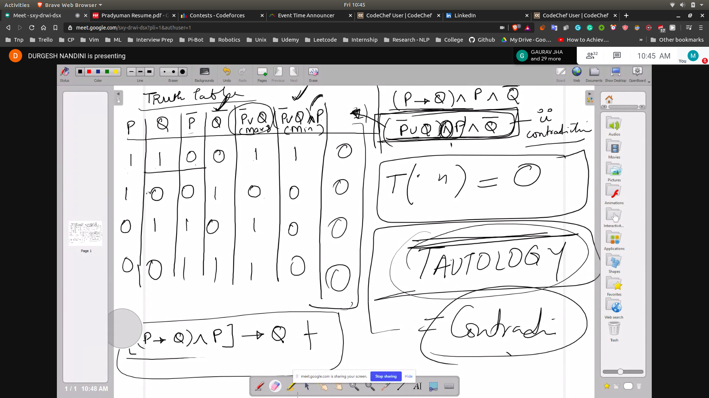
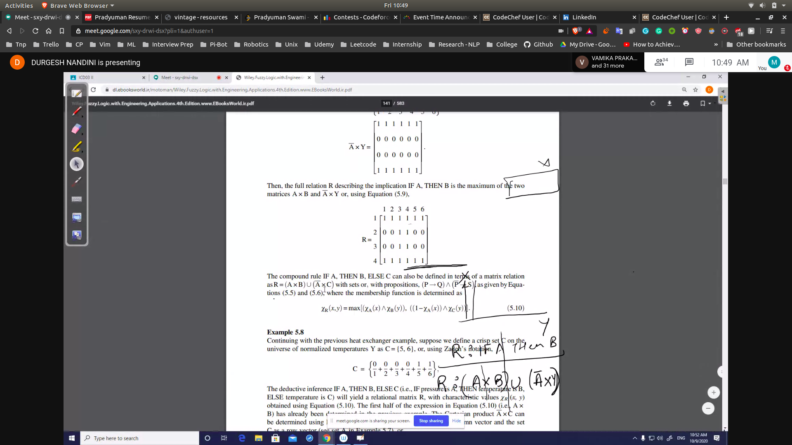

## Variations of implication
- 

## XOR and XNOR
- 

## How to tell if n proposition are Tautologies
- 
- We know compliment of tautology is contradiction
- Since it is tough to tell if it is a Tautology using methods or truth table
- Hence we will prove that it is a contradication
- Using truth table we prove that the above equation is a tautology
- 

## Prob
- 
