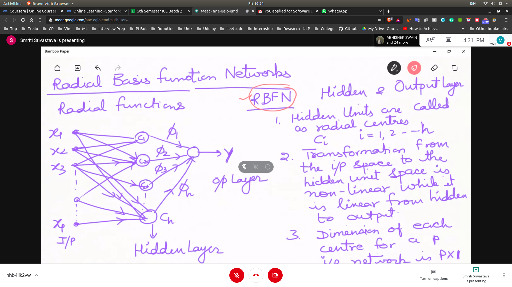
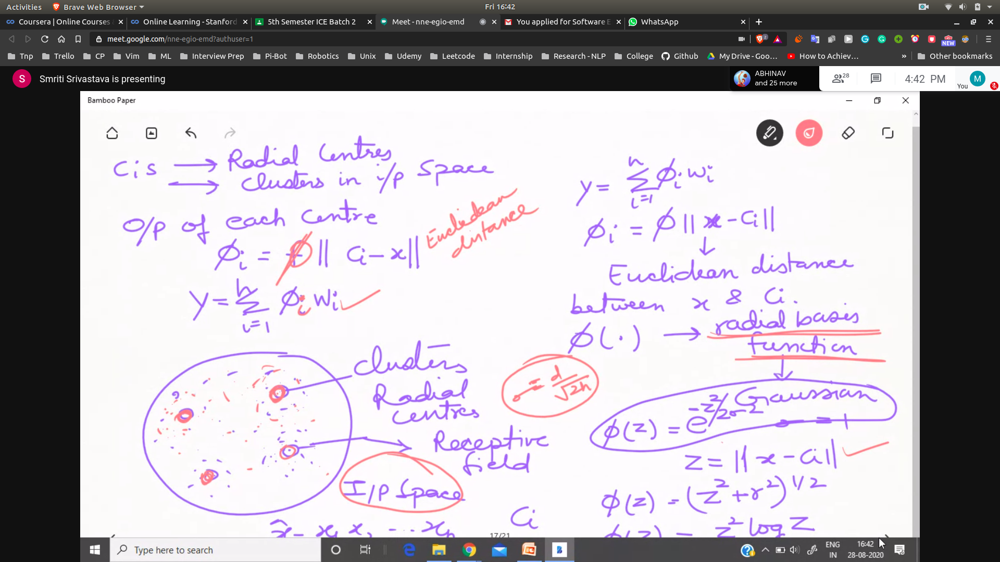

## Hidden Layer's and Neuron
**How many neurons in hidden layer?**
 - Start with 5 neurons and then move on increasing

- Size of the training set in relation to hidden neurons
 - If we have total for eg 67 weights , then you have to have 70 examples

- Training and Verification 
  - Training set is broken into training set and testing set
  - Verification is to be done in the testing set

## Radial Basis Function Networks
- [rbf_tutorial](https://mccormickml.com/2013/08/15/radial-basis-function-network-rbfn-tutorial/)
- Hidden Units are called radial centres
- Tranformation from input to hidden is non-linear
- Transformation from hidden to output is linear
### How radial centres are chosen
- We chose the radial centre of the dense data points
- Now if we input is given , those radial centres are activated which are close to these data outputs
- all the input go to the radial centre with unity weight
- 
- Radial Basis function
- 

|RBFNN | MLFNN|
|----- |------|
|single hidden layer|multiple hidden layer|
|hidden layer are non-linear|all layers are non-linear|
|act. function is a function of euclidan function|here activation func. is ~|
|two fold learning(radial centres,conncection wts)|one learning (weight's only)|

