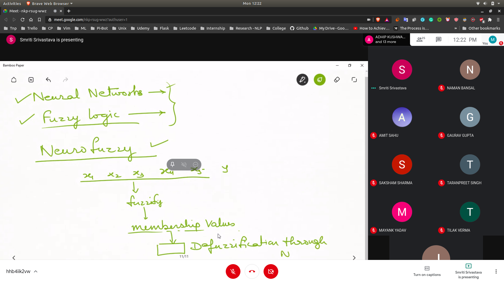

## Neuro - Fuzzy System
- ANFIS
  - 
  - Fuzzify the inputs and then defuzzification using NN's
  - Kind of like normalisation of inputs , just non linear

## Books for Neural Networks 
- Artifical Neural Systems
  - By Jacek M Zurada
- Neural Network Design
  - By Hagans
- Neural Networks
  - By Simon Haykins

## Books on Fuzzy
- Fuzzy logic with eng application
  - Timothy Ross
- Fuzzy control
  - Dimitra Driankov
