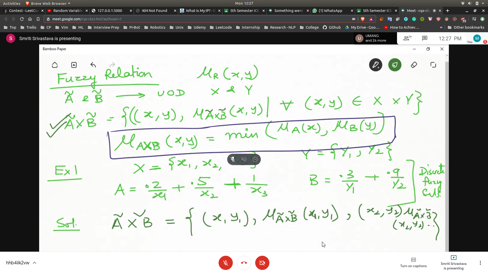
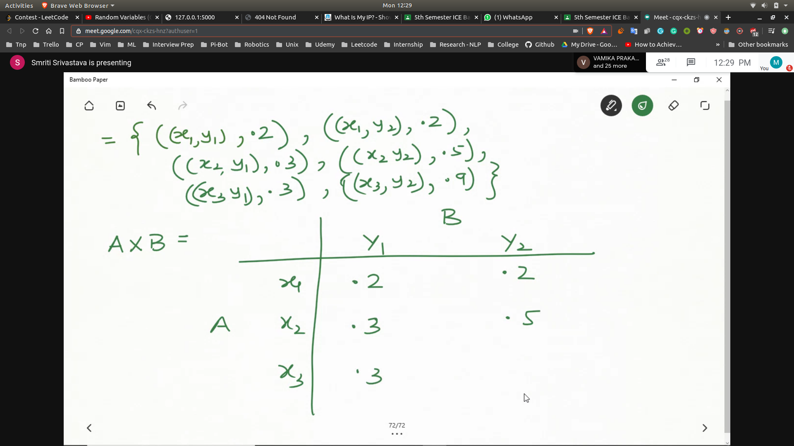
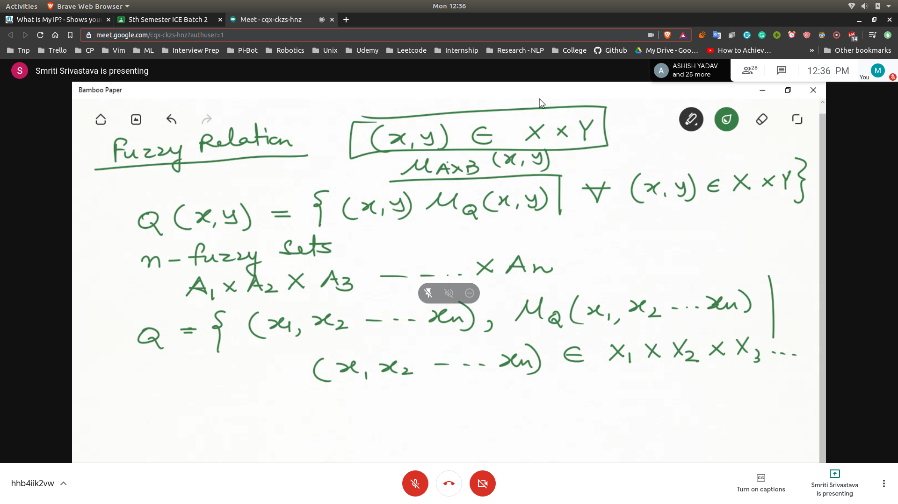
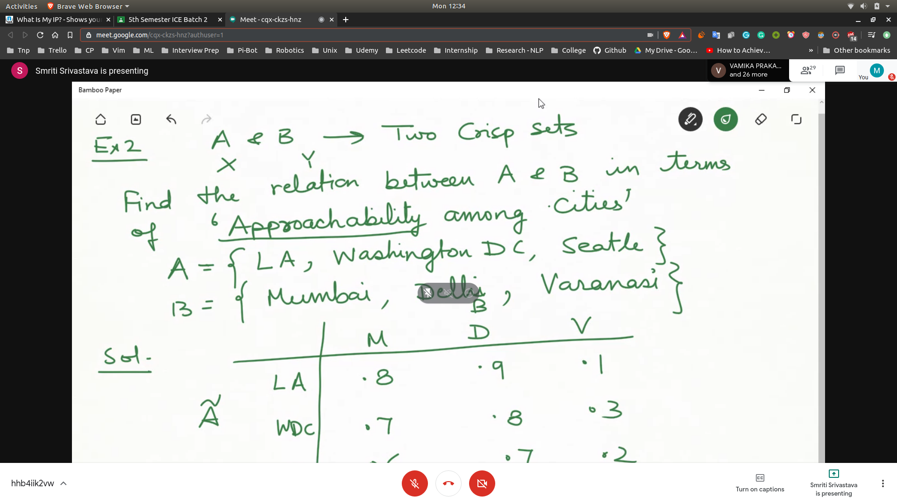
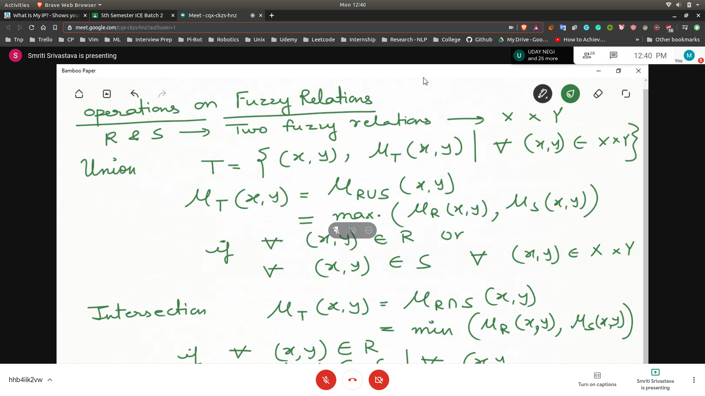
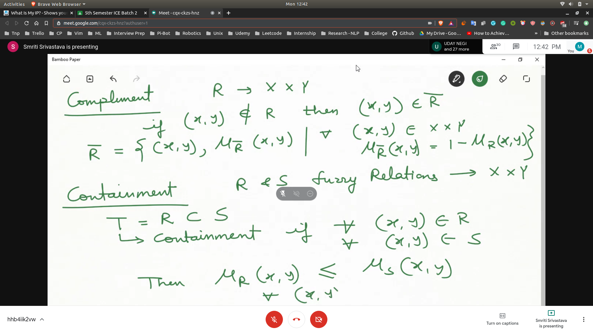
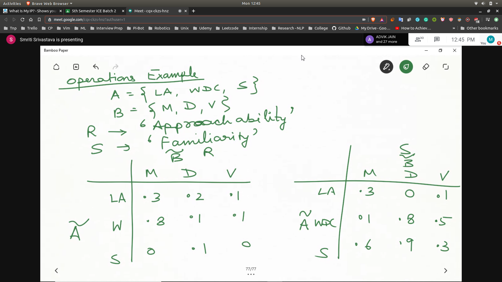

## Fuzzy Relation
- 
- 
- 

## Examples
- Find the relation b/w A and B in terms of approachability among cities
- A = {LA,Washington DC,Seattle}
- B = {Mumbai,Delhi,Varanasi}
- The relation can not be defined in 0 / 1 because it is not absolute
- Hence we will use fuzzy relation (fuzzy matrix)
- 

## Operation on Fuzzy Relations
- 
- Compliment
- 

## Example
- 