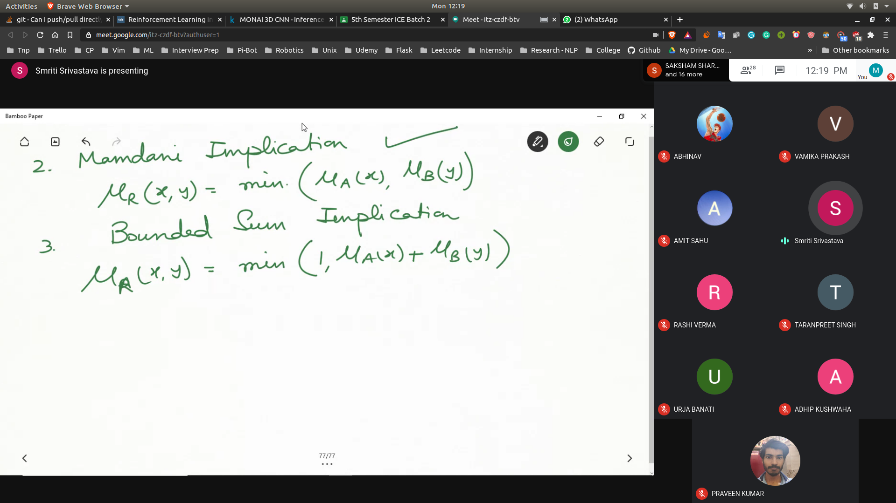
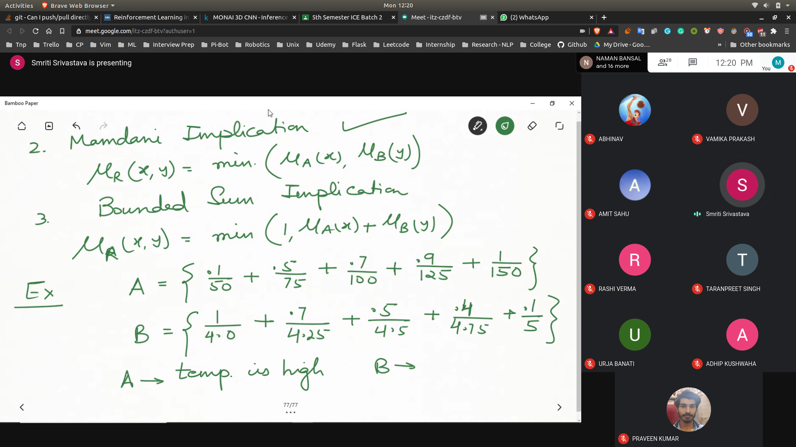
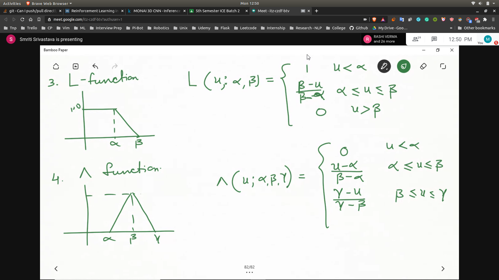
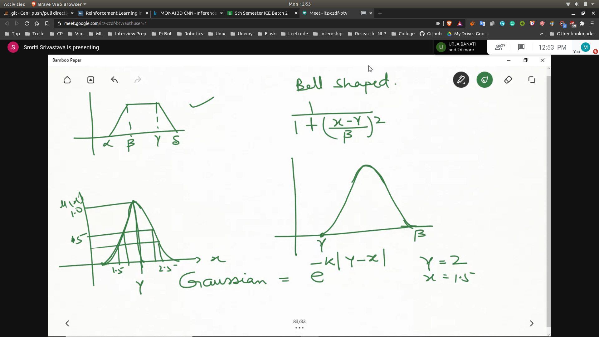

## Approximate Reasoning

### Implication
- Implication Operator
1. Classical Implication
     - u_R(x,y) = max [u_a(x) disjoint u_b(y),1 - u_a(x)]
2. Mam Dani Implication
3. Bounded Sum Implication
-  

### Example
- Basically this means that given we have information from u(a) and u(b) then we will get this relation
- 

### Membership Fucntions
- 
- T function
- L function

- 
- 