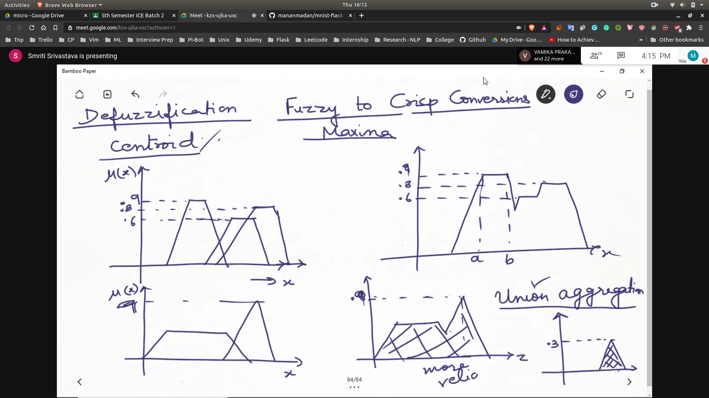
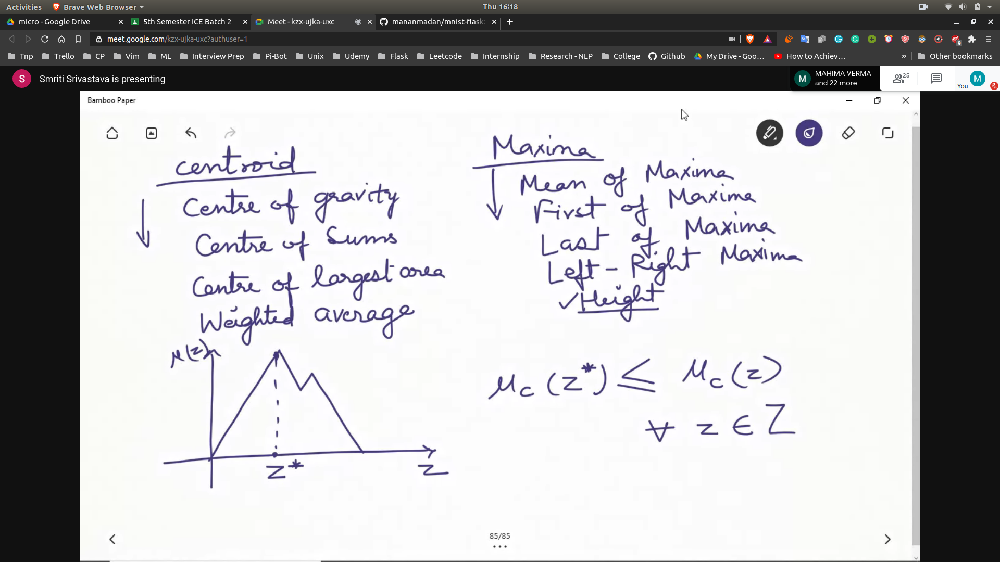
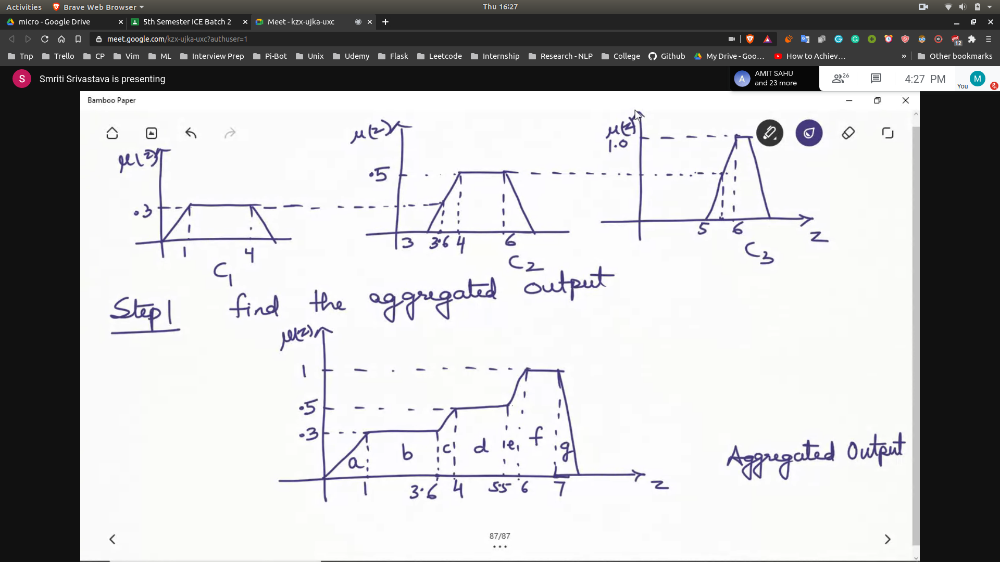
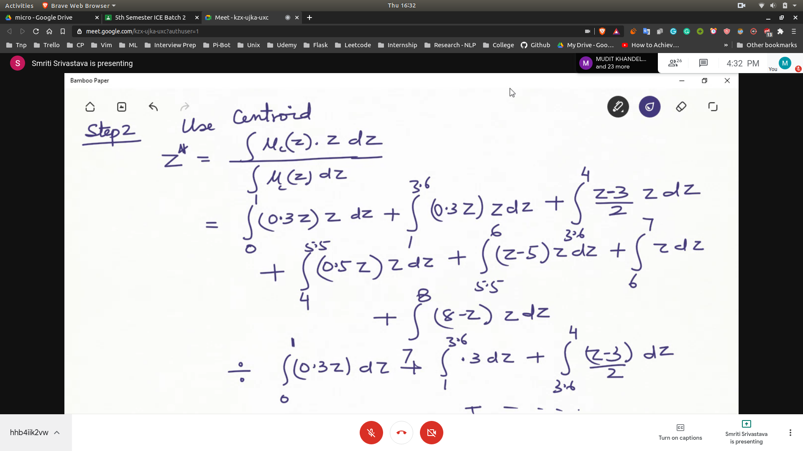

# Defuzzication Methods
**Fuzzy to Crisp Conversion**

## Methods
- Input to these methods?
 - Union Aggregation of the consequents
 - 
 - agreggation of the consequents can be done using the intersections also
 - we combine to get the overall output

### Centroid

- Methods
  - Centre of Gravity
  - Centre of Sum
  - Centre of largest area
  - Weighted avrage

### Maxima 

- Methods
  - Mean of maxima
  - First of maxima
  - Last of maxima
  - Left-right Maxima
  - Height Method
     - 

### Description of Methods
- *Centre of largest area* -> statement is not clear
   - CI is the convex sub region that has the largest area

- 

## Steps to defuzzify
- 
- 
