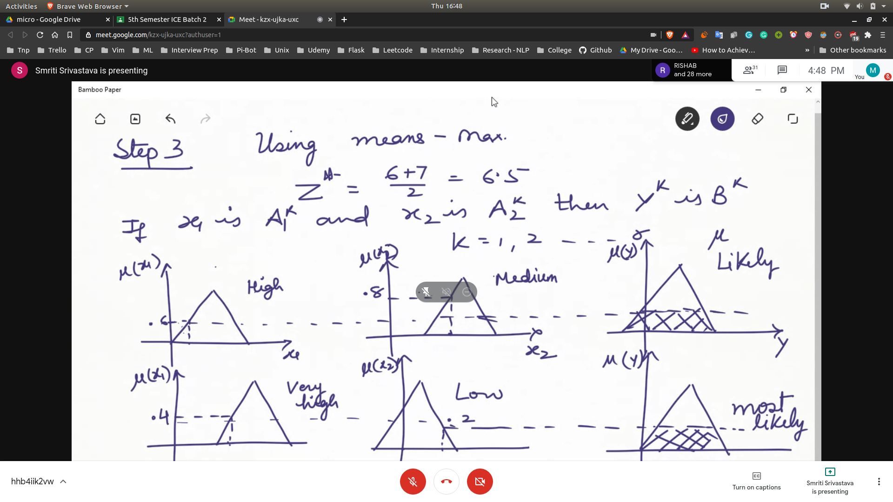
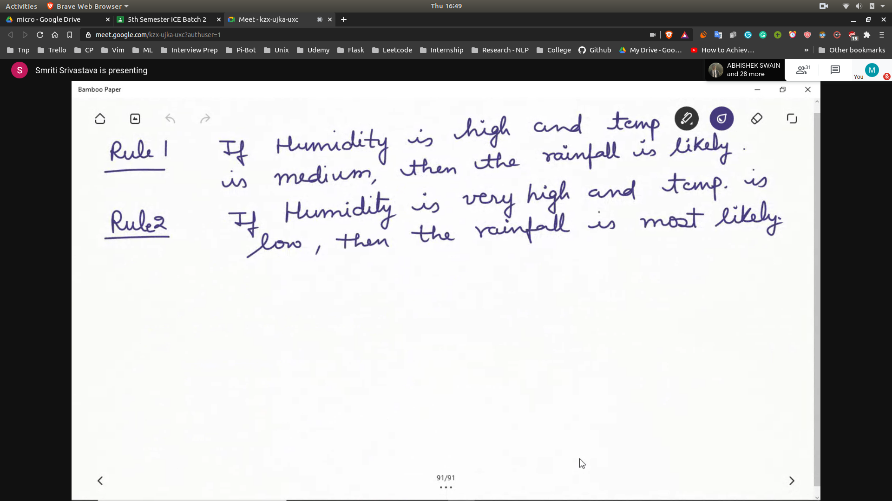

# Graphical Inference Techniques

- Why to use graphical?
  - Because we can have multiple ancedetants and consequents

## Examples
- 
- In the above examples the rules are
- 

- ON GETTING THE OUTPUT FROM INFERENCE --> IMPLICATION -->[FUZZIFIED OUTPUT]--> AGGRIGATION --> DEFUZZIFICATION
