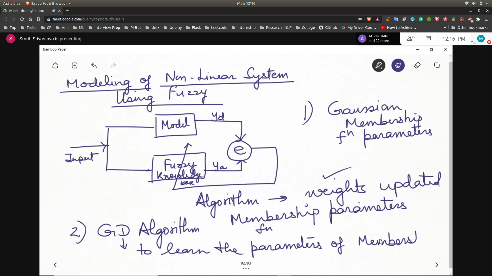
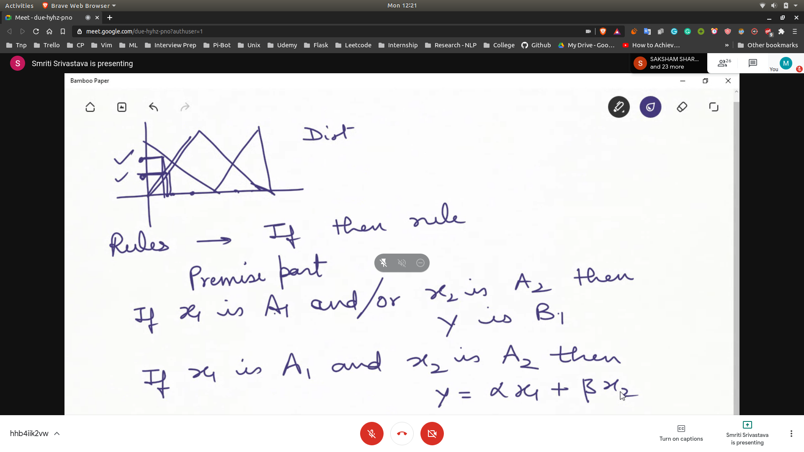
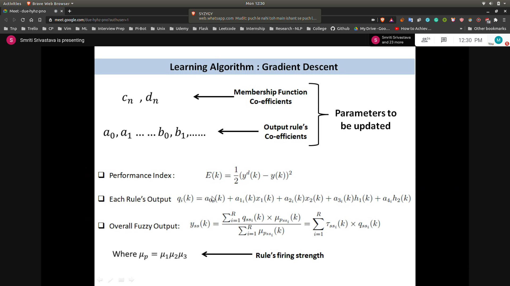
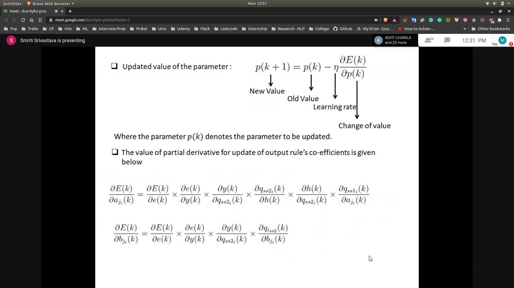
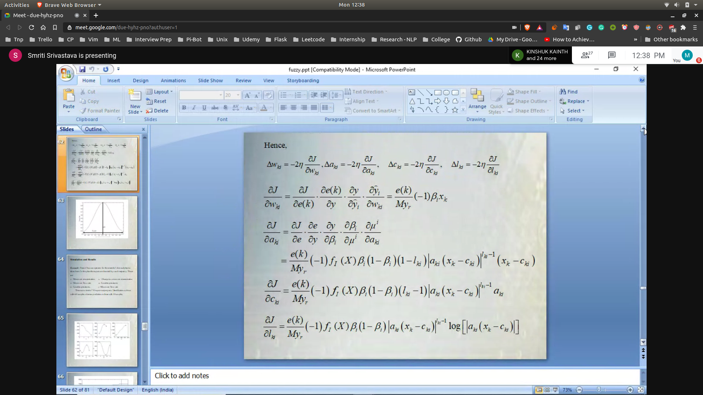
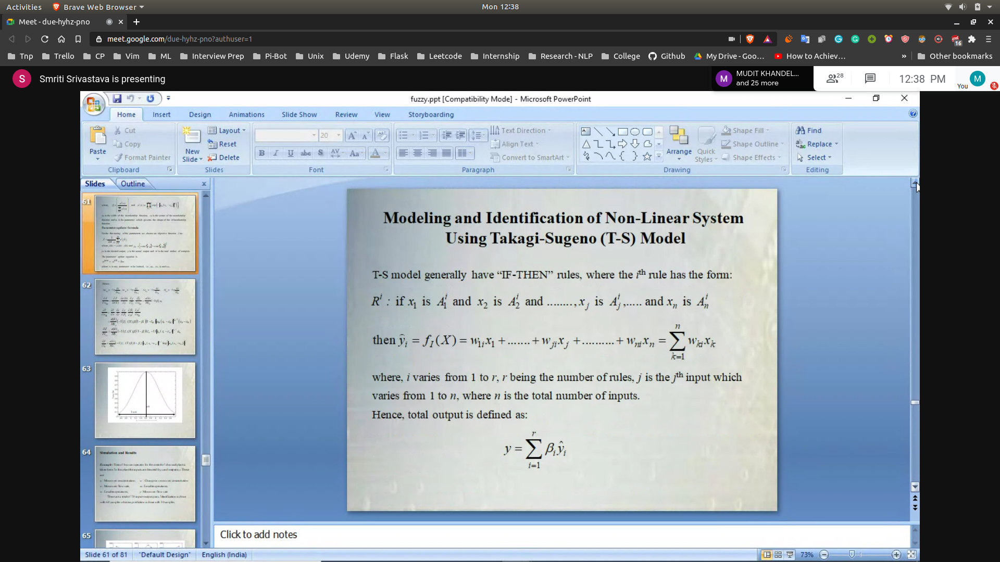

## Modelling of Non-Linear System Using Fuzzy
- 
- 

## Learning Algorithms
- First rules
- The parameters are adjusted using Grad Descent
  - output parameters and membership function are adjusted 
  - ignore h(k) values in rule's output
  - 
  - 
  - 
  - 

## Programming - [FOR SM DATA]
- Using Fuzzy Toolbox 
- Programming Matlab
   - Plot J vs the number of samples