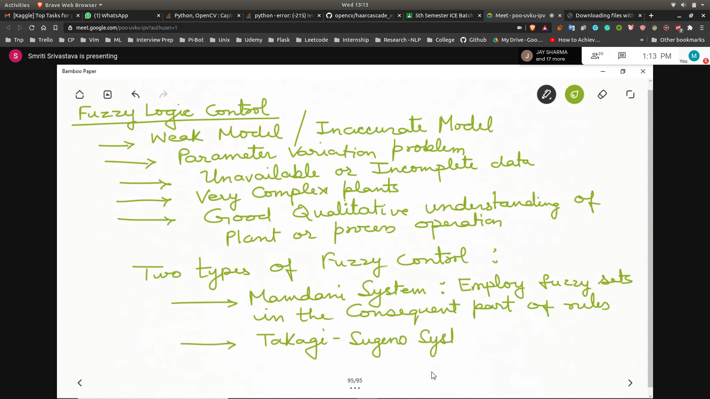

## Fuzzy Logic Control
- 

## PI Control
- 

## PD Control
- 

## Mamdani Type Fuzzy Logic Controller
- Fuzzy knowledge based controller
- [FKBC](FKBC.jpg)

### Principal Design Parameters
- Fuzzification strategies
- Intepretation of a fuzzification operators
- Database
- Normalization / Scaling
- Fuzzy partition of i/p and o/p variable
- Completeness
- choice of MF
- Rule Base
  - choice of i/p and o/p
  - source and derivation of rules
- Fuzzy inference mechanism
- Deffuzification strategy

## Architechture of a fuzzy logic controller
- 
