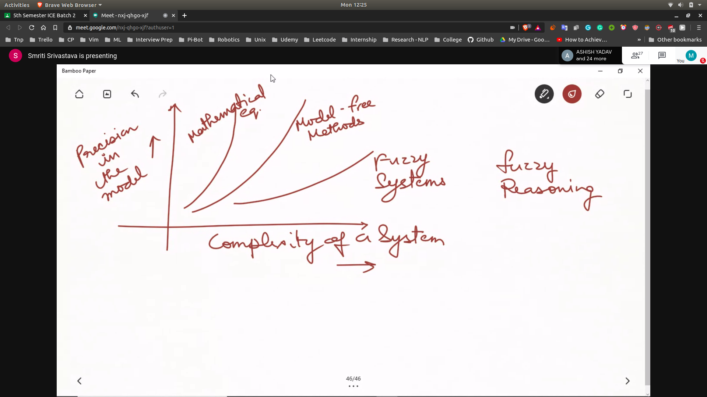

# Fuzzy Logic
- Can be helpful in modelling and control of non linear dynamical sysyems
- **We will combine neural network and fuzzy to get better controllers**

## Why Fuzzy?
- When the complexity of the system increases ,the precision becomes less as ambiguity increases

## How it came to be?
- Humans reason approximately and relatively , hence able to process much more data than we can process

## Complexity and Precision Comparision
- Basically when are mathematical equation , model free methods and fuzzy systems are used
- 
  - Fuzzy can be used when the data availabe is ambigous
  - Precision decreases because of the data and the complexity of the system

## Probability vs Fuzzy
- Random Uncertainity --> Probability
  - Outcome of random process is simply by chance
- Non Random Uncertainity --> Fuzzy
  - Like noise in the system
  - There exisits is a pattern in the uncertainity

## Formal Defination
- Tool for the modelling non random uncertainity which is affected by vagueness imprecission and lack of information of the system about the system
- Lack of information is the main reason about the fuzzy , otherwise we can use NN

## Where it is sucessfull?
- Very complex models where the understanding about the system is strictly limited or judgemental
- Processes where human reasoning / human perception or decision making are inextricably involved.
- Optimal fuzzy algorithms are of value to a large amount of populaiton where a little imprecission does not matter
- Like Travelling Salesman Problem , applied in drilling holes in circuit board using layers