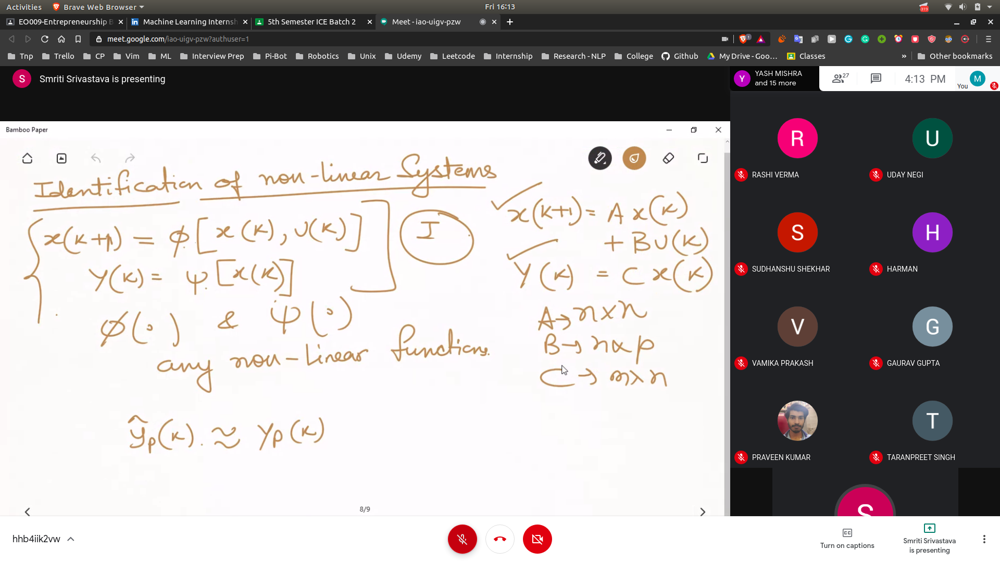
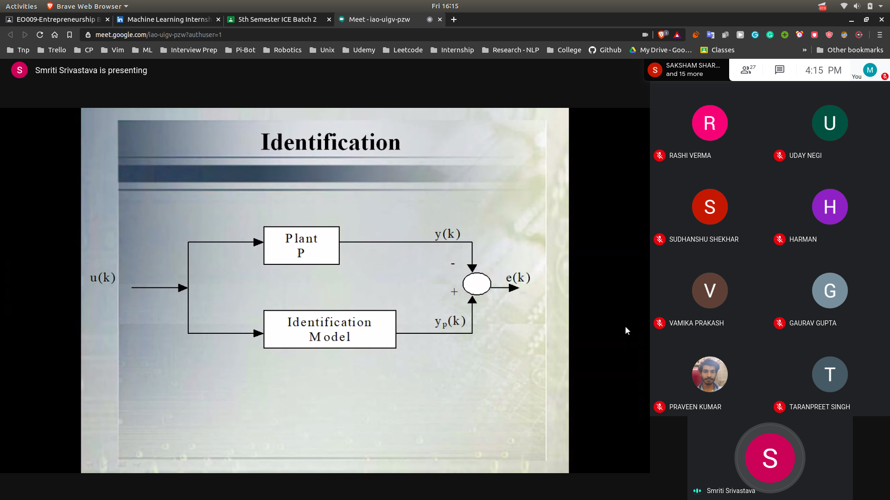
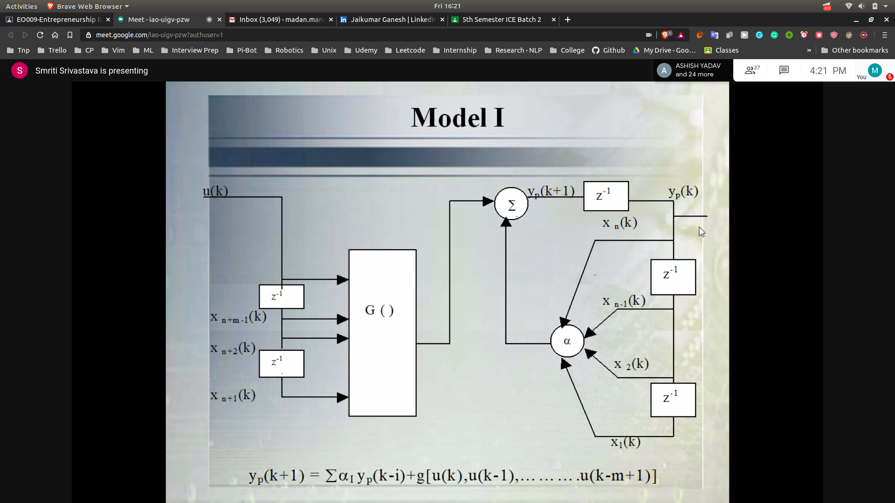
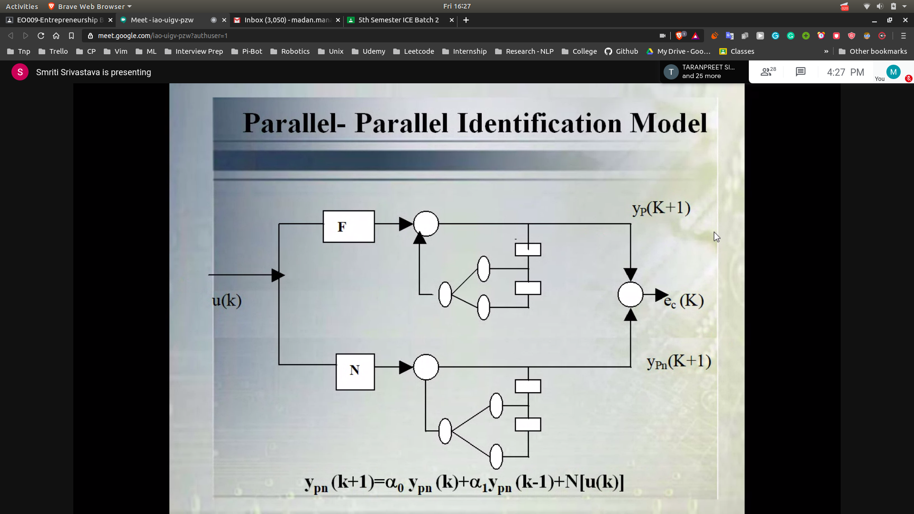
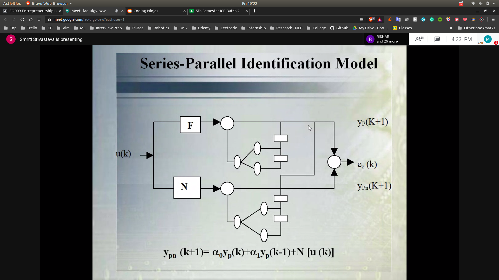
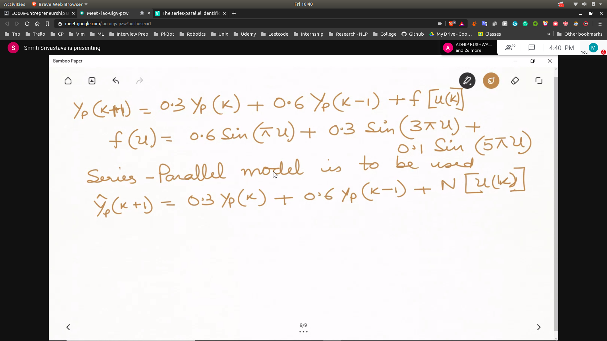
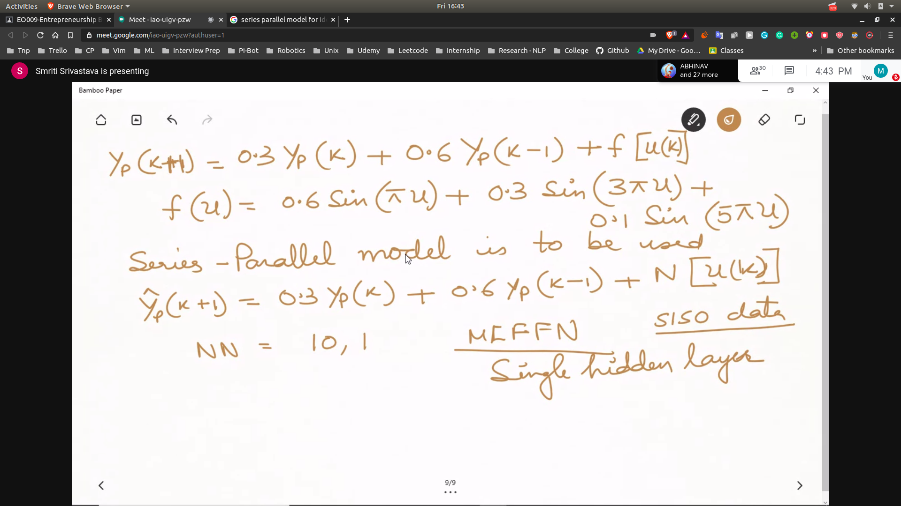
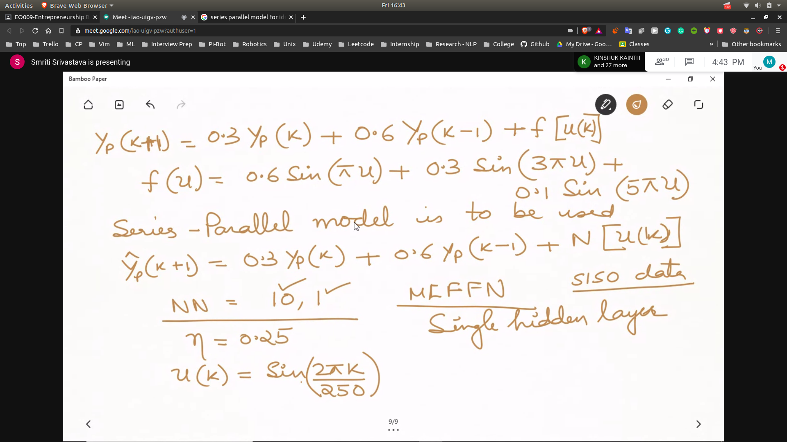

## Identification of Non Linear System
- 
### Standard Stucture for identification
- 

## Approaches
- Model Based Approach
- Model Free Approach

## Model Based Approaches
- 

**How to convert differential system into difference equations ==> From Stephanapolous**

## Model1
- 

==> Take rest of the model from the slides
- model2 , model3 , model4

## For Control
- Most suitable for model2
- Do identification with all the model

## Identification
- It is basically optimising the parameters in NN
- What Structures to Use?
  - 
  - 
### Advantages of sp over pp
- Model is considered to be BIBO stable all the signals , for input to NN are bounded
- BP Algo can be used as No feedback loop exist in the model
- Assuming that output error tends to a small values so that yp(k+1) = ypn(k+1)
- sp can be replaced by pp without series consequences

## Problem
- The plant to identified is goverened by the diff. eqation yp(k+1) = 0.3 yp(k) + 0.6yp(k-1) + f(u(k))
- where f(u) = 0.6 sin(pi* u)+0.3sin(3* pi* u)+0.1sin(5* pi* u)
- To identify this plant use an SP model
- 
- The weights in NN are to adjucted at every point of time using Back Prop
- 
- 